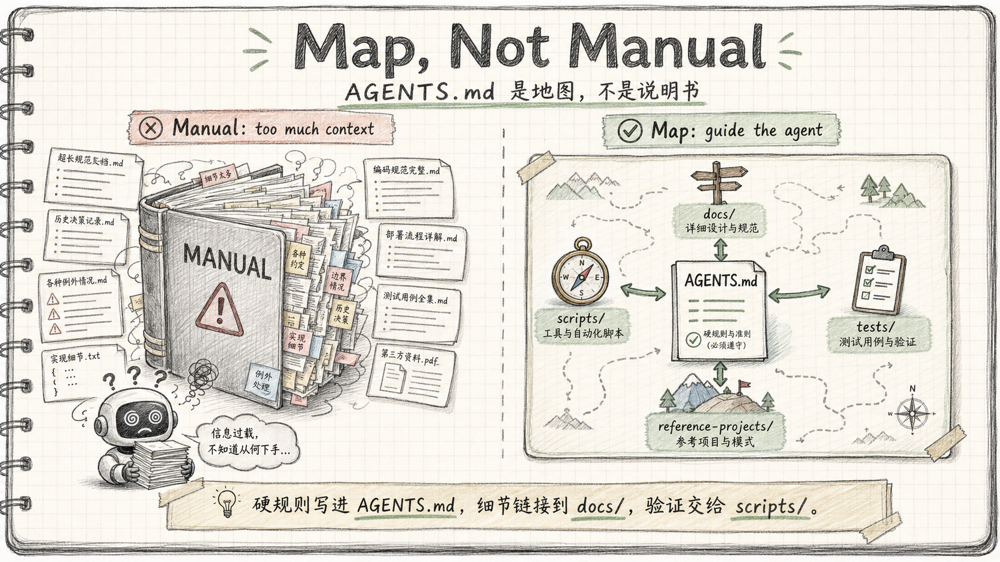

# AGENTS.md Practice Guide


---

## Summary

AGENTS.md is a README for AI agents.

Its purpose is not to cram all project documentation into one file. Its purpose is to give an AI coding agent the smallest useful map of the project: what the project is, where the code lives, what rules must not be violated, how to build it, how to verify it, and where to find deeper documentation.

The target experience is:

```text
Agent opens the repo -> understands the project
Agent changes code -> knows how to verify it
Agent violates a rule -> automation catches it
```

This is directly aligned with Harness Engineering and agentic workflows. The human role moves from manually checking every step to designing a feedback loop that the agent can execute.

---

## What AGENTS.md Is

AGENTS.md is an open Markdown convention placed at the repository root to guide AI coding agents.

It usually contains:

- Project overview
- Repository structure
- Build, run, and test commands
- Coding rules
- Safety constraints
- Verification workflow
- Documentation map

README.md is for humans. AGENTS.md is for AI first, humans second: its focus is project rules, commands, the verification loop, and forbidden actions—not a project intro.

Different AI coding tools used to have different context files: Claude Code uses `CLAUDE.md`, Cursor uses `.cursor/rules`, Copilot uses `.github/copilot-instructions.md`, and Codex uses `AGENTS.md`.

The content is fully tool-agnostic — the only difference is the filename. Maintain one `AGENTS.md` and bridge other tools with symlinks:

```bash
ln -s AGENTS.md CLAUDE.md        # Claude Code
ln -s AGENTS.md .cursor/rules    # Cursor (if not using .cursor/rules dir)
```

This means one file, zero duplication, all tools covered.

---

## The Problem Without AGENTS.md

The article's main diagnosis is simple:

> Project knowledge and project rules live in people's heads instead of in a place that AI can read and execute.

Common failure modes:

1. **Fragmented context**  
   Frontend, backend, component libraries, and docs are split across repositories. The agent only sees one slice of the system and loses context when a feature crosses boundaries.

2. **Private components are invisible to AI**  
   Closed-source component libraries are not in training data and often lack public docs. The agent misuses props, misses required config, or invents APIs.

3. **The agent does not know project rules**  
   Examples: exceptions must use `BusinessException`, response bodies must be wrapped by the framework, controllers must not depend on repositories directly. These rules are obvious to the team but invisible to the agent.

4. **The agent cannot start or verify the project**  
   Environment variables, startup commands, and validation steps are scattered across personal machines, IDE configs, and chat history. The agent can edit code but cannot close the loop.

AGENTS.md does not make the model smarter. It makes the project more legible to AI.

---

## Core Principle: Map, Not Manual



The first principle is **Map, not Manual**.

AGENTS.md should be a navigation map, not a giant handbook.

Only two kinds of information belong directly in AGENTS.md:

1. **Information required for the agent to understand the project**  
   Tech stack, repository layout, core modules, architecture boundaries.

2. **Hard rules whose violation causes real problems**  
   Coding conventions, forbidden dependencies, naming rules, mandatory checks.

Everything else should live in linked docs under `docs/`.

The decision rule:

```text
If the agent will write wrong code without it -> put it in AGENTS.md
If the agent will merely write less ideal code without it -> put it in docs/ and link it
```

A 5000-line AGENTS.md dilutes attention. Important rules become easier to miss. The article recommends keeping it around 200 lines and using progressive disclosure.

---

## Five Key Practices

### 1. Aggregate Repositories To Reduce Context Loss

If a feature crosses backend, frontend, docs, and component libraries, the agent should ideally see all relevant code in one workspace.

Practical options:

- Prefer monorepo for new systems.
- For existing systems, use scripts to aggregate related repos locally.
- Put auxiliary repos under gitignored directories if they should not affect CI/CD.
- Include user docs when useful, so the agent can update documentation after code changes.

The goal:

```text
The agent can inspect API definitions, frontend callers, component usage, and docs in one context.
```

### 2. Standardize Local Environment Setup

Agents need a reliable way to start and verify the project.

The article's recommended pattern:

- Store local environment variables in `~/.<project>_env`.
- Startup scripts automatically source the file.
- AGENTS.md documents the env file location and precedence.
- Startup scripts encapsulate JDK checks, process shutdown, restart, and health polling.

The agent should not need to understand the whole environment. It should only need stable commands:

```bash
./scripts/start-server.sh
./scripts/start-server.sh --quick
./scripts/start-server.sh --skip-build
```

This is an engineering move: reduce the agent's operational burden.

### 3. Close the Verification Loop

Code modification is not the end of the task. A task is only done when the feature is verified.

For backend work, use bash/curl verification. For frontend work, use an agent browser or screenshot-based checks when layout and interaction matter.

The article recommends strict curl conventions:

- Run each curl independently.
- Write outputs to `/tmp/` files.
- Parse JSON with separate commands.
- Template the login/token flow.
- Document log locations and database access paths.

This looks verbose, but it is robust. Agents often fail on shell quoting, zsh glob behavior, or fragile pipes. Temporary files are less elegant but more reliable.

Target loop:

```text
Agent completes task
  -> builds
  -> starts service
  -> verifies API or UI
  -> fixes based on the result
```

This is a prerequisite for unattended or overnight agent work.

### 4. Give Rules Executable Force

Rules written in AGENTS.md are weak unless automation enforces them.

The article's example is layered dependency checking:

```text
L0 entity      -> may depend only on common
L1 repository  -> may depend only on entity, common
L5 controller  -> may depend only on service, core, common
```

A script scans imports and reports violations. The error message format matters:

```text
WHAT: what rule was violated
WHY: why this is not allowed
HOW: how to fix it
```

This format is useful for humans and agents. If the agent sees HOW, it can often self-correct without additional explanation.

Rule priority:

```text
Automated checks > AGENTS.md rules > oral conventions
```

### 5. Use Reference Projects, Not Just Documentation

For closed-source components, internal systems, or code that the model has never seen, documentation can lag behind reality.

The article recommends bringing reference source code into the workspace:

```text
reference-projects/
  pro-components/
  other-product-backend/
  other-product-frontend/
  open-source-reference/
```

Then maintain `docs/design-docs/ref-*.md` files as maps:

```text
ref docs = tell the agent where important structures are
reference-projects = source of truth when details are needed
```

The core claim:

> Source code never goes stale. It is the most accurate documentation.

---

## Recommended AGENTS.md Structure

A compact general structure:

```markdown
# AGENTS.md

## 1. Project Overview
What this project is, tech stack, repository layout.
The first 10 lines should establish the mental model.

## 2. Quick Commands
Build, run, format, quality check, and test commands.
Environment file location and startup script behavior.

## 3. Architecture
Core directory tree, module boundaries, layered architecture rules,
and links to deeper docs.

## 4. Key Rules
5-10 hard rules that cause real problems if violated.
Each rule should include a reason or a link to detailed docs.

## 5. Local Development and Verification
The full edit -> build -> start -> verify loop.
curl/browser/log/database verification instructions.

## 6. Quality Checks
Unified command matrix for lint, format, build, and test.

## 7. Reference Projects
List of references, priority rules, and when to inspect them.

## 8. Documentation Map
Index of detailed docs.
```

For a C++ trading system, this would become:

```markdown
## Quick Commands
- cmake -B build -DCMAKE_BUILD_TYPE=Release
- cmake --build build -j
- ./build/test_order_book
- ./build/test_strategies
- ./build/benchmark

## Hard Rules
- Any change to order matching must preserve price-time priority.
- No benchmark result may be trusted unless unit tests and semantic invariants pass first.
- Do not optimize by changing trade sequence, fill quantity, or final book state.

## Verification
- Unit tests: ./build/test_order_book, ./build/test_strategies
- Semantic invariants: fixed order scenario must match golden output
- Performance: repeated benchmark, median comparison, threshold-based acceptance
```

---

## Implementation Advice

### Start With Auto-Generated Init

Use a tool's `/init` command as a first draft, then tighten it manually.

The first version usually covers:

- Project overview
- Basic build commands
- Directory structure

Then add project-specific constraints:

- Architecture boundaries
- Verification scripts
- Hard forbidden actions
- Performance and semantic gates

### Iterate From Bad Cases

Do not try to write the perfect AGENTS.md in one pass.

Better loop:

```text
1. Agent makes a mistake
2. Identify why it happened
3. If it is a global rule, add it to AGENTS.md
4. If it is module-specific, add it to docs/
5. If it can be checked automatically, write a script instead of only writing prose
```

AGENTS.md is a living project knowledge base, not a one-time document.

### Mark The Intended Reader

The article recommends making the audience clear:

| File | Reader | Role |
|---|---|---|
| README.md | Humans | Project intro and quick start |
| AGENTS.md | AI first, humans second | Automatically loaded project instructions |
| docs/*.md | AI first, humans can inspect | Module-level development manuals |
| scripts/*.sh | Humans and AI | Build, start, deploy, verify |

AGENTS.md is not a README replacement. It is the entry point for the AI workflow.

---

## Relationship To Quality Assurance / Overclock Mode

This article is not exactly about multi-agent adversarial review, but it provides the infrastructure underneath it.

Mapping:

```text
AGENTS.md
  -> project map and hard rules for Builder, Critic, and Executor

scripts/*.sh
  -> machine checks the Executor can run reliably

docs/*.md
  -> rule source for the Critic's checklist

bad-case-driven updates
  -> turn agent failures into durable rules
```

AGENTS.md is not the whole quality system. It does not replace:

- Unit tests
- Semantic invariants
- Backtests
- Benchmarks
- CI
- Critic review

But it tells agents where those checks are, when they must run, and what counts as acceptance.

For the current trading-system learning path, AGENTS.md should do three things:

1. **Teach the agent the hard rules of the matching engine**  
   Price-time priority, partial fills, stable trade sequence, final book state.

2. **Expose the verification commands**  
   Build, unit tests, fixed scenarios, benchmarks, and their required order.

3. **Define optimization boundaries**  
   Performance work must not change matching semantics. Benchmarks are only meaningful after correctness checks pass.

In one sentence:

> AGENTS.md is the map of an agent quality system; scripts, tests, and CI provide the execution force.

---

## Actionable Checklist

- [ ] Run `claude /init` (or equivalent) to generate a first-draft AGENTS.md; tighten manually after
- [ ] Add hard rules specific to this project — matching semantics, layer boundaries, forbidden actions
- [ ] Write or link verification scripts: build → unit tests → semantic invariants → benchmark; document their required order
- [ ] Keep it under 200 lines; push detailed docs to `docs/` and link from AGENTS.md
- [ ] Add `ln -s AGENTS.md CLAUDE.md` symlink for Claude Code compatibility
- [ ] For closed-source or internal components: add reference source to `reference-projects/`
- [ ] Treat every agent mistake as a signal: if it's a global rule, add to AGENTS.md; if it can be automated, write a script
- [ ] For the trading system: add matching semantics rules and the exact verification command sequence before running the agent optimization loop

---

## Takeaway


> Writing AGENTS.md means turning project "tribal knowledge" into AI-readable, executable, and maintainable engineering assets.

Many AI coding failures are not caused by weak models. They happen because the project has not exposed its context, rules, and verification path to the agent.

The ideal state:

```text
Open the repo -> understand the system
Modify code -> verify automatically
Violate a rule -> get blocked by automation
Hit a bad case -> turn it into a new durable rule
```

This is the same direction as agentic workflow design: humans design the feedback loop, agents operate inside it.

**The technical barrier is not model capability. It is whether the project has made its context, rules, and verification path legible to an agent.**
