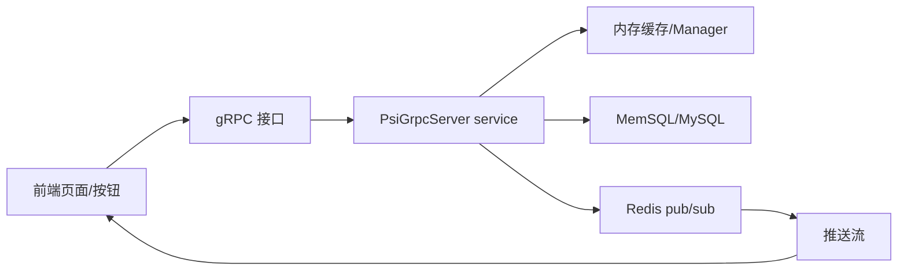

# AI 协作开发掌控攻略

> 目标：代码可以让 AI 写，但任务边界、架构理解、验证证据、交付口径必须握在你手里。

这份攻略适合你现在的工作场景：C++ / gRPC / 后端服务 / 远端 Linux 编译运行 / 前端联调 / 临时需求频繁变更。

## 1. 核心原则

你不需要亲手写每一行代码，但你要掌控四件事：

1. **需求边界**：到底改什么、不改什么、谁会调用、返回格式是什么。
2. **架构地图**：这次任务穿过哪些模块、数据从哪里来、最终推到哪里。
3. **变更账本**：AI 改了哪些文件、为什么改、是否越界。
4. **证据链**：不是“看起来能跑”，而是有编译、接口、日志、联调证据。

一句话：

```text
AI 可以负责产出代码，你负责证明这件事真的被正确完成。
```

## 2. 为什么这样做

外部工程实践里有几个共识，可以直接转成你的工作规则：

- GitHub 对 Copilot code review 的建议是：AI review 只能补充人类 review，不能替代；AI 可能漏问题、误报，也可能生成不安全或语义错误的代码，所以必须人工审查和测试。
- GitHub 的代码治理建议里明确强调：不能让未验证的 AI 建议或 agent work 直接进入重要代码库，应该有 PR/review、测试、安全扫描、质量检查和团队规范。
- DORA 关于小批量开发的实践指出：AI 时代更要拆小任务，因为 AI 很容易生成大块代码，而大改动更难 review、测试和安全集成。
- Thoughtworks Technology Radar 提到 coding agent harness：要给 agent 前置约束，也要有后置反馈传感器，比如编译器、lint、类型检查、测试套件和结构规则。
- ADR（Architecture Decision Record）实践强调：重要架构决策要记录上下文、决策和后果，否则你会逐渐只记得“改过”，忘了“为什么这样改”。

参考：

- GitHub Docs: Responsible use of GitHub Copilot code review  
  https://docs.github.com/en/copilot/responsible-use/code-review
- GitHub Docs: Maintaining codebase standards in a GitHub Copilot rollout  
  https://docs.github.com/en/copilot/tutorials/roll-out-at-scale/govern-at-scale/maintain-codebase-standards
- DORA: Working in small batches  
  https://dora.dev/capabilities/working-in-small-batches/
- Thoughtworks Technology Radar: Putting coding agents on a leash  
  https://www.thoughtworks.com/radar
- ADR resources  
  https://adr.github.io/

## 3. 你每次拿到任务后的最佳工作流

### Phase 0：原始需求冻结

先不要让 AI 改代码。把原始聊天、截图、接口样例、文件名保存下来。

你要得到一段“原始输入”：

```text
谁提的需求：
原话是什么：
给了哪些文件/截图：
要求改哪些接口：
有没有明确返回格式：
有没有说“不懂问谁”：
```

你的控制点：

- 原始需求不要被 AI 改写后覆盖。
- 截图里的字段、cmd、接口名要单独抄出来。
- 如果对方说“和上次差不多”，必须追问或让 AI 找“上次”的实际代码模式。

### Phase 1：让 AI 先讲懂，不许写

固定问法：

```text
先不要改代码。
你根据现有信息讲清楚：
1. 这个任务要解决什么业务问题；
2. 前端会怎么调用；
3. 后端数据从哪里来；
4. 哪些接口要新增/修改；
5. 哪些点你能推断，哪些点必须确认；
6. 你认为验收标准是什么。
```

你要看它有没有讲出：

- 用户操作路径：打开页面、展开子项、点击运行/停止/撤单、收到推送。
- API 边界：父行聚合操作走 aggregation，子账号独立操作走旧接口。
- 数据来源：DB、Redis、内存缓存、已有 manager，哪个才是业务权威。
- 返回结构：cmd、userId、accountId、data、subPositionInfoList 这些字段是否对上。
- 验证方式：远端 Linux 编译、服务启动、gRPC 调用、日志、前端联调。

如果 AI 讲不清，就还不能写。

### Phase 2：画架构小地图

每个任务至少要有一张小图，不用漂亮，但要能说明链路。

模板：



对 TWAP 这类任务，你要特别盯住：

- 接口是一次性查询还是 server stream。
- 推送是从 DB 查，还是从内存已有数据聚合。
- 前端父行和子行是不是同一套接口。
- userId / accountId 谁是主键。
- 返回结构是否保持老接口兼容。

### Phase 3：拆成小批量

不要让 AI 一口气“把所有 TWAP 都改完”。按 DORA 的小批量原则，每一批都要能独立验证。

建议切法：

```text
Batch 1：proto / 接口声明
Batch 2：service 实现
Batch 3：数据来源和聚合逻辑
Batch 4：推送 cmd 和 payload
Batch 5：运行/停止/撤单聚合接口
Batch 6：默认值/配置/搜索类聚合接口
Batch 7：联调修正
```

每一批完成后都问：

```text
这一批改了哪些文件？
为什么必须改？
有没有生成文件？
有没有越过本批范围？
下一批依赖什么？
```

### Phase 4：写代码前先定验收

这里不是让你搞复杂 TDD，而是先有验收靶子。

最少写清楚：

```text
正常场景：
- userId 下有两个账号，同一股票 50 + 60，父行显示 110。
- 展开后能看到两个账号明细。

边界场景：
- userId 为空。
- userId 查不到账号。
- 某个账号持仓变成 0。
- searchStockCode 过滤。

联调场景：
- 打开页面会调用哪个接口。
- 点父行按钮会调用哪个 aggregation 接口。
- 点子行按钮会调用哪个旧接口。
- 推送变更时主行是否刷新。
```

验收标准可以给 AI 看。  
但如果你跑严格 GateKeeper，Builder 只看 brief，Critic 再看 checklist。

## 4. AI 写代码时，你要盯的 7 个问题

### 1. 它是不是改了不该改的文件

每次改完先看：

```bash
git status --short
git diff --stat
```

你要能回答：

```text
这次真正需要提交的文件是哪几个？
哪些是环境/构建/临时测试文件，不能混进提交？
```

### 2. 它是不是绕过了业务权威数据源

比如这次 TWAP 推送问题：

```text
错误倾向：推送时直接查数据库。
业务提醒：上面内存里面有存。
正确问题：推送链路应该以哪个内存缓存/运行时状态为准？
```

你要经常问：

```text
这个数据从哪里来才是业务权威？
旧逻辑是从哪里拿的？
这次有没有破坏已有实时性？
```

### 3. 它是不是只测了查询，没测推送

接口查询 PASS 不等于推送 PASS。

你要区分：

```text
获取接口测试：
- 调 subPositionInfoListAggregation
- 看返回结构

推送测试：
- 建立订阅流
- 触发 Redis/业务变更
- 看 aggregation_position_info_insert/update payload
- 看前端主行是否刷新
```

### 4. 它是不是把 Windows 当成结果权威

你的规则应该固定：

```text
Windows = 编辑端 / 客户端探测端
远端 Linux = 编译、启动、运行、业务验证权威
```

报告里禁止写：

```text
Windows 编译通过，所以完成。
```

应该写：

```text
远端 Linux 编译通过。
远端服务已启动并监听。
gRPC runtime smoke 已覆盖哪些接口。
仍未覆盖哪些联调场景。
```

### 5. 它是不是把端口/配置讲混了

你每次联调前都要固定确认：

```text
服务机器：
服务端口：
实际运行 PID：
实际使用 config：
日志文件：
前端配置地址：
是否有旧进程占端口：
```

TWAP 这次的教训：

```text
8321 和 18321 不能混。
repo 里的 config.yaml 和 runtime 目录里的 config.yaml 也不能混。
```

### 6. 它是不是只说 PASS，不给证据

你要逼它说具体证据：

```text
编译命令是什么？
在哪台机器跑的？
服务监听在哪里？
调用了哪个 RPC？
用了哪个 userId？
返回 cmd 是什么？
返回 data 里关键字段是什么？
日志里看到什么？
提交号是什么？
```

### 7. 它是不是替你做了没确认的产品决定

例如：

```text
父行操作 accountId 传空还是不传？
子行操作是否仍走旧接口？
默认所有账号参数一致是什么意思？
推送是否受 searchStockCode 过滤？
0 持仓是推 0，还是不推？
```

这些不是纯代码问题，是产品/前后端契约问题。AI 可以提建议，不能替你定死。

## 5. 你应该保留的 5 个任务产物

每个任务不要只留下 commit。至少留下这些轻量产物。

### 1. brief.md

```md
# 任务简述

## 原始需求

## 我的理解

## 本次改动范围

## 不在本次范围

## 需要确认的问题

## 验收标准
```

### 2. architecture-map.md

```md
# 架构链路

前端入口：
gRPC 接口：
Service 方法：
数据来源：
缓存/DB/Redis：
推送 cmd：
日志位置：
```

### 3. change-ledger.md

```md
# 变更账本

## 文件清单

## 每个文件为什么改

## 生成文件

## 临时文件/不可提交文件

## 提交号
```

### 4. verification.md

```md
# 验证报告

## 结构检查

## 远端 Linux 编译

## 服务启动

## gRPC runtime 测试

## 推送测试

## 边界场景

## 未覆盖风险
```

### 5. handoff.md

```md
# 对外汇报

已完成：
最新提交：
服务地址：
前端需要调用：
已验证：
待联调确认：
```

## 6. 最适合你的实际工作流

这是建议你以后每次照着执行的版本。

### Step 1：收任务后，先建立任务卡

你对 AI 说：

```text
先不要写代码。
把这个需求整理成 brief：
1. 原始需求；
2. 你理解要做什么；
3. 涉及接口/文件/数据流；
4. 能推断的点；
5. 必须确认的点；
6. 验收标准。
```

你的目标：确认 AI 是否真的懂业务。

### Step 2：让 AI 读代码，输出架构地图

你对 AI 说：

```text
读相关代码，先输出架构地图，不要改。
我要知道：
1. 请求从 proto 到 service 到 DB/cache 的链路；
2. 推送链路；
3. 旧接口和新接口的关系；
4. 哪些函数可以复用；
5. 哪些地方不能碰。
```

你的目标：你自己先形成心智模型。

### Step 3：你确认切片和验收

你让 AI 输出：

```text
建议分几批做？
每一批改哪些文件？
每一批怎么验？
```

你只批准第一批或当前批。

### Step 4：AI 实现，但每批都要交账

每批完成后固定让它回答：

```text
这批做了什么？
改了哪些文件？
为什么这样改？
有没有复用旧逻辑？
有哪些风险？
下一步怎么测？
```

你的目标：不被一大坨 diff 淹没。

### Step 5：远端 Linux 验证

你的固定要求：

```text
按照通用开发规范，在远端 Linux 完成：
1. proto 生成；
2. 目标编译；
3. 服务启动；
4. gRPC runtime；
5. 推送/边界场景；
6. 日志证据。

不要用 Windows 本地结果作为业务通过依据。
```

### Step 6：你做 owner review

你不需要逐行看完全部 generated pb，但要看四类 diff：

```text
1. proto 契约；
2. service 业务逻辑；
3. DB/cache/Redis 数据源；
4. Auth/log/配置/运行入口。
```

重点问：

```text
有没有破坏旧接口？
有没有把父行/子行逻辑混了？
有没有查错数据源？
有没有只处理正常场景？
有没有旧进程/旧端口/旧配置干扰测试？
```

### Step 7：提交前清点

提交前必须看：

```bash
git status --short
git diff --stat
git diff --cached --stat
```

只提交任务相关文件。环境临时改动、构建实验、测试副本不要混进业务提交。

### Step 8：对外汇报要短，但要有锚点

推荐格式：

```text
已完成并推送。
提交号：xxxxxxx

本次完成：
1. xxx；
2. xxx；
3. xxx。

验证：
远端 Linux 编译通过；
runtime 覆盖 xxx；
待联调确认 xxx。
```

不要写：

```text
应该可以了。
我这边看没问题。
测试过了。
```

要写：

```text
在哪台机器、哪个端口、哪个接口、哪个数据、哪个结果。
```

## 7. 你的固定提问清单

每次任务都可以直接复制。

### 需求理解

```text
你先讲懂这个任务，不要写代码。
哪些是明确需求？
哪些是你推断的？
哪些必须问人？
```

### 架构理解

```text
画出这次请求/推送的数据流。
入口、service、cache、DB、Redis、日志分别在哪里？
```

### 改动计划

```text
列出预计改动文件。
每个文件为什么要改？
哪些文件不能动？
```

### 验证计划

```text
给出远端 Linux 验证计划。
区分编译、接口调用、推送、边界场景、联调。
```

### 完成后复盘

```text
这次改动对架构有什么影响？
我需要记住哪些项目知识？
哪些经验要写入通用开发规范？
```

## 8. 普通模式 vs GateKeeper 模式

不是每个小任务都要重型流程。

### 普通模式

适合：

- 小接口改动；
- 明确 bug 修复；
- 单模块、小范围；
- 你能快速看懂 diff。

流程：

```text
brief -> 架构地图 -> AI 实现 -> 远端验证 -> 你 review -> 提交
```

### GateKeeper 模式

适合：

- 需求边界不清；
- 涉及多个模块；
- 容易影响线上；
- 需要异源 review；
- 你特别怕 AI 自己写自己验。

流程：

```text
Manager：整理 brief，控制流程
Builder：只看 brief 写代码
Executor：跑远端验证，产 eval.log
Critic：看 checklist + diff + eval.log，判断证据是否足够
Reporter：出报告和对外口径
```

关键纪律：

```text
主会话不能偷偷降级成 inline 实现。
如果没有真正隔离 Builder/Critic，就不能称为 GateKeeper。
```

## 9. 你如何建立项目心智

每完成一个任务，补一张“项目知识卡”。

模板：

```md
# 项目知识卡：TWAP 卖出持仓聚合

## 用户动作
打开 TWAP 卖出页 / 展开账号 / 点击运行停止撤单 / 接收持仓推送

## API
subPositionInfoListAggregation
runAggregation / stopAggregation / withdrawAggregation
accountConfigListAggregation / tempConfAggregation / stockSearchAggregation

## 数据模型
userId -> 多 accountId -> stockCode -> position

## 数据源
查询：
推送：
配置：

## 关键约定
父行聚合：只传 userId
子行独立操作：传 accountId
返回结构：保持老接口兼容，新增 subPositionInfoList

## 容易踩坑
端口混淆；
Windows 结果不算最终证据；
推送不能只测查询接口；
不能直接绕过内存状态查 DB；
旧进程会干扰联调。
```

你会发现：每次任务结束后，你不是只多了一个 commit，而是多了一块架构地图。

## 10. 一句话工作法

以后每次拿到任务，你就按这个节奏：

```text
先复述需求，
再画链路，
再拆小批，
再让 AI 写，
再远端验证，
再看 diff，
最后沉淀知识。
```

你的角色不是“看 AI 表演的人”，而是：

```text
任务 owner + 架构记录员 + 验证负责人 + 对外交付人。
```

