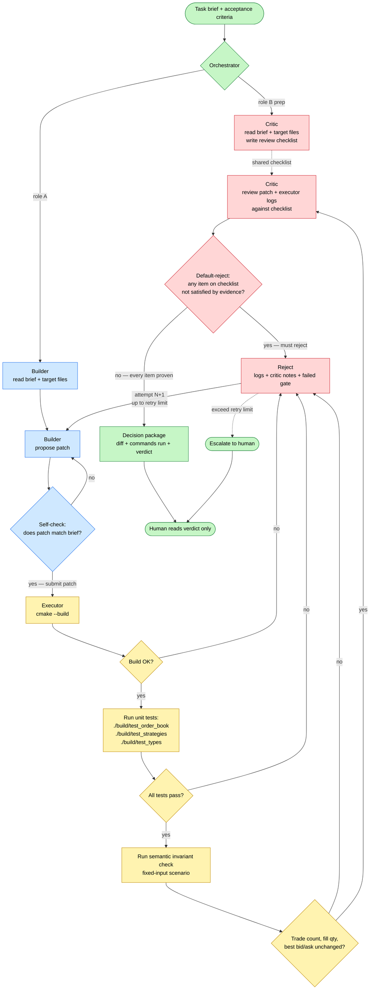
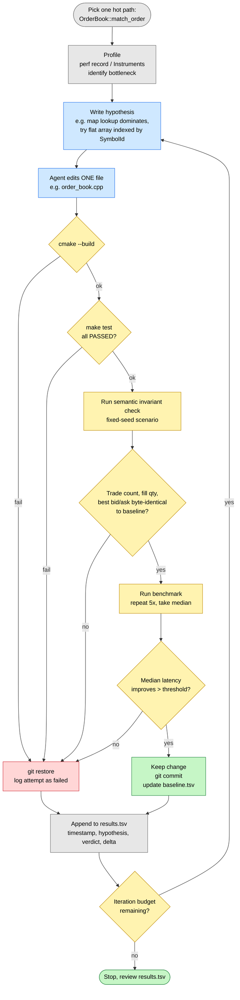

# Agent-Driven Workflow

This document covers two patterns I want to learn instead of hand-coding:

1. **GateKeeper Mode** — multi-agent adversarial review with executable gates. The slide pattern.
2. **Agentic Low-Latency Optimization** — autonomous propose-measure-keep-or-revert loop on hot paths. This *is* "Make It More Measurable" + "Agent-Assisted Optimization" combined; treating them as separate stages is wrong.

Both patterns already have working open-source references and one direct precedent in my own knowledge base. The job is to read those, not to reinvent them.

> Talking to one coding agent in a chat window is not GateKeeper Mode. Without a second role, a deterministic executor, and an acceptance gate, there is no quality system — only a single LLM with edit access.

---

## 1. GateKeeper Mode: Multi-Agent Adversarial Review

- *why don't you need to read the code?*  
- --> *AI internal adversarial review*.

The mechanism that makes this safe is **role separation plus an executable gate**, not "be careful when you ask the agent."



The order of operations matters and was wrong in earlier sketches:

1. Builder and Critic both read the brief, but the Critic's job at this stage is to write a **checklist** of what the patch must prove — not to approve anything.
2. Builder produces the patch.
3. Executor runs **before** the Critic. The Critic must never approve based on reading alone — it must see build logs, test results, and invariant-check output.
4. Critic compares the patch + executor evidence against its pre-written checklist. Default reject unless every checklist item is backed by evidence.

Color mapping to the slide:

| Slide color | Role | Why it must be separate |
|---|---|---|
| Blue column | **Builder** — generate a patch that matches the task | Optimizes for solving |
| Pink column | **Critic** — try to reject the patch | Optimizes for finding holes |
| Orange/yellow nodes | **Executor** — build + test + semantic regression | Replaces LLM judgment with machine output |
| Red diamonds | Decision gates, including the most important one: **default-reject** | The Critic must default to rejection or it's useless |
| Green terminal | Decision package handed to human | The human reads the verdict, not the diff |

The single non-obvious design point: **the Critic must default to rejection**. A Critic that defaults to "looks good" is a sycophant and contributes nothing. The system prompt has to force the burden of proof onto the patch, not onto the rejection.

### Reference to learn first: AutoGen Reflection

Microsoft AutoGen ships a working reference for exactly this pattern, with named message types:

- `CodeWritingTask` — sent to Builder
- `CodeReviewTask` — sent to Critic
- `CodeReviewResult` — Critic verdict
- `CodeWritingResult` — final accepted patch

This is the simplest framework that exposes the orchestration directly. Read the example before adapting anything.

### Why one Claude Code session isn't enough

| Responsibility | If one agent does all three |
|---|---|
| Builder | It writes a patch optimized for plausibility |
| Critic | It rationalizes its own work |
| Executor | It reports what the agent says happened, not what the machine measured |

Three failure modes collapse into one: the loop becomes a self-confirming narrative.

### Plan I can execute today

Three steps, ~2 hours total, no changes to this trading repo yet.

**Step 1 — Run AutoGen Reflection example unchanged** (~30 min)
Goal: see the four message types fly between two agents in your terminal. Don't modify anything.

```bash
pip install "autogen-agentchat" "autogen-ext[openai]"
# clone autogen-core and run the reflection example
```

**Step 2 — Tighten the Critic prompt** (~30 min)
Replace the default reviewer prompt with a forced-rejection one:

```text
You did not write this patch. You assume it is wrong until evidence proves
otherwise. For each approval, list:
  - files reviewed
  - specific tests that cover the change
  - assumptions still unverified
If you cannot list at least one unverified assumption, you have not reviewed
hard enough. Try again.
```

Re-run on a toy problem. Notice how rejection rate jumps. That's the point.

**Step 3 — Add a real Executor role** (~30 min)
The reviewer must not approve based on reading alone. Plug in a tool that runs `cmake --build` and `./build/test_order_book` and feeds stdout back as part of the review context. AutoGen's tool-use docs cover this.

Only after step 3 works on a toy task should the trading repo become a target.

### What to avoid in step 1–3

- Don't start with LangGraph — too much orchestration plumbing for a learning exercise.
- Don't write a custom orchestration framework. AutoGen Reflection is ~150 lines.
- Don't let the Builder and Critic share **hidden reasoning or self-confirmation context** — that is what creates the sycophant. They *must* share the structured artifacts: the task brief, the patch, the executor output, and the review result. Without those shared artifacts the Reflection loop has nothing to operate on. The line is between (a) shared facts and (b) shared rationalizations; only (a) is allowed.

---

## 2. Agentic Low-Latency Optimization

### These are not two phases — they are one practice

The reading guide split this into Phase 3 (measurement) and Phase 4 (optimization). That split is wrong for this pattern.

**The measurement layer is the safety boundary that allows the optimization agent to run unattended.** Without an evaluator that catches semantic regressions, an "optimization" loop happily ships faster but incorrect matching.

Combined, this is exactly the practice in `03-博客与资料/用Agent榨干低延时最后的性能.md`.

### Primary reference: the order-book optimization experiment in my notes

Before reading any GPU-kernel paper, re-read this:

```
03-博客与资料/用Agent榨干低延时最后的性能.md
```

It is the most directly applicable reference I have:

- **Same domain** — order-book matching engine, not GPU kernels.
- **Concrete result** — ~30 min, ~20 iterations, ~23% latency reduction on the QuantCup / Tower Research winner.
- **Real architecture** — only two files: `evaluate.py` (judge) + `program.md` (rules + commit/revert protocol).
- **Real lesson on prompts** — the agent discovered the test data was 75% buy orders and added a `likely()` branch hint. That kind of discovery only happens when the prompt provides domain context (order distribution, low-latency principles), not generic "make it faster."
- **Real lesson on noise** — CPU pinning, process isolation, real-time scheduling. Without these, throughput jitter dominates and the agent reverts good changes.
- **Real lesson on testing** — without thorough unit tests, the agent breaks correctness in pursuit of speed.

That note is written for *this exact problem*. The external references below are useful but secondary — they are GPU-kernel systems, the architecture transfers but the domain doesn't.

### Secondary reference: AutoKernel

AutoKernel mechanizes the same loop on PyTorch GPU kernels. Its repo is small enough to read end-to-end, and its file layout is the lesson:

| AutoKernel file | What it teaches | Equivalent for this project |
|---|---|---|
| `program.md` | The agent's standing instructions, commit/revert protocol | Same name, same purpose — write one for this repo |
| `bench.py` | Fixed benchmark with correctness gate first, perf second | A shell script wrapping `./build/benchmark` plus invariant assertions |
| `verify.py` | End-to-end correctness check | `make test` + a semantic-invariant script |
| `orchestrate.py` | Picks the next target | For now: pick by hand. Don't automate this yet. |
| `results.tsv` | Plain experiment log | Same — TSV per attempt: timestamp, target, hypothesis, verdict, delta |

The architectural lesson, in one line:

> The agent searches inside a bounded target. Every candidate must pass a fixed evaluator before any speed claim is trusted.

### Tertiary references (skim only, don't get pulled in)

- **PyTorch KernelAgent** — richer multi-agent decomposition: `Profile → Diagnose → Prescribe → Orchestrate → Explore → Measure`. Useful later when you want the agent to choose its own target.
- **Cursor multi-agent kernels** — productized version, 38% geomean speedup over 235 CUDA kernels. Useful as evidence the pattern scales.

### The full loop, with this project's actual artifacts



### Why each gate exists (and why none can be removed)

| Gate | Without it, what fails |
|---|---|
| Build | Agent ships syntactically broken code |
| Unit tests | Agent breaks core correctness (e.g. FIFO violated) |
| **Semantic invariants** | Agent silently changes matching behavior — same throughput, wrong P&L. **This is the gate that matters most for trading code.** |
| Performance threshold | Noise gets confused for improvement |
| Repeat 5× median | Single-run jitter approves a regression |

The semantic invariant gate is the difference between optimizing a sorting algorithm and optimizing a trading engine. A faster sort that returns wrong results is obviously broken. A faster matcher that produces a slightly different fill sequence is a multi-million-dollar bug nobody notices.

### Plan I can execute this week

Five steps. Small. Bounded. None of them require building new infrastructure.

**Step 1 — Re-read my own note** (~15 min)
`03-博客与资料/用Agent榨干低延时最后的性能.md`. Specifically the three lessons (testability, environment noise, prompt context) and the `evaluate.py` + `program.md` two-file pattern.

**Step 2 — Read AutoKernel's `program.md` and `bench.py` only** (~45 min)
Don't try to run AutoKernel — it's GPU-targeted. Read those two files for the protocol. Take notes on:
- How the agent is told what counts as success
- How revert is triggered
- How the experiment log is structured

**Step 3 — Capture the current baseline** (~30 min)

```bash
cd /Users/mac/Desktop/Quant/cpp-trader-backtester-main
cmake --build build -j
./build/test_order_book && ./build/test_strategies   # confirm clean
./build/benchmark > experiments/2026-05-01_baseline.txt
```

Annotate the file head:
```
# Apple M1 Pro, clang 15, -O3 -march=native, commit <hash>
# This is the reference. Any optimization must beat this AND match invariants below.
```

**Step 4 — Write the evaluator contract** (~1 hour)
A shell script — not Python, not an MCP server, not an agent framework — that an agent can call:

```bash
# scripts/evaluate.sh — exit 0 = pass, non-zero = revert
set -e
cmake --build build -j > /dev/null
./build/test_order_book > /dev/null
./build/test_strategies > /dev/null
./scripts/check_invariants.sh                    # diff against fixed baseline
./build/benchmark > /tmp/bench.out
./scripts/compare_perf.sh experiments/baseline.txt /tmp/bench.out
```

The two helper scripts are the work. `check_invariants.sh` does an exact diff on trade count / volume / best bid / best ask after a fixed scenario. `compare_perf.sh` checks median latency improved beyond noise threshold over 5 runs.

This is the "measurable layer" — and it's also the executor for the optimization agent. They are the same artifact.

**Step 5 — Write `program.md` for this repo** (~30 min)
Adapted from AutoKernel's. It tells the agent:
- What target it may edit (one file at a time)
- What it must run after each edit (`scripts/evaluate.sh`)
- What to do on pass (commit, log)
- What to do on fail (`git restore`, log)
- What domain context to use (data distribution, low-latency principles — borrowed from my note's section 3)

After step 5, the loop is ready. The first agent run can be the cleanup task already on the list (e.g. `bid_volume()` from O(n) to O(1) by maintaining a counter). Small enough to verify by hand if the loop misbehaves.

### What I will not do at this stage

- Profile-driven targeting (KernelAgent style) — too much new infra, defer until base loop works
- Multi-agent parallel exploration — defer
- Connecting flame graphs into the prompt — defer
- Optimizing `OrderBook::match_order` directly — too risky as the first target. Pick something low-stakes first to validate the loop itself.

---

## Recommended Reading Order

1. `03-博客与资料/用Agent榨干低延时最后的性能.md` (own note — primary)
2. AutoGen Reflection example + docs (quality-gate pattern)
3. AutoKernel `program.md` and `bench.py` (optimization-loop pattern)
4. *Then* apply both to this repo, starting with the evaluator contract

Steps 1–3 are reading. Step 4 is when the trading repo is touched.

---

## Sources

- `03-博客与资料/用Agent榨干低延时最后的性能.md` (local — primary reference for section 2)
- [AutoGen Reflection design pattern](https://microsoft.github.io/autogen/stable/user-guide/core-user-guide/design-patterns/reflection.html)
- [AutoKernel: Autonomous GPU Kernel Optimization (arXiv:2603.21331)](https://arxiv.org/abs/2603.21331)
- [PyTorch KernelAgent: Hardware-Guided GPU Kernel Optimization via Multi-Agent Orchestration (PyTorch blog, 2026-03-06)](https://pytorch.org/blog/kernelagent-hardware-guided-gpu-kernel-optimization-via-multi-agent-orchestration/)
- [Cursor: Speeding up GPU kernels by 38% with a multi-agent system](https://cursor.com/blog/multi-agent-kernels)
- [Adversarial robustness of LLM-based multi-agent systems (Frontiers, 2026)](https://www.frontiersin.org/journals/artificial-intelligence/articles/10.3389/frai.2026.1784484/abstract)
