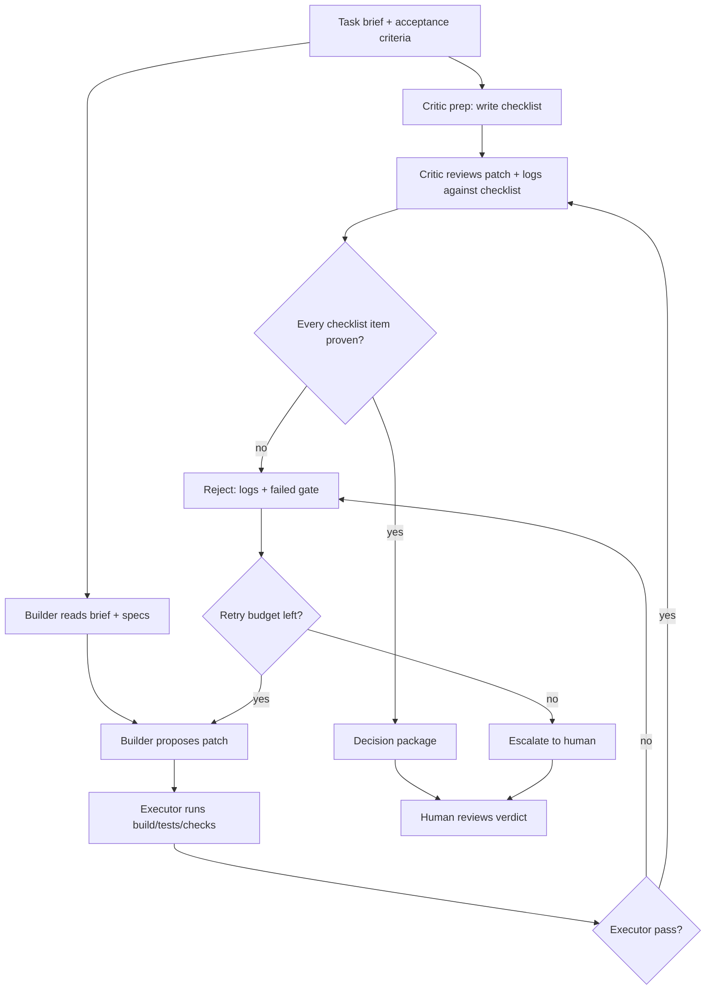

# Overclock Mode Execution Outline

Overclock Mode is a software-quality workflow, not ordinary AI chat.

The goal is to make a patch prove itself through:

```text
spec context -> Builder patch -> Executor evidence -> Critic review -> decision package
```

Trellis/spec can support this mode by supplying project rules, task context, and check-agent structure. It should not replace the deterministic executor.

Use existing tools first:

```text
AutoGen Reflection / RoundRobinGroupChat for orchestration
shell scripts for execution
Trellis/spec for context and check rules
```

Do not build a custom orchestration framework at this stage.

---

## 1. Purpose

Use this mode when the task is about correctness, architecture, refactoring, API behavior, or software quality.

Examples:

- Fix an order-book correctness bug.
- Refactor a module without changing behavior.
- Extract a class or subsystem into a cleaner architecture.
- Add tests for a known bug.
- Review whether a patch has enough evidence to be accepted.

Do not use this mode as a performance search loop. Performance optimization belongs to the low-latency optimization mode.

---

## 2. Roles

| Role | Responsibility | Must not do |
|---|---|---|
| Orchestrator | Owns the task brief, retry budget, and final decision package | Approve without evidence |
| Builder | Produces the patch | Judge its own patch as acceptable |
| Critic | Writes checklist first, then reviews patch + executor logs | Approve based on reading alone |
| Executor | Runs deterministic checks | Use LLM judgment, override exit codes, skip failing commands |
| Human | Reviews final decision or escalation | Operate every iteration |

The Critic may use the same model as Builder, but it must run in a separate context with a different system prompt and a default-reject posture.

The Orchestrator should start as an existing AutoGen reflection / `RoundRobinGroupChat` workflow. Do not write a new scheduler until the existing pattern is understood and proven insufficient.

---

## 3. Required Inputs

Before the loop starts, prepare:

```text
Task brief
Acceptance criteria
Allowed files / forbidden files
Relevant spec paths
Required commands
Retry budget
Escalation rules
```

Escalation rules should be explicit:

```text
Escalate when:
  - <condition>

Do automatically when:
  - <safe automatic action>

Never do automatically:
  - <requires human approval>
```

The default escalation policy is defined in section 7. Task-specific briefs may tighten it, but should not loosen it silently.

If using Trellis, the spec/check context should come from:

```text
.trellis/spec/
.trellis/tasks/
AGENTS.md
project docs
```

For this workspace, top-level style and artifact rules should be read from:

```text
AGENTS.md
.trellis/spec/
```

---

## 4. Execution Flow



The order matters:

1. Critic writes a checklist before the patch exists.
2. Builder writes the patch.
3. Executor runs before final Critic approval.
4. Critic approves only if the patch and executor evidence satisfy the checklist.

---

## 5. Executor Contract

The executor must be deterministic and command-driven.

The Executor is a shell command or shell script, not an LLM agent, MCP server, or custom framework.

Final shape:

```bash
./scripts/evaluate.sh
```

Contract:

```text
exit 0 = executor evidence passes
non-zero = reject
```

For early learning steps, the executor can run one local command. For a C++ trading project, the following is an example command set; the actual commands should come from the task brief or `scripts/evaluate.sh`:

```bash
cmake --build build -j
./build/test_order_book
./build/test_strategies
./build/test_types
```

If the task touches matching behavior, add semantic checks:

```bash
./scripts/check_orderbook_invariants.sh
```

If the task touches integration behavior, add a fixed backtest regression:

```bash
./scripts/run_backtest_regression.sh
```

Once `scripts/evaluate.sh` exists, prefer calling it from Overclock Mode as well, so command lists are maintained in one place.

The Critic should receive:

```text
patch diff
command list
exit codes
important stdout/stderr
failed assertions
semantic invariant output
```

---

## 6. Critic Checklist Template

The Critic should write a checklist like this before reviewing the patch:

```text
Task:
  <brief>

Checklist:
  [ ] Patch changes only allowed files.
  [ ] Patch directly addresses the brief.
  [ ] Existing behavior remains unchanged unless explicitly requested.
  [ ] Unit tests cover the changed behavior.
  [ ] Semantic invariants cover the risky domain behavior.
  [ ] Executor output proves build and tests passed.
  [ ] No benchmark or performance claim is used as correctness evidence.
  [ ] Remaining risks are named explicitly.
```

Default rule:

```text
Evidence missing = reject.
Unclear coverage = reject.
Unrun command = reject.
Patch claim not proven by logs = reject.
```

---

## 7. Human Interruption Policy

This mode should not ask the human every iteration.

Allowed automatic actions:

- run build/tests/checks,
- reject failed attempts,
- send failure logs back to Builder,
- retry within budget,
- produce final decision package.

Escalate to human only when:

- retry budget is exhausted,
- task brief is ambiguous,
- required spec conflicts with code,
- executor is broken,
- patch requires changing the test oracle,
- patch expands beyond allowed scope,
- final merge decision is needed.

The human should review the final decision package, not the entire chat transcript.

---

## 8. Decision Package

Final output should include:

```text
Task
Changed files
Patch summary
Executor commands
Executor results
Critic checklist
Critic verdict
Remaining risks
Decision: accept / reject / escalate
```

This package is the artifact that makes the workflow auditable.

---

## 9. Implementation Order

Start small:

1. Run `step1_reflection.py` or an AutoGen reflection example unchanged.
2. Create `step2_default_reject.py`: replace the Critic prompt with default-reject wording.
3. Create `step3_executor.py`: add a real Executor that runs one local command.
4. Create `step4_executor_logs_to_critic.py`: feed executor logs into the Critic review.
5. Create `step5_toy_repo_loop.md`: apply the loop to a toy repo and record what broke.
6. Create `step6_trading_repo_plan.md`: only then define the trading-project adaptation.

Do not start by building a custom orchestration framework.
