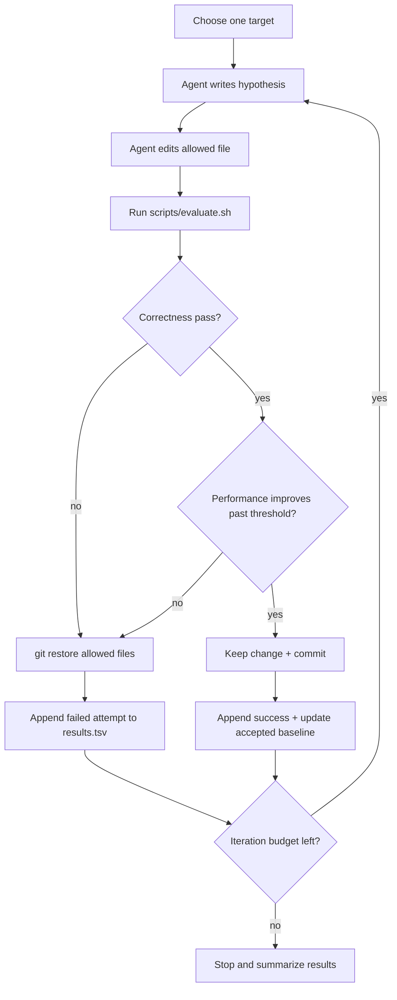

# Agentic Low-Latency Optimization Execution Outline

This mode is an unattended propose-measure-keep-or-revert loop for performance work.

The core idea:

```text
agent proposes one bounded optimization
evaluator decides with correctness first and performance second
passing improvements are kept
failed attempts are reverted and logged
```

Trellis/spec can provide context and rules, but it must not sit in the critical path as a per-iteration human approval system.

Use existing pieces first:

```text
program.md for agent rules
scripts/evaluate.sh for judging
experiments/*.tsv for logging
git worktree / branch for isolation
```

Do not build an MCP server, Python orchestration package, or multi-agent framework before the shell evaluator works.

---

## 1. Purpose

Use this mode when the goal is to improve hot-path performance without changing semantics.

Examples:

- Reduce `OrderBook` matching latency.
- Improve allocation overhead.
- Reduce tick-processing overhead.
- Test a narrow data-layout optimization.
- Run repeated optimization attempts overnight.

Do not use this mode before the evaluator is stable. An optimization loop without a correctness oracle will optimize away business semantics.

---

## 2. Core Principle

Correctness gates come before performance gates.

```text
build -> unit tests -> semantic invariants -> backtest regression -> benchmark
```

Benchmark results are meaningful only after correctness is proven.

---

## 3. Required Artifacts

Minimum files before running this mode:

```text
program.md
scripts/evaluate.sh
scripts/check_orderbook_invariants.sh
scripts/compare_perf.sh
experiments/baseline.tsv
experiments/results.tsv
```

Recommended meaning:

| Artifact | Purpose |
|---|---|
| `program.md` | Standing instructions for the optimization agent |
| `evaluate.sh` | Single command returning pass/fail |
| `check_orderbook_invariants.sh` | Exact semantic checks on fixed scenarios |
| `compare_perf.sh` | Threshold-based performance comparison |
| `baseline.tsv` | Current accepted correctness/performance baseline |
| `results.tsv` | Attempt log, including failures |

Suggested `baseline.tsv` schema:

```tsv
timestamp	target	commit	metric	median_before	median_after	delta_pct	threshold_pct	verdict	notes
```

Suggested `results.tsv` schema:

```tsv
timestamp	target	commit	hypothesis	changed_files	correctness	perf_metric	median_before	median_after	delta_pct	threshold_pct	verdict	revert_reason
```

Thresholds should live in data or config, not hidden in prose. For example:

```text
threshold_pct = 3.0
```

can be stored in `baseline.tsv`, `experiments/config.tsv`, or an environment variable read by `compare_perf.sh`.

---

## 4. Execution Flow



The loop should run without asking the human each iteration.

After a successful commit, the next iteration should compare against the newly accepted baseline. Otherwise consecutive small wins can be misclassified as "no improvement" when measured against stale state.

---

## 5. Evaluator Contract

`scripts/evaluate.sh` is the judge.

It should be a bash script first. Do not wrap it in an MCP server or Python package until the command contract is stable.

It should return:

```text
0 = accept candidate
non-zero = reject candidate
```

Suggested structure:

```bash
#!/usr/bin/env bash
set -euo pipefail

cmake --build build -j

./build/test_order_book
./build/test_strategies
./build/test_types

./scripts/check_orderbook_invariants.sh
./scripts/run_backtest_regression.sh
./scripts/compare_perf.sh
```

Important rule:

```text
Do not diff the entire benchmark output.
Semantic values are exact.
Performance values use repeated runs and thresholds.
```

---

## 6. Semantic Invariant Contract

Semantic invariants are fixed-input, golden-output checks.

For an order book, they should include:

```text
same orders in
same trade sequence out
same trade prices
same trade quantities
same order statuses
same best bid / best ask
same remaining bid / ask volume
same final book state
```

These checks are smaller than a full backtest and stronger than a basic unit test.

They catch "faster but wrong" optimizations.

---

## 7. Performance Contract

Performance comparison should be robust against noise.

Minimum rules:

- run benchmark multiple times,
- compare median or best-of-N consistently,
- require improvement above a threshold,
- record machine/compiler/build flags,
- avoid trusting one run.

Example policy:

```text
Run benchmark 5 times.
Use median latency.
Accept only if median improves by >= 3%.
Reject if semantic invariants fail, regardless of speed.
```

The threshold is target-specific. `3%` is a starting example, not a universal constant. Make it configurable through `baseline.tsv`, `experiments/config.tsv`, or a variable consumed by `compare_perf.sh`.

For serious low-latency work, later add:

- CPU pinning,
- process isolation,
- fixed build mode,
- stable thermal conditions,
- perf/Instruments counters.

Do not start with these if the base evaluator is not working.

---

## 8. Agent Boundaries

The optimization agent must be constrained.

`program.md` should state:

```text
Allowed target:
  <one file or one module>

Forbidden:
  changing tests to make the patch pass
  changing golden outputs without approval
  changing benchmark workload to look faster
  broad refactors
  unrelated formatting churn

On success:
  commit patch
  append results.tsv
  update accepted baseline only if policy allows

On failure:
  git restore allowed files
  append results.tsv
  continue until iteration budget expires
```

The agent can be creative inside the target, but not outside the evaluation contract.

---

## 9. Trellis / Spec Boundary

Trellis/spec is useful as a context layer:

```text
hard rules
allowed files
domain constraints
review checklist
bad-case memory (TODO: formalize where this lives)
```

It should not control every iteration through human approval.

Allowed automatic actions:

- run `evaluate.sh`,
- revert failed attempts,
- log attempts,
- continue to next hypothesis,
- summarize final results.

Escalate to human only when:

- evaluator fails for infrastructure reasons,
- the agent wants to change tests or golden outputs,
- the agent wants to expand scope,
- the result is ready for final merge,
- the spec is ambiguous or contradictory.

The loop should be low-interrupt by default.

---

## 10. First Practical Target

Do not start with `OrderBook::match_order` if the loop is untested.

Start with a smaller target:

```text
maintain bid/ask volume counters instead of recomputing total volume
```

Why:

- local scope,
- easy semantic tests,
- low business risk,
- clear performance hypothesis,
- good evaluator smoke test.

After the loop survives small targets, move to matching hot paths.

---

## 11. Output Summary

At the end of an optimization run, produce:

```text
Target
Iteration count
Accepted commits
Rejected attempts
Best improvement
Median before / after
Semantic checks run
Backtest checks run
Remaining risks
Next suggested target
```

The summary should be enough for a human to decide whether to merge or discard the experiment branch.
