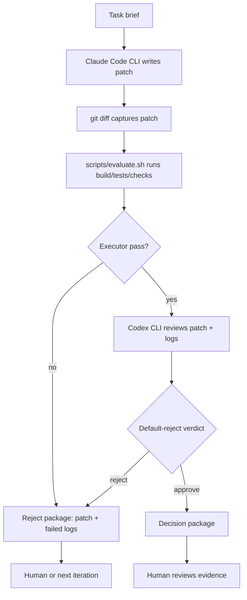

# Claude Code Builder + Codex Reviewer Branch

This is a practical branch of Overclock Mode that avoids building a new agent framework.

Instead of using AutoGen as the main runtime, use the CLIs already available on the machine:

```text
Builder  = Claude Code CLI
Executor = shell script
Critic   = Codex CLI
Human    = reads final decision package
```

This branch is useful when Claude Code and Codex are already logged in locally, so no API key is required inside the script.

---

## 1. Why This Branch Exists

The AutoGen version is useful for learning the reflection pattern, but it is not the fastest route to a working local Overclock loop.

The CLI branch follows the "do not reinvent the wheel" principle:

```text
Claude Code already knows how to edit files.
Codex already knows how to review code.
Shell scripts already know how to run tests.
Git already knows how to produce diffs and isolate changes.
```

So the first runnable Overclock implementation should compose these tools instead of building a custom scheduler.

---

## 2. Workflow



The order remains the same as Overclock Mode:

```text
AI proposes.
Machine verifies.
Another AI challenges.
Human reads evidence.
```

---

## 3. Directory Layout

Recommended files:

```text
02-Agent-Driven Workflow/
  04. Claude Code Builder + Codex Reviewer Branch.md

scripts/
  overclock_cli_loop.sh
  evaluate.sh

overclock_runs/
  <timestamp>/
    brief.md
    builder_prompt.md
    patch.diff
    eval.log
    critic_prompt.md
    critic.md
    decision.md
```

`overclock_runs/` should be gitignored if it stores temporary logs. Promote only useful summaries into docs.

---

## 4. Required Local Assumptions

Before running this branch:

```bash
claude --version
codex --version
```

Both tools should already be authenticated in the local environment.

This branch does **not** assume:

```text
ANTHROPIC_API_KEY
OPENAI_API_KEY
AutoGen SDK
LangGraph
MCP server
custom agent runtime
```

If either CLI is not available, do not build a replacement framework. Fix the local CLI setup first.

---

## 5. Builder Prompt Contract

Claude Code receives the task brief and allowed scope.

Template:

```text
You are the Builder in an Overclock workflow.

Task:
<task brief>

Allowed files:
<paths>

Rules:
- Make the smallest patch that satisfies the task.
- Do not change tests or golden outputs unless explicitly allowed.
- Do not commit.
- Do not run broad refactors.
- After editing, stop and summarize changed files.

The Executor and Codex Critic will review your patch.
```

Claude Code should write the patch directly in the worktree.

---

## 6. Executor Contract

The executor is still the deterministic judge.

First version:

```bash
./scripts/evaluate.sh
```

Minimum `evaluate.sh` shape:

```bash
#!/usr/bin/env bash
set -euo pipefail

cmake --build build -j
./build/test_order_book
./build/test_strategies
./build/test_types
```

Later add:

```bash
./scripts/check_orderbook_invariants.sh
./scripts/run_backtest_regression.sh
```

Do not let Claude Code or Codex reinterpret failing commands. Exit code is the gate.

---

## 7. Critic Prompt Contract

Codex receives:

```text
task brief
patch.diff
eval.log
allowed scope
required checks
```

Template:

```text
You are the Critic in an Overclock workflow.
You did not write this patch.

Default posture:
Reject unless the patch proves itself with evidence.

Review inputs:
1. Task brief
2. Patch diff
3. Executor log

Checklist:
- Does the patch stay within allowed files?
- Does it directly address the task?
- Did the executor run the required commands?
- Did every required command pass?
- Are risky behavior changes covered by tests or semantic invariants?
- Are there any claims not supported by evidence?

Output exactly one verdict:

APPROVE
Evidence:
- ...
Remaining risk:
- ...

or

REJECT
Missing evidence:
- ...
Required next action:
- ...
```

Codex should not approve because the code "looks fine". It must cite evidence from the patch and executor log.

---

## 8. Shell Loop

**Implemented**: `scripts/overclock_cli_loop.sh`

Key features:

```text
Pre-flight checks:
  ✓ Git repository required
  ✓ Working directory must be clean
  ✓ CLI availability verified

Brief format:
  YAML frontmatter with eval_command
  Or markdown section "## Evaluator Command"

Claude Code:
  --print --allowedTools "Edit,Write,Read,Bash"

Codex:
  --skip-git-repo-check (for non-git subdirs)

Decision:
  APPROVE → keep changes
  REJECT  → git checkout -- .
```

Usage:

```bash
./scripts/overclock_cli_loop.sh overclock_runs/example-brief.md
```

Run directory structure:

```text
overclock_runs/<timestamp>/
  brief.md
  builder_prompt.md
  builder.log
  patch.diff
  changed_files.txt
  eval.log
  critic_prompt.md
  critic.md
  decision.md
```

---

## 9. Human Interruption Policy

This branch should be low-interrupt.

Automatic:

- Claude Code edits within allowed scope.
- Executor runs.
- Codex reviews.
- Logs are saved.
- Failed executor output becomes a reject package.

Ask human only when:

- Claude Code wants to change tests or golden outputs.
- Patch expands beyond allowed files.
- Executor script is missing or broken.
- Codex rejects for missing specification.
- Final merge decision is needed.

Do not ask after every failed attempt.

---

## 10. First Use Case

Use a toy task first:

```text
Create a small Python utility function.
Claude Code writes it.
evaluate.sh runs a tiny test command.
Codex reviews patch + logs.
```

Then try the trading project:

```text
Task: Add a regression test for best_bid / best_ask behavior.
Allowed files:
  src/test_order_book.cpp

Executor:
  cmake --build build -j
  ./build/test_order_book
```

Do not start with `OrderBook::match_order` optimization.

---

## 11. Summary

This branch is the most practical Overclock MVP:

```text
Claude Code writes.
Shell verifies.
Codex rejects or approves.
Human reads the decision package.
```

It preserves the Overclock quality structure while avoiding a new orchestration framework.

