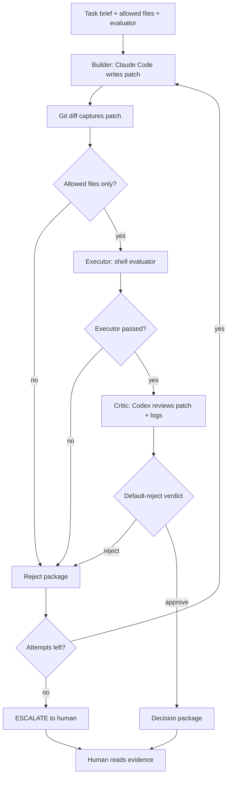
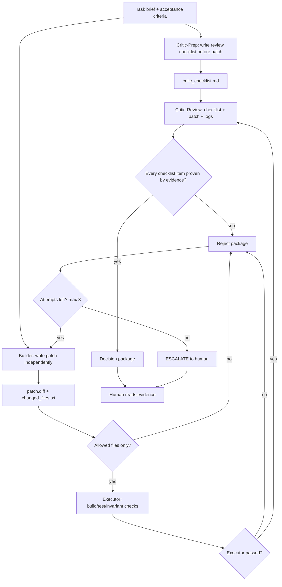

# Claude Code Builder + Codex Reviewer Branch

This branch implements Overclock Mode with local CLIs instead of a new agent
runtime.

The goal is not "multiple models vote on code." The goal is role separation plus
an executable gate:

```text
AI proposes.
Machine verifies.
Another AI challenges.
Human reads evidence.
```

The current CLI implementation proves the practical path. The next upgrade is
to make the Critic appear before the patch exists, so it can define the evidence
standard before the Builder can influence it.

---

## 1. Current CLI Roles

Implemented roles:

```text
Builder  = Claude Code CLI writes the patch
Executor = shell evaluator runs deterministic checks
Critic   = Codex CLI reviews patch + executor logs
Judge    = script writes decision package
Human    = reads final evidence and decides whether to apply
```

Target Overclock roles:

```text
Critic-Prep   = Codex writes review checklist before patch
Builder       = Claude Code writes patch independently
Executor      = shell evaluator runs build/tests/invariants
Critic-Review = Codex reviews patch + logs against pre-written checklist
Judge         = script writes decision package
Human         = decides final apply/merge
```

The difference is important:

```text
Current: Critic reviews after the patch exists.
Target: Critic defines rejection criteria before the patch exists.
```

That pre-patch checklist is what moves the CLI branch from Overclock Lite+ to
full Overclock Mode.

---

## 2. Why Use CLI First

This branch follows the "do not reinvent the wheel" principle:

```text
Claude Code already knows how to edit files.
Codex already knows how to review code.
Shell scripts already know how to run tests.
Git already knows how to isolate work.
```

This is not a claim that AutoGen, LangGraph, or LangChain are too expensive to
learn. They can be useful later. The reason to use CLI first is narrower:

```text
prove the quality-control semantics with visible artifacts on disk
before hiding the flow inside an orchestration framework
```

---

## 3. Implemented Workflow: Overclock Lite+



This is already stronger than ordinary AI code review because:

- Builder cannot approve its own work.
- Executor checks facts before Critic sees the patch.
- Critic uses default-reject verdict parsing.
- Rejects feed the next Builder attempt.
- The main worktree stays untouched unless `--apply` is explicit.

But it is still not the complete slide pattern because Critic does not yet write
a checklist before Builder starts.

---

## 4. Target Workflow: Full Overclock Mode



The core rule:

```text
Critic is not a reviewer who appears after the patch.
Critic is an adversary who defines the evidence standard before the patch.
```

---

## 5. Brief Contract

Every task must be verifiable.

Example:

```yaml
task: "Fix best_bid / best_ask regression"
allowed_files:
  - "src/order_book.cpp"
  - "include/order_book.h"
eval_script: "scripts/evaluate.sh"
max_attempts: 3
acceptance_criteria:
  - "All unit tests pass"
  - "best_bid / best_ask unchanged on fixed scenario"
  - "Patch must not modify tests"
  - "No broad refactor"
```

If the brief is vague, adversarial review degrades into model guessing.

---

## 6. Critic-Prep Contract

Inputs:

```text
brief.md
allowed_files
acceptance criteria
current target files
```

Output:

```text
critic_checklist.md
```

Checklist shape:

```markdown
# Review Checklist

## Scope
- [ ] Patch only touches allowed files
- [ ] No tests or golden outputs changed unless allowed
- [ ] No unrelated refactor

## Functional Correctness
- [ ] Required behavior is implemented
- [ ] Edge cases from the brief are covered
- [ ] Existing behavior is preserved where required

## Evidence Required
- [ ] Build log shows success
- [ ] Unit test log shows required tests passed
- [ ] Semantic invariant log proves fixed scenario unchanged

## Rejection Triggers
- Missing executor log
- Changed files outside allowed scope
- Behavior claim without test or invariant evidence
- Semantic invariant mismatch
```

For v1.1, keep this checklist hidden from Builder. Builder gets the brief, not
the Critic's analysis. That keeps the goals separated.

---

## 7. Builder Contract

Claude Code receives:

```text
brief.md
allowed files
target files
retry evidence, only after a previous reject
```

Rules:

```text
- Make the smallest patch that satisfies the task.
- Edit only allowed files.
- Do not run shell commands.
- Do not commit.
- Do not run broad refactors.
- Stop after editing and summarize changed files.
```

Builder artifacts:

```text
builder_prompt.md
builder.log
patch.diff
changed_files.txt
```

---

## 8. Executor Contract

Executor is the deterministic judge.

Example:

```bash
#!/usr/bin/env bash
set -euo pipefail

cmake --build build -j
./build/test_order_book
./build/test_strategies
./build/test_types
./scripts/check_orderbook_invariants.sh
```

Rules:

```text
- Exit code is the gate.
- No LLM interpretation of failing commands.
- No mutation of tests or golden outputs.
- Logs must be saved as evidence.
```

If Executor fails, the attempt is rejected without asking Critic to review.

---

## 9. Critic-Review Contract

Inputs:

```text
brief.md
critic_checklist.md
patch.diff
changed_files.txt
eval.log
invariant.log, when available
```

Output must be structured:

```text
VERDICT: APPROVE | REJECT
SUMMARY: <one line>

Checklist result:
- <item>: PASS/FAIL, with evidence

Missing evidence:
- ...

Required next action:
- ...
```

Default-reject rule:

```text
Missing evidence = REJECT.
Executor did not run = REJECT.
Changed files outside allowed scope = REJECT.
Behavior changed without invariant evidence = REJECT.
Risk not covered by tests = REJECT.
```

Critic must not approve because the patch "looks fine."

---

## 10. Retry And Escalation

Default:

```text
max_attempts = 3
```

Loop:

```text
REJECT notes + failed gate + logs
  -> Builder retry
  -> Executor rerun
  -> Critic-review rerun
```

After 3 failed attempts:

```text
ESCALATE to human
```

Escalation means:

```text
- Do not ask Builder again.
- Do not auto-apply.
- Preserve the worktree.
- Write final_decision.md with all attempt summaries.
```

---

## 11. Current Files

```text
scripts/
  overclock_cli_loop.sh
  evaluators/
    evaluate_safe_divide.sh
    evaluate_safe_add.sh
    evaluate_safe_multiply.sh
    evaluate_impossible.sh
    evaluate_retry_deterministic.sh

overclock_runs/
  <timestamp>/
    attempt-1/
    attempt-2/
    final_decision.md

tests/
  test_verdict_parsing.sh
```

Run:

```bash
./scripts/overclock_cli_loop.sh --max-attempts 3 <brief.md>
```

Manual apply only after final approval:

```bash
git apply overclock_runs/<timestamp>/attempt-N/patch.diff
```

---

## 12. Research Notes: Why Attacker Is Later

Attacker is useful, but it should not become the next blocking gate.

The useful version of Attacker is not "another reviewer." It is a
counterexample generator:

```text
Critic   = checks whether checklist items are proven by evidence
Attacker = searches for executable counterexamples outside the checklist
Executor = verifies whether those counterexamples are real
Judge    = records the result in the decision package
```

The research signal is consistent with this design:

- Adversarial multi-agent review can reduce false positives, but adversarial
  language alone is insufficient. Empirical validation remains mandatory.
- Multi-agent debate and reviewer ensembles can suffer from correlated errors,
  identity bias, and persuasive-but-wrong agreement.
- Coder-reviewer-tester structures improve resilience, but extra roles increase
  cost and can still be attacked or misled.
- Code review agents are more useful when they reason over concrete vulnerability
  patterns and executable evidence than when they react to adversarial comments.

Therefore Attacker must be evidence-producing:

```text
Good Attacker output:
- runnable failing test
- reproducible command
- concrete input/output counterexample
- semantic invariant violation

Bad Attacker output:
- "this might be risky"
- another free-form review
- unverified suspicion
- model-vote disagreement
```

Blocking rule for a future Attacker gate:

```text
Attacker can block only if Executor verifies the counterexample.
Natural-language concern alone is recorded as non-blocking risk.
```

First implementation should be `shadow` mode:

```text
ATTACKER_MODE=shadow

Run Attacker after Critic-Review APPROVE.
Save attacker.md and attacker_eval.log.
Record findings in final_decision.md.
Do not change APPROVE / REJECT yet.
```

Promotion criteria from shadow mode to blocking mode:

```text
confirmed_bug_count / attacker_run_count is consistently high
false_positive_count is manageable
average extra time and token cost are acceptable
```

This keeps the system empirical: Attacker earns blocking authority by producing
verified counterexamples, not by sounding adversarial.

---

## 13. Roadmap

Recommended sequence:

```text
1. Overclock Lite+                    DONE
   Builder -> Executor -> Critic -> Retry -> Decision

2. Full Overclock Mode v1.1            NEXT
   Add Critic-prep checklist before Builder.
   Make Critic-review use the pre-written checklist.

3. Attacker Shadow Mode v2             LATER
   Run after Critic APPROVE.
   Generate executable counterexamples.
   Record findings without blocking.

4. Attacker Blocking Gate v3           ONLY AFTER DATA
   Block only on Executor-verified counterexamples.

5. Parallel search / framework runtime LATER
   Consider AutoGen, LangGraph, or other orchestration only after the semantics
   are stable in the CLI implementation.
```

---

## 14. What Not To Add Yet

Do not add these until Critic-prep is implemented and validated:

- Attacker role
- multi-builder parallel search
- AutoGen/LangGraph runtime migration
- trading system optimization loop

Attacker is a good v2 role, but it should produce runnable counterexamples, not
free-form suspicion.

---

## 15. Summary

Current branch:

```text
Overclock Lite+:
Builder -> Executor -> Critic -> Retry -> Decision
```

Next branch:

```text
Full Overclock Mode:
Critic-prep checklist
+ Builder independent patch
+ Executor evidence gate
+ Critic-review against pre-written checklist
+ retry loop
+ decision package
```

Future branch:

```text
Attacker Shadow:
Critic APPROVE
+ Attacker searches for executable counterexample
+ Executor verifies counterexample
+ Judge records non-blocking risk
```

---

## References

- [Refute-or-Promote: Adversarial Stage-Gated Multi-Agent Review for High-Precision LLM-Assisted Defect Discovery](https://arxiv.org/html/2604.19049v1)
- [AutoGen Application Stack](https://microsoft.github.io/autogen/stable//user-guide/core-user-guide/core-concepts/application-stack.html)
- [Analyzing Code Injection Attacks on LLM-based Multi-Agent Systems in Software Development](https://arxiv.org/html/2512.21818v1)
- [Combating Adversarial Attacks with Multi-Agent Debate](https://arxiv.org/html/2401.05998v1)
- [Measuring and Mitigating Identity Bias in Multi-Agent Debate via Anonymization](https://openreview.net/forum?id=XxBR2KNWNh)
- [LLM Code Reviewers Are Harder to Fool Than You Think](https://arxiv.org/html/2602.16741v1)
