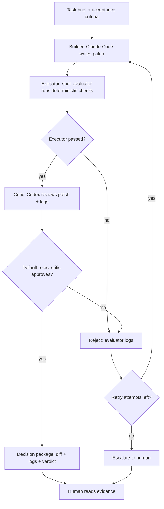
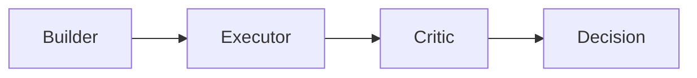

# Overclock CLI MVP Status

## Current State

**Single-pass Overclock gate is validated.**

Implemented:

```text
Builder -> Executor -> Critic -> Decision Package
```

Not yet implemented:

```text
Reject -> Builder retry loop with attempt limit
```

---

## Validated Scenarios

| Scenario | Result | Evidence |
|----------|--------|----------|
| APPROVE path | ✓ Pass | `overclock_runs/20260503-150724/` |
| Executor rejection | ✓ Pass | `overclock_runs/20260503-151227/` |
| Verdict parsing | ✓ Pass | `tests/test_verdict_parsing.sh` |
| Semantic Critic REJECT | ✓ Pass | `overclock_runs/20260503-153929/` |

### Evidence Details

**APPROVE path** (`20260503-150724`):

```text
Task: Create safe_divide utility
Builder: Created safe_math.py + test_safe_math.py
Executor: 4/4 tests PASS
Critic: VERDICT: APPROVE
Decision: Approved, worktree preserved
```

**Executor rejection** (`20260503-151227`):

```text
Task: Create safe_divide with missing test file
Builder: Only created safe_math.py (respected allowed_files)
Executor: FAIL - test_safe_math.py not found
Decision: REJECT (Executor Failed)
```

**Semantic Critic REJECT** (`20260503-153929`):

```text
Task: safe_divide must catch ONLY ZeroDivisionError
Patch: Uses except Exception: (wrong)
Executor: 4/4 tests PASS
Critic: VERDICT: REJECT
Reason: catches unrelated exceptions instead of only ZeroDivisionError
```

This proves:
- Critic performs semantic code review
- Critic does not just replay test results
- Default-reject posture catches issues tests miss

---

## Target Loop (Not Yet Implemented)



Current MVP only implements single-pass:



---

## Next Step: Retry Loop v1

### Goal

Add automatic retry when rejected:

```text
REJECT -> logs + critic notes -> Builder retry -> re-run Executor -> re-run Critic
```

This turns the current single-pass gate into a small adversarial repair loop.
The loop should still stay boring: no new orchestration framework is required
for v1 because the CLI branch already proves the role split.

This is not a statement that LangChain, LangGraph, or AutoGen are too hard to
learn. They can be useful later. The reason to keep v1 in shell is narrower:
prove the retry semantics first, with every artifact visible on disk.

### Implementation Plan

1. **Add `--max-attempts` parameter**

   Default: 3

   ```bash
   ./scripts/overclock_cli_loop.sh --max-attempts 3 <brief.md>
   ```

   Rules:
   - `max_attempts` means total Builder attempts, not retries after the first attempt.
   - `--max-attempts 1` should behave like the current single-pass MVP.
   - Invalid values (`0`, negative, non-number) must fail in pre-flight.

2. **Per-attempt directory structure**

   ```text
   overclock_runs/<timestamp>/
     attempt-1/
       builder_prompt.md
       builder.log
       patch.diff
       eval.log
       critic.md
       decision.md
     attempt-2/
       ...
     final_decision.md
   ```

3. **Use one persistent worktree per run**

   Keep one branch/worktree for the whole run:

   ```text
   .overclock_worktrees/<timestamp>
   overclock/<timestamp>
   ```

   Between attempts:
   - Do not create a new worktree.
   - Reset only the experiment worktree back to the original base commit.
   - Never reset or clean the main worktree.

   The retry prompt gives the Builder failure evidence from the previous
   attempt. The Builder then writes a fresh patch in the same isolated worktree.

4. **Retry prompt must include failure evidence**

   ```text
   Previous attempt was rejected.

   Attempt:
   <N of max_attempts>

   Reason:
   <decision summary>

   Executor log:
   <eval.log>

   Critic notes:
   <critic.md>

   Fix the patch. Do not repeat the rejected mistake.
   ```

   For attempt 1, use the original Builder prompt.
   For attempt 2 and 3, append the previous attempt's decision package and logs.

5. **Termination conditions**

   - APPROVE → stop, output decision package
   - REJECT + attempts left → retry
   - REJECT after 3 attempts → escalate to human

   Escalation means:

   ```text
   Do not ask the Builder again.
   Do not auto-apply.
   Preserve the worktree.
   Write final_decision.md with:
     - final verdict: ESCALATE
     - all attempt summaries
     - last patch
     - last executor log
     - last critic notes
     - cleanup commands
   ```

6. **Attempt decision format**

   Each attempt writes its own `attempt-N/decision.md`:

   ```text
   Verdict: APPROVE | REJECT
   Gate: BUILDER | SCOPE | EXECUTOR | CRITIC
   Summary: <one line>
   Evidence:
     - patch.diff
     - eval.log
     - critic.md
   ```

   The top-level `final_decision.md` should summarize the whole run:

   ```text
   Final verdict: APPROVE | ESCALATE
   Attempts used: N / 3
   Final worktree: .overclock_worktrees/<timestamp>
   Final branch: overclock/<timestamp>
   ```

7. **Builder failure behavior**

   Builder failure still counts as an attempt.
   If Claude Code exits non-zero:

   ```text
   attempt-N/decision.md = REJECT
   gate = BUILDER
   retry if attempts remain
   escalate if attempt N == max_attempts
   ```

   The retry prompt should include `builder.log` as evidence.

8. **Executor failure behavior**

   Executor failure also counts as an attempt.
   Retry prompt should include:

   ```text
   - evaluator exit code
   - eval.log
   - patch.diff
   ```

   This lets Builder fix compile/test/semantic-invariant failures without the
   human reading the code.

9. **Critic rejection behavior**

   Critic rejection counts as an attempt.
   Retry prompt should include:

   ```text
   - critic.md
   - decision summary
   - patch.diff
   - eval.log
   ```

   This is the core adversarial loop: the next Builder attempt must respond to
   specific missing evidence, not just try again blindly.

10. **Auto-apply rule**

    `--apply` may only run after `final_decision.md` is APPROVE.
    It must not apply after a partial attempt approval unless that approval is
    the final loop result.

    Before applying, keep the existing clean main worktree check.

11. **Test plan**

    Add toy briefs for three cases:

    ```text
    tests / run artifacts:
    1. attempt-1 APPROVE
       Expected: stops after attempt 1.

    2. attempt-1 Executor REJECT, attempt-2 APPROVE
       Expected: retry prompt includes eval.log; final APPROVE.

    3. attempt-1..3 REJECT
       Expected: final_decision.md = ESCALATE; worktree preserved.
    ```

    Keep `tests/test_verdict_parsing.sh` as a parser unit test.
    Add a small shell test only if the parsing or attempt-state code becomes
    hard to reason about.

### Not Doing Yet

- AutoGen orchestration
- LangGraph
- Multi-builder parallelism
- Trading project integration
- Performance optimization loop

---

## File Structure

```
scripts/
  overclock_cli_loop.sh       # Main loop (single-pass)
  evaluators/
    evaluate_safe_divide.sh   # Toy evaluator

overclock_runs/               # Run history
  20260503-150724/            # APPROVE case
  20260503-151227/            # Executor rejection
  20260503-153929/            # Semantic REJECT case

tests/
  test_verdict_parsing.sh     # Verdict parser unit tests
```

---

## Commands

```bash
# Run single-pass Overclock
./scripts/overclock_cli_loop.sh <brief.md>

# With auto-apply on APPROVE
./scripts/overclock_cli_loop.sh --apply <brief.md>

# Clean up worktrees
git worktree remove .overclock_worktrees/<timestamp>
git branch -D overclock/<timestamp>
```

---

## Summary

```text
MVP Status: Single-pass gate validated ✓

Ready for:
- Retry loop implementation
- Production evaluators
- Real project tasks

Not ready for:
- Automatic multi-round fixes
- Complex orchestration
```
