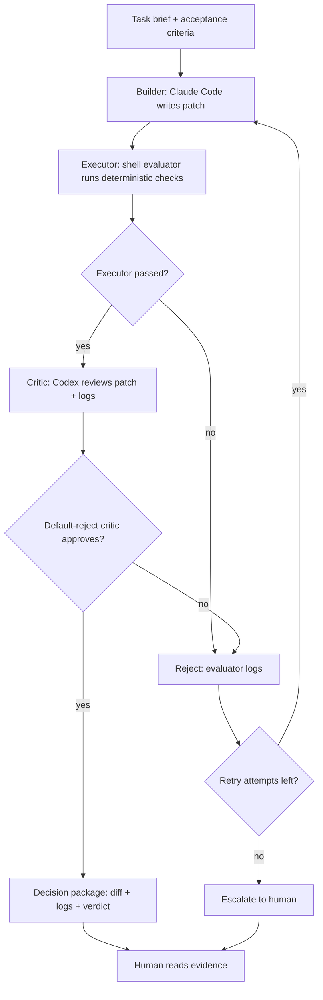
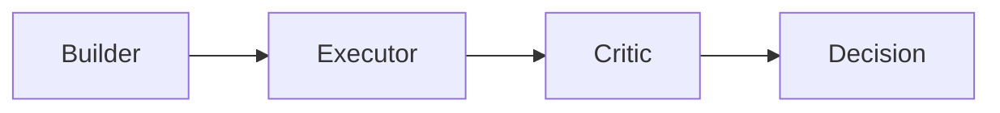

# Overclock CLI MVP Status

## Current State

**Single-pass Overclock gate is validated.**

Implemented:

```text
Builder -> Executor -> Critic -> Decision Package
```

Not yet implemented:

```text
Reject -> Builder retry loop with attempt limit
```

---

## Validated Scenarios

| Scenario | Result | Evidence |
|----------|--------|----------|
| APPROVE path | ✓ Pass | `overclock_runs/20260503-150724/` |
| Executor rejection | ✓ Pass | `overclock_runs/20260503-151227/` |
| Verdict parsing | ✓ Pass | `tests/test_verdict_parsing.sh` |
| Semantic Critic REJECT | ✓ Pass | `overclock_runs/20260503-153929/` |

### Evidence Details

**APPROVE path** (`20260503-150724`):

```text
Task: Create safe_divide utility
Builder: Created safe_math.py + test_safe_math.py
Executor: 4/4 tests PASS
Critic: VERDICT: APPROVE
Decision: Approved, worktree preserved
```

**Executor rejection** (`20260503-151227`):

```text
Task: Create safe_divide with missing test file
Builder: Only created safe_math.py (respected allowed_files)
Executor: FAIL - test_safe_math.py not found
Decision: REJECT (Executor Failed)
```

**Semantic Critic REJECT** (`20260503-153929`):

```text
Task: safe_divide must catch ONLY ZeroDivisionError
Patch: Uses except Exception: (wrong)
Executor: 4/4 tests PASS
Critic: VERDICT: REJECT
Reason: catches unrelated exceptions instead of only ZeroDivisionError
```

This proves:
- Critic performs semantic code review
- Critic does not just replay test results
- Default-reject posture catches issues tests miss

---

## Target Loop (Not Yet Implemented)



Current MVP only implements single-pass:



---

## Next Step: Retry Loop v1

### Goal

Add automatic retry when rejected:

```text
REJECT -> logs + critic notes -> Builder retry -> re-run Executor -> re-run Critic
```

### Implementation Plan

1. **Add `--max-attempts` parameter**

   Default: 2

   ```bash
   ./scripts/overclock_cli_loop.sh --max-attempts 2 <brief.md>
   ```

2. **Per-attempt directory structure**

   ```text
   overclock_runs/<timestamp>/
     attempt-1/
       builder_prompt.md
       builder.log
       patch.diff
       eval.log
       critic.md
       decision.md
     attempt-2/
       ...
     final_decision.md
   ```

3. **Retry prompt must include failure evidence**

   ```text
   Previous attempt was rejected.

   Reason:
   <decision summary>

   Executor log:
   <eval.log>

   Critic notes:
   <critic.md>

   Fix the patch. Do not repeat the rejected mistake.
   ```

4. **Termination conditions**

   - APPROVE → stop, output decision package
   - REJECT + attempts left → retry
   - REJECT + no attempts left → escalate to human

### Not Doing Yet

- AutoGen orchestration
- LangGraph
- Multi-builder parallelism
- Trading project integration
- Performance optimization loop

---

## File Structure

```
scripts/
  overclock_cli_loop.sh       # Main loop (single-pass)
  evaluators/
    evaluate_safe_divide.sh   # Toy evaluator

overclock_runs/               # Run history
  20260503-150724/            # APPROVE case
  20260503-151227/            # Executor rejection
  20260503-153929/            # Semantic REJECT case

tests/
  test_verdict_parsing.sh     # Verdict parser unit tests
```

---

## Commands

```bash
# Run single-pass Overclock
./scripts/overclock_cli_loop.sh <brief.md>

# With auto-apply on APPROVE
./scripts/overclock_cli_loop.sh --apply <brief.md>

# Clean up worktrees
git worktree remove .overclock_worktrees/<timestamp>
git branch -D overclock/<timestamp>
```

---

## Summary

```text
MVP Status: Single-pass gate validated ✓

Ready for:
- Retry loop implementation
- Production evaluators
- Real project tasks

Not ready for:
- Automatic multi-round fixes
- Complex orchestration
```
