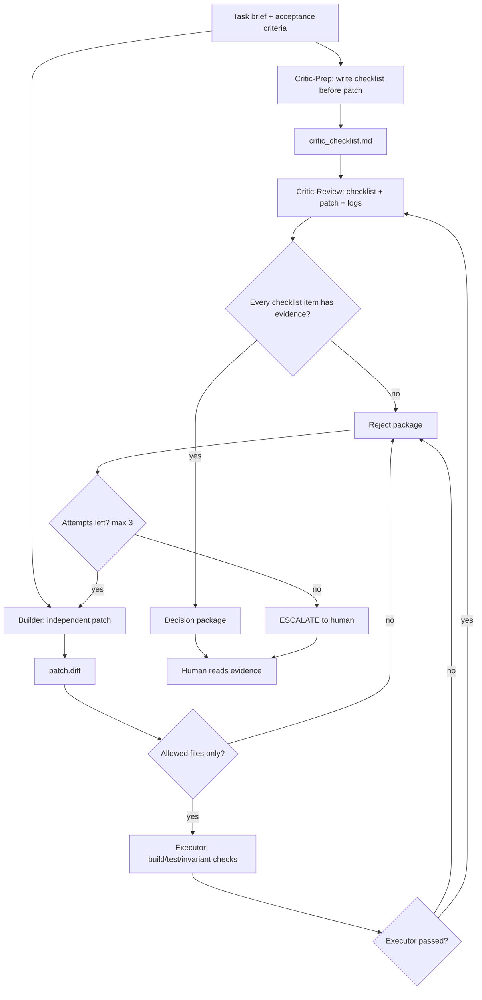

# Overclock CLI MVP Status

## Current State

**Full Overclock Mode v1.1 validated.**

Validation date: 2026-05-03

Current implemented loop:

```text
Critic-Prep writes checklist before patch
    ↓
Builder writes patch independently
    ↓
Executor runs deterministic checks
    ↓
Critic-Review checks patch + logs against pre-written checklist
    ↓
REJECT → retry with failure evidence → Builder retry
    ↓
Max attempts exhausted → ESCALATE to human
```

Parameters:

- `--max-attempts N` (default: 3, min: 1)
- `--apply` (only after final APPROVE)
- `--help` / `-h`

Run artifacts:

```text
overclock_runs/<timestamp>/
  critic_checklist.md           # Clean checklist artifact (via codex -o)
  critic_prep_prompt.md         # Full prompt sent to Critic-Prep
  critic_prep.log               # Full Codex CLI transcript
  attempt-1/
    builder_prompt.md
    builder.log
    patch.diff
    eval.log
    critic_prompt.md            # Includes pre-written checklist
    critic.md
    decision.md
  attempt-2/
    ...
  final_decision.md
```

Final output:

```text
final_decision.md = APPROVE | ESCALATE | SETUP_FAILED
```

Core design principle:

```text
Critic is not just a reviewer after the patch.
Critic is the adversary that defines what evidence counts BEFORE the patch.
```

---

## Full Overclock Mode Design

The key design point:

```text
Critic is not just a reviewer after the patch.
Critic is the adversary that defines what evidence counts BEFORE the patch.
```

Current implementation:

```text
Phase 0: Critic-Prep
  - Input: brief.md, allowed_files, current target file contents
  - Output: critic_checklist.md
  - Failure: SETUP_FAILED (does not start Builder)

Phase 1: Builder
  - Input: brief.md, allowed_files, retry evidence
  - Does NOT see critic_checklist.md (stays independent)

Phase 2: Executor
  - Runs deterministic evaluator script
  - Failure triggers retry

Phase 3: Critic-Review
  - Input: critic_checklist.md, patch.diff, eval.log
  - Verifies EACH checklist item has evidence
  - Does NOT write new checklist

Phase 4: Decision
  - APPROVE or REJECT
  - REJECT with attempts left → retry
  - REJECT after max attempts → ESCALATE
```

---

## Validated Scenarios

### v1.1 Validation (Critic-Prep)

| Scenario | Result | Evidence | Checklist Items |
|---|---:|---|---:|
| Attempt-1 APPROVE | Pass | `20260503-173556/` | 10 clean items |
| Deterministic retry | Pass | `20260503-173731/` | 5 clean items |
| ESCALATE path | Pass | `20260503-173917/` | 8 clean items |

### Earlier Validation (Overclock Lite+)

| Scenario | Result | Evidence |
|---|---:|---|
| APPROVE path | Pass | `20260503-150724/` |
| Executor rejection | Pass | `20260503-151227/` |
| Verdict parsing | Pass | `tests/test_verdict_parsing.sh` |
| Semantic Critic REJECT | Pass | `overclock_runs/20260503-153929/` |
| Attempt-1 APPROVE | Pass | `overclock_runs/20260503-163637/` |
| Deterministic retry | Pass | `overclock_runs/20260503-164316/` |
| ESCALATE path | Pass | `overclock_runs/20260503-164430/` |
| Critic-Prep + Attempt-1 APPROVE | Pass | `overclock_runs/20260503-170344/` |
| Critic-Prep + Deterministic retry | Pass | `overclock_runs/20260503-170505/` |
| Critic-Prep + ESCALATE | Pass | `overclock_runs/20260503-170645/` |

### APPROVE Path

Evidence: `overclock_runs/20260503-150724/`

```text
Task: Create safe_divide utility
Builder: Created safe_math.py + test_safe_math.py
Executor: 4/4 tests PASS
Critic: VERDICT: APPROVE
Decision: Approved, worktree preserved
```

### Executor Rejection

Evidence: `overclock_runs/20260503-151227/`

```text
Task: Create safe_divide with missing test file
Builder: Only created safe_math.py
Executor: FAIL - test_safe_math.py not found
Decision: REJECT (Executor Failed)
```

### Semantic Critic REJECT

Evidence: `overclock_runs/20260503-153929/`

```text
Task: safe_divide must catch ONLY ZeroDivisionError
Patch: Uses except Exception: (wrong)
Executor: 4/4 tests PASS
Critic: VERDICT: REJECT
Reason: catches unrelated exceptions instead of only ZeroDivisionError
```

This proves:

- Critic reads patch semantics, not just test output.
- Passing tests are not enough for approval.
- Default-reject can catch issues that evaluator does not cover.

---

## Implemented Loop (v1.1)

This is the current implementation:



---

## Completed Implementation Tasks

### 1. ~~Fix deterministic retry evaluator state~~ ✓ Done

The loop now exports `OVERCLOCK_ATTEMPT` to evaluators, removing the need for
marker files that could be cleaned by worktree reset.

### 2. ~~Add Critic-Prep Checklist Phase~~ ✓ Done

Critic-Prep now generates `critic_checklist.md` before Builder runs:

```text
Critic-Prep input:
  brief.md
  allowed_files
  current target file contents (if exist)

Critic-Prep output:
  critic_checklist.md

Failure handling:
  SETUP_FAILED (does not start Builder, does not consume attempt)
```

### 3. ~~Keep Builder Independent~~ ✓ Done

Builder does NOT see critic_checklist.md. It receives only:

```text
brief.md
allowed files
retry evidence from previous failed attempt
```

### 4. ~~Update Critic-Review to use pre-written checklist~~ ✓ Done

Critic-Review now receives the pre-written checklist and verifies each item
has evidence in patch.diff or eval.log.

---

## Next Step Plan

```text
1. ✓ Fix deterministic retry evaluator state.
2. ✓ Validate attempt-1 REJECT -> attempt-2 APPROVE.
3. ✓ Add Critic-prep checklist generation.
4. ✓ Update Critic-review to use critic_checklist.md.
5. ✓ Validate with all test scenarios.
6. ✓ Real sandbox project integration (cpp-trader-backtester).
```

---

## Real Sandbox Integration (2026-05-03)

**Project**: cpp-trader-backtester

**Evaluator**: `scripts/evaluators/evaluate_cpp_trader.sh`

**Gates**:
- Debug/ASan build (assertions enabled, memory safety)
- Tests in Debug mode (test_order_book, test_strategies, test_types)
- Release build (optimized)
- Benchmark smoke in Release mode (realistic performance)

**First Task**: Add volume consistency invariant check to test_order_book.cpp

**Result**: APPROVED (attempt 2 of 3)

**Evidence**: `overclock_runs/20260503-205323/`

```text
Attempt 1: REJECT
  Reason: Missing explicit verification that executed quantity equals expected matched quantity

Attempt 2: APPROVE
  Reason: All checklist items have direct evidence in patch and executor log
```

**Key findings**:
1. Builder correctly received retry evidence and fixed the rejected patch
2. Critic-Review correctly verified each checklist item against evidence
3. Executor gates (build, test, benchmark) all passed
4. No production files were modified (only test code changed)

**Bug fixed during integration**:
- Script used relative path for brief file after `cd` to worktree
- Fixed by using `$RUN_DIR/brief.md` instead of `$BRIEF_FILE`

---

## Evaluator Weakness Discovery (2026-05-03)

**Issue**: Original evaluator used Release build for all gates, but tests use `assert()` which is compiled out with `-DNDEBUG` in Release mode.

**Discovery process**:
1. Stress test on strategy accounting task failed 3 attempts → ESCALATE
2. Debug build revealed `test_strategies` assertion failure
3. Test uptrend was too weak to trigger 2% buy threshold signal
4. Release mode hid this bug because assertions were disabled

**Evidence**: `overclock_runs/20260503-214848/`

```text
Attempt 1: REJECT (tests used local stubs)
Attempt 2: REJECT (position stayed 0, tests passed due to disabled assertions)
Attempt 3: REJECT (tests actually failed with proper Debug build)
Final: ESCALATE
```

**Fix applied**:
```bash
# Old evaluator (weak):
cmake -DCMAKE_BUILD_TYPE=Release  # -DNDEBUG compiles out assert()
./build-release/test_*

# New evaluator (correct):
cmake -DCMAKE_BUILD_TYPE=Debug -DCMAKE_CXX_FLAGS="-fsanitize=address"
./build-debug/test_*              # Assertions checked, ASan enabled
cmake -DCMAKE_BUILD_TYPE=Release
./build-release/benchmark         # Only benchmark needs Release
```

**Lessons learned**:
1. **Executor must run tests in Debug mode** when code uses `assert()`
2. **Release mode is only for benchmark smoke** (performance validation)
3. **Debug mode caught a real test bug** that Release mode hid
4. **Overclock stress testing is valuable** - it found a real weakness

---

## Overclock ESCALATE Case: submit_order ID Timing (2026-05-03)

**Task**: Fix `submit_order()` API timing so strategies can track their own orders.

**Brief**: `overclock_runs/cpp-trader-submit-order-id-brief.md`

**Result**: ESCALATE (3/3 attempts failed)

**Evidence**: `overclock_runs/20260503-225431/`

### Attempt Summary

| Attempt | Gate | Reason |
|---------|------|--------|
| 1 | EXECUTOR | Test assertion failed - deferred trades processed inside `submit_order()` before ID returned |
| 2 | CRITIC | Deferred callbacks only work during `process_tick()`, not for all `submit_order()` calls |
| 3 | CRITIC | Same issue - architectural constraint cannot be satisfied with allowed scope |

### Root Cause

**The brief had an unachievable requirement**:

```text
Checklist item: "Trade callbacks caused by submit_order() are not delivered
synchronously before submit_order() returns"
```

**Why it's impossible**:

1. Strategies call `submit_order()` from inside `on_tick()` → called by `process_tick()`
2. To defer callbacks, `process_tick()` sets `defer_trades_ = true` before calling strategies
3. This ONLY works for calls made during `process_tick()`
4. External calls to `submit_order()` would fire callbacks immediately

**This is a valid ESCALATE** - the requirement cannot be satisfied with the allowed file scope. The code architecture requires callbacks to be scoped to `process_tick()`, not to `submit_order()`.

### Fix Options (for human decision)

1. **Accept limitation**: Update checklist to scope deferred callbacks to `process_tick()` only
2. **Redesign API**: Add `submit_order_async()` that returns ID before callbacks fire
3. **Two-phase commit**: Strategies pre-register orders, then engine executes after ID assignment

### Key Takeaway

**Overclock caught a requirements gap that would have caused bugs in production**:
- Tests would pass (callbacks ARE deferred during normal backtest)
- But external API callers would get callbacks before ID is returned
- Critic caught this by reading the patch semantics, not just test output

This validates the **Full Overclock Mode v1.1 design**:
- Critic-Prep writes checklist BEFORE patch
- Critic-Review verifies EACH checklist item has evidence
- Default-reject catches issues that tests cannot cover

---

## Overclock ESCALATE Case: Two-Phase API (2026-05-03)

**Task**: Implement two-phase order submission API for ownership tracking

**Brief**: `overclock_runs/cpp-trader-two-phase-order-api-brief.md`

**Result**: ESCALATE (3/3 attempts failed)

**Evidence**: `overclock_runs/20260503-231757/`

### Attempt Summary

| Attempt | Gate | Reason |
|---------|------|--------|
| 1 | CRITIC | Test doesn't use strategy callback, can't prove ID-before-callback |
| 2 | EXECUTOR | Compile error - `OwnershipTestStrategy` missing `name()` implementation |
| 3 | CRITIC | Test directly calls `OrderBook::add_order()`, violates "TickEngine-only" requirement |

### Root Cause

**Brief was too large**: It simultaneously required:

```text
1. New TickEngine API (prepare_order + submit_prepared_order)
2. Pending order storage mechanism
3. Migration of MomentumStrategy and MarketMakerStrategy
4. Ownership callback test that proves ID-before-callback
5. Test must use only TickEngine API, no direct OrderBook calls
6. Existing behavior preserved
```

This is a **small architectural refactor**, not a simple patch.

### Why "TickEngine-only" Test Requirement Matters

The checklist correctly requires tests to exercise the API through `TickEngine` only:

- **What we want to verify**: Engine/Strategy API boundary
- **What direct OrderBook calls prove**: Only that OrderBook can match orders
- **What we need**: Strategy can safely track ownership in real engine paths

If test bypasses TickEngine to set up liquidity, it doesn't prove the full path.

### Correct Decomposition

Split into smaller, provable tasks:

**Brief C1**: Add test utility capability only
- Allow tests to create liquidity through TickEngine
- Use two test strategies: LiquidityProvider + Taker
- Don't modify production strategies yet

**Brief C2**: Implement two-phase API + engine-level test
- Only modify `tick_engine.hpp`, `tick_engine.cpp`, `test_strategies.cpp`
- Test proves: prepare returns ID → strategy records → submit triggers callback → on_trade sees known ID
- No direct OrderBook calls

**Brief C3**: Migrate production strategies
- Modify `momentum_strategy.hpp`
- Prove: owned buy increases position, owned sell decreases, unrelated trades ignored

### Key Insight

```text
Overclock is working correctly:
- Small patches: auto-APPROVE
- Medium patches: retry → APPROVE
- Architectural patches: ESCALATE (correct behavior)

The workflow is not broken. It's correctly detecting that the task
requires human decomposition, not AI guessing.

---

## Brief C2 Success: Engine-Level Ownership Test (2026-05-03)

**Task**: Add two-phase order submission API and prove ownership tracking at engine level

**Brief**: `overclock_runs/cpp-trader-engine-level-ownership-test-brief.md`

**Result**: APPROVE (Attempt 1 of 3)

**Evidence**: `overclock_runs/20260503-234657/`

### What Changed

Decomposed the architectural task into a focused subtask:
- **Previous brief**: API + storage + strategy migration + ownership test (too large)
- **Brief C2**: API + test only, no production strategy changes (correctly scoped)

### Key Success Factors

1. **Test ignores unrelated trades**: `on_trade()` checks if trade involves owned orders before asserting
2. **TickEngine-only test**: No `OrderBook::add_order()`, no `get_order_book()`, no `set_trade_callback()`
3. **Post-run assertions**: Verify counts and engine stats after backtest
4. **Two strategies**: LiquidityProvider (sell) + Taker (buy) create matching scenario through TickEngine only

### API Implemented

```cpp
// Phase 1: Prepare - returns ID, no callbacks
OrderId prepare_order(const Order& order_template);

// Phase 2: Submit - adds to book, callbacks fire here
void submit_prepared_order(OrderId id);
```

### Test Pattern

```cpp
// LiquidityProviderStrategy
void on_tick(...) {
    OrderId id = engine->prepare_order(sell);
    owned_orders_.insert(id);  // Record BEFORE submit
    engine->submit_prepared_order(id);
}

void on_trade(const Trade& trade) {
    if (owned_orders_.count(trade.sell_order_id) == 0) return;  // Ignore unrelated
    assert(owned_orders_.count(trade.sell_order_id) > 0);  // ID was known
    owned_trade_count++;
}

// TakerStrategy similar, but checks trade.buy_order_id
```

### Lessons Learned

```text
1. Decomposition works: Large architectural tasks must be split
2. Test design matters: "Ignore unrelated trades" is the key pattern
3. Scope control: No production strategy changes in engine-level test
4. Brief quality: Detailed test requirements prevent "looks correct but wrong" patches
```
```

---

Do not add these yet:

- Attacker as a blocking role
- multi-builder parallelism
- AutoGen/LangGraph migration
- trading system optimization loop

Those are useful later, but they should wait until v1.1 is stable across more
ordinary tasks.

---

## Attacker Roadmap

Attacker is useful, but it should not be introduced first as a blocking gate.

Now that Critic-prep checklist generation is implemented, the next experimental
extension is Attacker shadow mode.

Rationale:

```text
More agents do not automatically improve reliability.
Adversarial reports must be grounded in executable evidence.
Empirical validation is more important than adversarial tone.
```

Attacker role:

```text
Attacker does not approve or reject the patch.
Attacker tries to generate a concrete counterexample.
Executor verifies whether the counterexample is real.
Judge records the result.
```

Accepted Attacker evidence:

```text
- runnable failing test
- reproducible command
- fixed input that violates the brief
- semantic invariant violation
- baseline-pass / patch-fail comparison, when available
```

Rejected Attacker evidence:

```text
- free-form suspicion
- another natural-language review
- unverified "possible issue"
- model disagreement without reproduction
```

First implementation mode:

```text
ATTACKER_MODE=shadow
```

Shadow behavior:

```text
Run only after Critic-review APPROVE.
Save attacker.md.
If it proposes a runnable counterexample, run it in an isolated temp worktree.
Save attacker_eval.log.
Record the summary in final_decision.md.
Do not change final APPROVE / REJECT yet.
```

Metrics to collect before making Attacker blocking:

```text
attacker_run_count
attacker_claim_count
attacker_executable_counterexample_count
attacker_confirmed_bug_count
attacker_false_positive_count
average_extra_time
average_extra_cost
```

Promotion rule:

```text
Only promote Attacker to blocking mode after it repeatedly produces
Executor-verified counterexamples with acceptable false-positive cost.
```

Use Attacker selectively:

```text
Good candidates:
- trading matching logic
- authorization / security
- concurrency
- caching / consistency
- semantic invariant changes
- large or risky patches

Bad candidates:
- docs
- formatting
- UI copy
- small type-only fixes
- patches already fully covered by deterministic tests
```

This keeps Attacker aligned with the project goal: executable quality control,
not multi-model debate.

---

## File Structure

```text
scripts/
  overclock_cli_loop.sh
  evaluators/
    evaluate_safe_divide.sh
    evaluate_safe_add.sh
    evaluate_safe_multiply.sh
    evaluate_impossible.sh
    evaluate_retry_deterministic.sh

overclock_runs/
  20260503-173556/                 # v1.1 APPROVE case
  20260503-173731/                 # v1.1 deterministic retry
  20260503-173917/                 # v1.1 ESCALATE case
  test-attempt1-approve-brief.md
  test-deterministic-retry-brief.md
  test-escalate-brief.md

tests/
  test_verdict_parsing.sh
```

---

## Commands

```bash
# Run Full Overclock Mode v1.1
./scripts/overclock_cli_loop.sh <brief.md>

# Use explicit max attempts
./scripts/overclock_cli_loop.sh --max-attempts 3 <brief.md>

# Auto-apply only after final APPROVE
./scripts/overclock_cli_loop.sh --apply <brief.md>

# Parser test
tests/test_verdict_parsing.sh

# Clean up worktree
git worktree remove .overclock_worktrees/<timestamp>
git branch -D overclock/<timestamp>
```

---

## Summary

```text
Current status:
Full Overclock Mode v1.1 implemented and validated.

Implemented:
- Critic-Prep checklist before patch
- Builder / Executor / Critic role split
- deterministic gate
- default-reject verdict parsing
- semantic Critic rejection
- Critic-Review against pre-written checklist
- retry loop with max attempts
- ESCALATE state
- SETUP_FAILED for Critic-Prep failure or empty checklist
- worktree isolation with proper reset
- OVERCLOCK_ATTEMPT environment variable for evaluators

Validated:
- Critic-Prep + attempt-1 APPROVE
- Critic-Prep + deterministic retry
- Critic-Prep + ESCALATE after max attempts

Next:
Attacker shadow mode, then decide from measured evidence whether it deserves
blocking authority. Do not make Attacker blocking by default.
```

---

## References

- [Refute-or-Promote: Adversarial Stage-Gated Multi-Agent Review for High-Precision LLM-Assisted Defect Discovery](https://arxiv.org/html/2604.19049v1)
- [AutoGen Application Stack](https://microsoft.github.io/autogen/stable//user-guide/core-user-guide/core-concepts/application-stack.html)
- [Analyzing Code Injection Attacks on LLM-based Multi-Agent Systems in Software Development](https://arxiv.org/html/2512.21818v1)
- [Combating Adversarial Attacks with Multi-Agent Debate](https://arxiv.org/html/2401.05998v1)
- [Measuring and Mitigating Identity Bias in Multi-Agent Debate via Anonymization](https://openreview.net/forum?id=XxBR2KNWNh)
- [LLM Code Reviewers Are Harder to Fool Than You Think](https://arxiv.org/html/2602.16741v1)

---

## Brief C3 Success: Strategy Ownership Migration (2026-05-04)

**Task**: Migrate production strategies to two-phase ownership tracking

**Brief**: `overclock_runs/cpp-trader-strategy-ownership-brief.md`

**Result**: APPROVE (Attempt 3 of 3)

**Evidence**: `overclock_runs/20260504-001216/`

### Attempt Summary

| Attempt | Gate | Reason |
|---------|------|--------|
| 1 | EXECUTOR | Test timing mismatch - MarketMaker quotes every 10 ticks, test expected earlier |
| 2 | CRITIC | Missing MarketMakerStrategy ownership-aware position test evidence |
| 3 | CRITIC | APPROVE - All checklist items have evidence |

### What Was Implemented

**MomentumStrategy**:
- Uses `prepare_order()` + `submit_prepared_order()`
- Records order IDs in `my_orders_` before submit
- `on_trade()` ignores unrelated trades
- Position increases on owned buy fills
- Position decreases on owned sell fills

**MarketMakerStrategy**:
- Same migration pattern
- Position tracking now ownership-aware

**New Tests**:
- `test_owned_buy_increases_position()` - Verifies position increase
- `test_owned_sell_decreases_position()` - Verifies position decrease
- `test_unrelated_trades_ignored()` - Verifies strategies ignore other trades
- `test_market_maker_position_tracking()` - Verifies MM position tracking

### Key Fix

Attempt-1 failed because test used MarketMakerStrategy for sell test, but timing didn't align:
- MarketMaker quotes every 10 ticks
- Test expected trade at tick 2

Fix: Use LiquidityProviderStrategy (acts at tick 1) instead.

### Lessons Learned

1. **Test timing matters**: Strategies with different quote frequencies need careful test design
2. **Critic catches scope gaps**: Attempt-2 was rejected because tests didn't prove MarketMakerStrategy behavior
3. **Decomposition continues to work**: Brief C3 built on C2's API, didn't modify TickEngine
