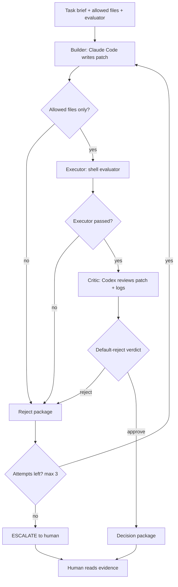
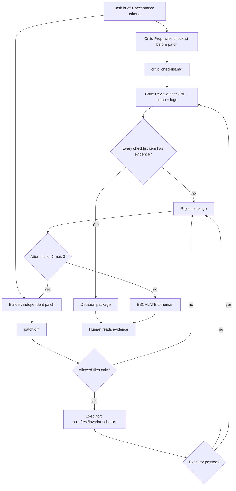

# Overclock CLI MVP Status

## Current State

**Full Overclock Mode is implemented.**

Current implemented loop:

```text
Critic-Prep generates checklist
    ↓
Builder writes patch independently
    ↓
Executor runs deterministic checks
    ↓
Critic-Review checks against pre-written checklist
    ↓
REJECT → retry with failure evidence → Builder retry
    ↓
Max attempts exhausted → ESCALATE
```

Parameters:

- `--max-attempts N` (default: 3, min: 1)
- `--apply` (only after final APPROVE)
- `--help` / `-h`

Run artifacts:

```text
overclock_runs/<timestamp>/
  critic_checklist.md           # Generated BEFORE patch
  critic_prep_prompt.md
  attempt-1/
    builder_prompt.md
    builder.log
    patch.diff
    eval.log
    critic_prompt.md            # Includes pre-written checklist
    critic.md
    decision.md
  attempt-2/
    ...
  final_decision.md
```

Final output:

```text
final_decision.md = APPROVE | ESCALATE | SETUP_FAILED
```

This is Full Overclock Mode:

- **Critic-Prep** defines evidence standards BEFORE Builder writes code
- **Builder** writes code independently (never sees checklist)
- **Executor** runs deterministic checks
- **Critic-Review** verifies each checklist item has evidence
- worktree isolation
- default-reject verdict parsing
- retry with failure evidence
- human-readable decision package

---

## Full Overclock Mode Design

The key design point:

```text
Critic is not just a reviewer after the patch.
Critic is the adversary that defines what evidence counts BEFORE the patch.
```

Current implementation:

```text
Phase 0: Critic-Prep
  - Input: brief.md, allowed_files, current target file contents
  - Output: critic_checklist.md
  - Failure: SETUP_FAILED (does not start Builder)

Phase 1: Builder
  - Input: brief.md, allowed_files, retry evidence
  - Does NOT see critic_checklist.md (stays independent)

Phase 2: Executor
  - Runs deterministic evaluator script
  - Failure triggers retry

Phase 3: Critic-Review
  - Input: critic_checklist.md, patch.diff, eval.log
  - Verifies EACH checklist item has evidence
  - Does NOT write new checklist

Phase 4: Decision
  - APPROVE or REJECT
  - REJECT with attempts left → retry
  - REJECT after max attempts → ESCALATE
```

---

## Validated Scenarios

| Scenario | Result | Evidence |
|---|---:|---|
| APPROVE path | Pass | `overclock_runs/20260503-150724/` |
| Executor rejection | Pass | `overclock_runs/20260503-151227/` |
| Verdict parsing | Pass | `tests/test_verdict_parsing.sh` |
| Semantic Critic REJECT | Pass | `overclock_runs/20260503-153929/` |
| Attempt-1 APPROVE | Pass | `overclock_runs/20260503-163637/` |
| Deterministic retry | Pass | `overclock_runs/20260503-164316/` |
| ESCALATE path | Pass | `overclock_runs/20260503-164430/` |
| Critic-Prep + Attempt-1 APPROVE | Pass | `overclock_runs/20260503-170344/` |
| Critic-Prep + Deterministic retry | Pass | `overclock_runs/20260503-170505/` |
| Critic-Prep + ESCALATE | Pass | `overclock_runs/20260503-170645/` |

### APPROVE Path

Evidence: `overclock_runs/20260503-150724/`

```text
Task: Create safe_divide utility
Builder: Created safe_math.py + test_safe_math.py
Executor: 4/4 tests PASS
Critic: VERDICT: APPROVE
Decision: Approved, worktree preserved
```

### Executor Rejection

Evidence: `overclock_runs/20260503-151227/`

```text
Task: Create safe_divide with missing test file
Builder: Only created safe_math.py
Executor: FAIL - test_safe_math.py not found
Decision: REJECT (Executor Failed)
```

### Semantic Critic REJECT

Evidence: `overclock_runs/20260503-153929/`

```text
Task: safe_divide must catch ONLY ZeroDivisionError
Patch: Uses except Exception: (wrong)
Executor: 4/4 tests PASS
Critic: VERDICT: REJECT
Reason: catches unrelated exceptions instead of only ZeroDivisionError
```

This proves:

- Critic reads patch semantics, not just test output.
- Passing tests are not enough for approval.
- Default-reject can catch issues that evaluator does not cover.

---

## Current Retry Loop



---

## Target Full Overclock Loop



---

## Known Follow-Ups

### 1. ~~Fix deterministic retry evaluator state~~ ✓ Done

The loop now exports `OVERCLOCK_ATTEMPT` to evaluators, removing the need for
marker files that could be cleaned by worktree reset.

### 2. ~~Add Critic-Prep Checklist Phase~~ ✓ Done

Critic-Prep now generates `critic_checklist.md` before Builder runs:

```text
Critic-Prep input:
  brief.md
  allowed_files
  current target file contents (if exist)

Critic-Prep output:
  critic_checklist.md

Failure handling:
  SETUP_FAILED (does not start Builder, does not consume attempt)
```

### 3. ~~Keep Builder Independent~~ ✓ Done

Builder does NOT see critic_checklist.md. It receives only:

```text
brief.md
allowed files
retry evidence from previous failed attempt
```

### 4. ~~Update Critic-Review to use pre-written checklist~~ ✓ Done

Critic-Review now receives the pre-written checklist and verifies each item
has evidence in patch.diff or eval.log.

---

## Next Step Plan

```text
1. ✓ Fix deterministic retry evaluator state.
2. ✓ Validate attempt-1 REJECT -> attempt-2 APPROVE.
3. ✓ Add Critic-prep checklist generation.
4. ✓ Update Critic-review to use critic_checklist.md.
5. ✓ Validate with all test scenarios.
```

Do not add these yet:

- Attacker role
- multi-builder parallelism
- AutoGen/LangGraph migration
- trading system optimization loop

Those are useful later, but they should wait until Critic-prep is real.

---

## Attacker Roadmap

Attacker is useful, but it is not the next blocking gate.

The next blocking capability is Critic-prep checklist generation. Attacker comes
after that, first as shadow mode.

Rationale:

```text
More agents do not automatically improve reliability.
Adversarial reports must be grounded in executable evidence.
Empirical validation is more important than adversarial tone.
```

Attacker role:

```text
Attacker does not approve or reject the patch.
Attacker tries to generate a concrete counterexample.
Executor verifies whether the counterexample is real.
Judge records the result.
```

Accepted Attacker evidence:

```text
- runnable failing test
- reproducible command
- fixed input that violates the brief
- semantic invariant violation
- baseline-pass / patch-fail comparison, when available
```

Rejected Attacker evidence:

```text
- free-form suspicion
- another natural-language review
- unverified "possible issue"
- model disagreement without reproduction
```

First implementation mode:

```text
ATTACKER_MODE=shadow
```

Shadow behavior:

```text
Run only after Critic-review APPROVE.
Save attacker.md.
If it proposes a runnable counterexample, run it in an isolated temp worktree.
Save attacker_eval.log.
Record the summary in final_decision.md.
Do not change final APPROVE / REJECT yet.
```

Metrics to collect before making Attacker blocking:

```text
attacker_run_count
attacker_claim_count
attacker_executable_counterexample_count
attacker_confirmed_bug_count
attacker_false_positive_count
average_extra_time
average_extra_cost
```

Promotion rule:

```text
Only promote Attacker to blocking mode after it repeatedly produces
Executor-verified counterexamples with acceptable false-positive cost.
```

Use Attacker selectively:

```text
Good candidates:
- trading matching logic
- authorization / security
- concurrency
- caching / consistency
- semantic invariant changes
- large or risky patches

Bad candidates:
- docs
- formatting
- UI copy
- small type-only fixes
- patches already fully covered by deterministic tests
```

This keeps Attacker aligned with the project goal: executable quality control,
not multi-model debate.

---

## File Structure

```text
scripts/
  overclock_cli_loop.sh
  evaluators/
    evaluate_safe_divide.sh
    evaluate_safe_add.sh
    evaluate_safe_multiply.sh
    evaluate_impossible.sh
    evaluate_retry_deterministic.sh

overclock_runs/
  20260503-150724/                 # APPROVE case
  20260503-151227/                 # Executor rejection
  20260503-153929/                 # Semantic REJECT case
  test-attempt1-approve-brief.md
  test-deterministic-retry-brief.md
  test-escalate-brief.md

tests/
  test_verdict_parsing.sh
```

---

## Commands

```bash
# Run Overclock with retry loop
./scripts/overclock_cli_loop.sh <brief.md>

# Use explicit max attempts
./scripts/overclock_cli_loop.sh --max-attempts 3 <brief.md>

# Auto-apply only after final APPROVE
./scripts/overclock_cli_loop.sh --apply <brief.md>

# Parser test
tests/test_verdict_parsing.sh

# Clean up worktree
git worktree remove .overclock_worktrees/<timestamp>
git branch -D overclock/<timestamp>
```

---

## Summary

```text
Current status:
Overclock Lite+ implemented and fully validated.

Implemented:
- Builder / Executor / Critic role split
- deterministic gate
- default-reject verdict parsing
- semantic Critic rejection
- retry loop with max attempts
- ESCALATE state
- worktree isolation with proper reset
- OVERCLOCK_ATTEMPT environment variable for evaluators

Validated:
- Attempt-1 APPROVE
- Deterministic retry (attempt-1 REJECT -> attempt-2 APPROVE)
- ESCALATE after max attempts

Not yet full Overclock:
- no pre-patch Critic checklist
- Critic-review does not yet use a pre-written checklist

Next:
Add Critic-prep checklist generation.

Later:
Add Attacker shadow mode, then decide from measured evidence whether it deserves
blocking authority.
```

---

## References

- [Refute-or-Promote: Adversarial Stage-Gated Multi-Agent Review for High-Precision LLM-Assisted Defect Discovery](https://arxiv.org/html/2604.19049v1)
- [AutoGen Application Stack](https://microsoft.github.io/autogen/stable//user-guide/core-user-guide/core-concepts/application-stack.html)
- [Analyzing Code Injection Attacks on LLM-based Multi-Agent Systems in Software Development](https://arxiv.org/html/2512.21818v1)
- [Combating Adversarial Attacks with Multi-Agent Debate](https://arxiv.org/html/2401.05998v1)
- [Measuring and Mitigating Identity Bias in Multi-Agent Debate via Anonymization](https://openreview.net/forum?id=XxBR2KNWNh)
- [LLM Code Reviewers Are Harder to Fool Than You Think](https://arxiv.org/html/2602.16741v1)
