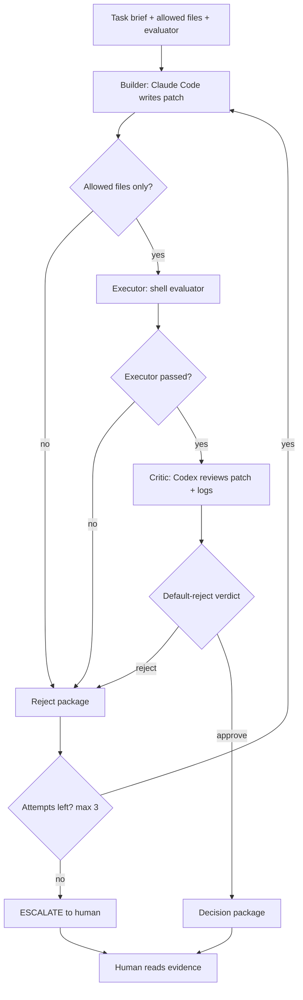
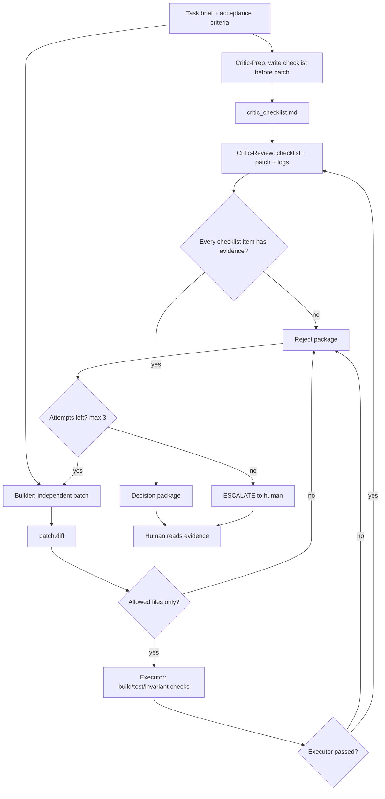

# Overclock CLI MVP Status

## Current State

**Overclock Lite+ is implemented.**

Current implemented loop:

```text
Builder -> Executor -> Critic -> Decision Package
    ↓
REJECT -> Retry with failure evidence -> Builder retry
    ↓
Max attempts exhausted -> ESCALATE
```

Parameters:

- `--max-attempts N` (default: 3, min: 1)
- `--apply` (only after final APPROVE)
- `--help` / `-h`

Per-attempt artifacts:

```text
overclock_runs/<timestamp>/
  attempt-1/
    builder_prompt.md
    builder.log
    patch.diff
    eval.log
    critic.md
    decision.md
  attempt-2/
    ...
  final_decision.md
```

Final output:

```text
final_decision.md = APPROVE | ESCALATE
```

This is stronger than ordinary AI code review because it has:

- worktree isolation
- deterministic executor gate
- default-reject verdict parsing
- Codex reviewer in read-only sandbox
- retry with failure evidence
- human-readable decision package

But it is not yet full Overclock Mode.

---

## Missing For Full Overclock Mode

The current implementation does **not** yet include pre-patch Critic checklist
generation.

Current:

```text
Builder writes patch
Executor runs
Critic reviews patch + logs
```

Target:

```text
Critic-prep writes checklist before patch
Builder writes patch independently
Executor runs
Critic-review checks patch + logs against pre-written checklist
```

The missing design point:

```text
Critic is not just a reviewer after the patch.
Critic is the adversary that defines what evidence counts before the patch.
```

Until that is implemented, this project should describe the CLI branch as:

```text
Overclock Lite+ validated.
Full Overclock Mode requires Critic-prep checklist.
```

---

## Validated Scenarios

| Scenario | Result | Evidence |
|---|---:|---|
| APPROVE path | Pass | `overclock_runs/20260503-150724/` |
| Executor rejection | Pass | `overclock_runs/20260503-151227/` |
| Verdict parsing | Pass | `tests/test_verdict_parsing.sh` |
| Semantic Critic REJECT | Pass | `overclock_runs/20260503-153929/` |

### APPROVE Path

Evidence: `overclock_runs/20260503-150724/`

```text
Task: Create safe_divide utility
Builder: Created safe_math.py + test_safe_math.py
Executor: 4/4 tests PASS
Critic: VERDICT: APPROVE
Decision: Approved, worktree preserved
```

### Executor Rejection

Evidence: `overclock_runs/20260503-151227/`

```text
Task: Create safe_divide with missing test file
Builder: Only created safe_math.py
Executor: FAIL - test_safe_math.py not found
Decision: REJECT (Executor Failed)
```

### Semantic Critic REJECT

Evidence: `overclock_runs/20260503-153929/`

```text
Task: safe_divide must catch ONLY ZeroDivisionError
Patch: Uses except Exception: (wrong)
Executor: 4/4 tests PASS
Critic: VERDICT: REJECT
Reason: catches unrelated exceptions instead of only ZeroDivisionError
```

This proves:

- Critic reads patch semantics, not just test output.
- Passing tests are not enough for approval.
- Default-reject can catch issues that evaluator does not cover.

---

## Current Retry Loop



---

## Target Full Overclock Loop



---

## Known Follow-Ups

### 1. Fix deterministic retry evaluator state

The deterministic retry evaluator must not store attempt state inside the
experiment worktree because retry reset runs:

```bash
git reset --hard "$ORIGINAL_COMMIT"
git clean -fd
```

Correct options:

```bash
export OVERCLOCK_RUN_DIR="$RUN_DIR"
export OVERCLOCK_ATTEMPT="$ATTEMPT"
export OVERCLOCK_ATTEMPT_DIR="$ATTEMPT_DIR"
```

Then the evaluator can use:

```bash
if [[ "$OVERCLOCK_ATTEMPT" == "1" ]]; then
  exit 1
fi
```

or store marker state outside the cleaned worktree:

```bash
MARKER_FILE="$OVERCLOCK_RUN_DIR/.retry_test_attempt"
```

The cleaner version is `OVERCLOCK_ATTEMPT` because it tests the orchestrator's
attempt bookkeeping directly.

### 2. Add Critic-Prep Checklist Phase

Add a phase before Builder:

```text
Critic-Prep input:
  brief.md
  allowed_files
  target file snapshots

Critic-Prep output:
  critic_checklist.md
```

Attempt 1 should generate the checklist before Builder writes code.

For v1.1, keep the checklist stable across attempts:

```text
overclock_runs/<timestamp>/critic_checklist.md
```

Critic-review should then receive:

```text
brief.md
critic_checklist.md
patch.diff
changed_files.txt
eval.log
```

And its prompt should change from:

```text
Write a checklist, then review the patch.
```

to:

```text
Use the pre-written checklist.
Reject unless every checklist item is proven by patch or executor evidence.
```

### 3. Keep Builder Independent

For the first version of Critic-prep:

```text
Do not feed critic_checklist.md to Builder.
```

Builder should receive only:

```text
brief.md
allowed files
retry evidence from previous failed attempt, when applicable
```

This keeps the Critic's evidence standard independent.

---

## Next Step Plan

Recommended order:

```text
1. Fix deterministic retry evaluator state.
2. Validate attempt-1 REJECT -> attempt-2 APPROVE.
3. Add Critic-prep checklist generation.
4. Update Critic-review to use critic_checklist.md.
5. Validate that missing checklist evidence causes REJECT.
```

Do not add these yet:

- Attacker role
- multi-builder parallelism
- AutoGen/LangGraph migration
- trading system optimization loop

Those are useful later, but they should wait until Critic-prep is real.

---

## File Structure

```text
scripts/
  overclock_cli_loop.sh
  evaluators/
    evaluate_safe_divide.sh
    evaluate_safe_add.sh
    evaluate_safe_multiply.sh
    evaluate_impossible.sh
    evaluate_retry_deterministic.sh

overclock_runs/
  20260503-150724/                 # APPROVE case
  20260503-151227/                 # Executor rejection
  20260503-153929/                 # Semantic REJECT case
  test-attempt1-approve-brief.md
  test-deterministic-retry-brief.md
  test-escalate-brief.md

tests/
  test_verdict_parsing.sh
```

---

## Commands

```bash
# Run Overclock with retry loop
./scripts/overclock_cli_loop.sh <brief.md>

# Use explicit max attempts
./scripts/overclock_cli_loop.sh --max-attempts 3 <brief.md>

# Auto-apply only after final APPROVE
./scripts/overclock_cli_loop.sh --apply <brief.md>

# Parser test
tests/test_verdict_parsing.sh

# Clean up worktree
git worktree remove .overclock_worktrees/<timestamp>
git branch -D overclock/<timestamp>
```

---

## Summary

```text
Current status:
Overclock Lite+ implemented and partially validated.

Implemented:
- Builder / Executor / Critic role split
- deterministic gate
- default-reject verdict parsing
- semantic Critic rejection
- retry loop with max attempts
- ESCALATE state

Not yet full Overclock:
- no pre-patch Critic checklist
- Critic-review does not yet use a pre-written checklist

Next:
fix retry evaluator state, then add Critic-prep checklist.
```
