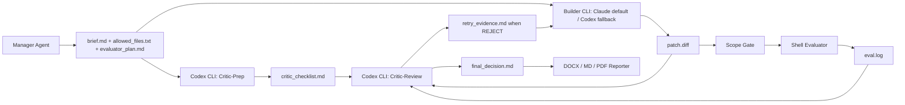
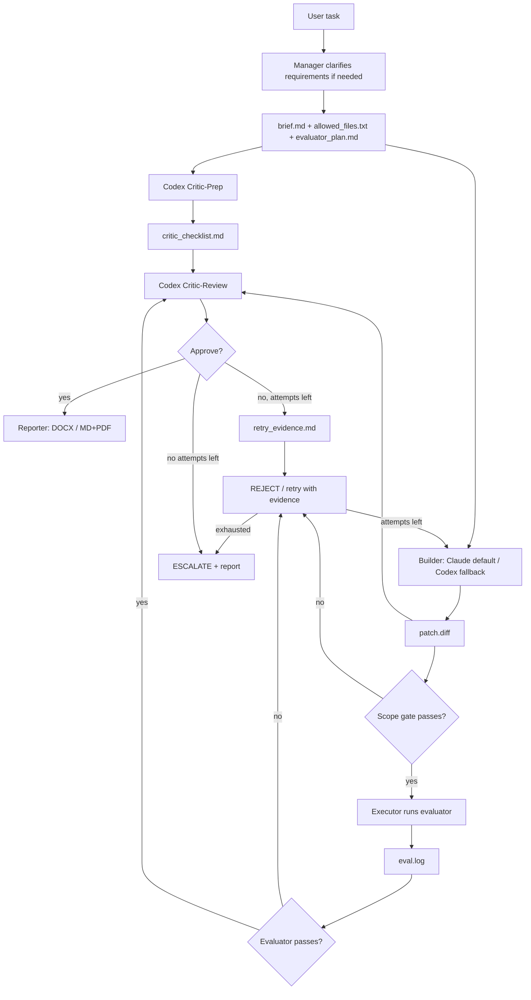
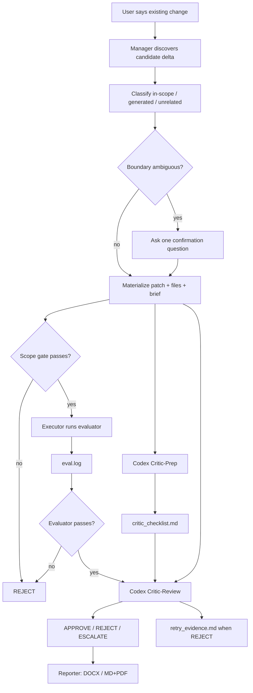
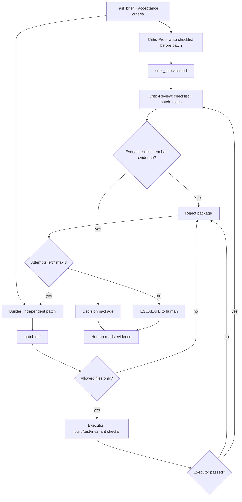

---
created: 2026-05-03
tags:
  - agent
  - gatekeeper
  - status
---

# GateKeeper CLI Workflow Status

## Document Structure

This document is organized into 4 parts:

- **Part 1: Current Design** - Latest operational design (2026-05-15)
- **Part 2: Evolution History** - How we got here
- **Part 3: Case Studies** - Real validation evidence
- **Part 4: Implementation** - File structure, commands, roadmap

If you're new, start with Part 1. If you want to understand the design evolution, read Part 2. If you need evidence, check Part 3.

# Part 1: Current Design

## Overview

GateKeeper is now an agent-custody workflow, not a bare shell script and not an
ordinary chat loop. The design has two layers:

```text
GateKeeper Manager skill = semantic decisions and task custody
GateKeeper scripts       = deterministic execution and evidence packaging
```

The Manager owns clarification, scope discovery, evaluator strategy, CLI
orchestration, retries, and final report delivery. Scripts own reproducible
execution after the Manager has made the semantic decisions.

The core principle is unchanged:

```text
Critic is not just a reviewer after the patch.
Critic is the adversary that defines what evidence counts BEFORE the patch.
```

Current implemented loop:

```text
Critic-Prep writes checklist before patch
  -> Builder writes patch independently
  -> Executor runs deterministic checks
  -> Critic-Review checks patch + logs against the pre-written checklist
  -> REJECT retries with failure evidence
  -> Max attempts exhausted becomes ESCALATE
```

Final decision states:

```text
APPROVE | REJECT | ESCALATE | SETUP_FAILED
```

`REJECT` is a normal final state for existing-patch review. `ESCALATE` means the
workflow cannot safely prove or disprove the task with available automation.

## Research Alignment

This section is intentionally conservative. It records only design claims that
are supported by earlier local notes or primary external references.

| Design claim | Local source | External alignment | Current rule |
|---|---|---|---|
| Role separation is the safety boundary | `0. Agent-Driven Workflow.md`, `1.1. GateKeeper Mode Execution Outline.md`, `1.3. Claude Code Builder + Codex Reviewer Branch.md` | AutoGen Reflection uses separate coder and reviewer agents with an explicit message protocol | Keep Manager, Builder, Executor, Critic, Reporter as separate roles |
| Critic defines proof before the patch | `0. Agent-Driven Workflow.md`, `1.3. Claude Code Builder + Codex Reviewer Branch.md` | "Specification as Quality Gate" argues for specification and deterministic verification before AI review | Critic-Prep writes `critic_checklist.md` before Builder runs |
| Builder does not receive the full checklist on the first attempt | `1.3. Claude Code Builder + Codex Reviewer Branch.md` explicitly says to keep the checklist hidden from Builder | Refute-or-Promote uses context asymmetry to reduce anchoring cascades | Builder sees `brief.md`, allowed files, and retry evidence only |
| Rejection must feed actionable evidence back to Builder | `0. Agent-Driven Workflow.md` uses "logs + critic notes + failed gate"; `1.3` says rejects feed retry with failure evidence | AutoGen Reflection feeds reviewer output back to the coder until approval or stop condition | Every REJECT must produce retry evidence |
| Executor evidence is mandatory | `0`, `1.1`, and `1.3` all require build/test/log evidence before approval | "Specification as Quality Gate" argues for specifications first, deterministic verification second, and AI review only after that foundation | Critic-Review cannot approve without `eval.log` evidence |
| Cross-model review is useful but not proof by itself | `1.3` separates Claude Builder and Codex Critic | Refute-or-Promote reports cross-family review can catch correlated blind spots; Specification as Quality Gate warns that review without executable specifications is circular | Use heterogeneous CLI roles, but still require machine evidence |
| Attacker should not be blocking by default | `1.3` puts Attacker in shadow mode first | Refute-or-Promote supports adversarial stage gates, but only when candidates are empirically refuted or promoted | Attacker remains roadmap/shadow until measured evidence justifies blocking |

The difference from the earliest AutoGen-style sketch is that this design is
stricter about artifact custody:

```text
Early sketch: reviewer feedback loops back to coder.
Current design: full checklist stays with Critic, but REJECT always creates
actionable retry evidence for Builder.
```

## Role Boundary

| Role | Tool / Model | Sees | Must not see / do |
|---|---|---|---|
| Manager | Current assistant / skill | User task, repo, diffs, run artifacts | Invent a PASS without evidence |
| Critic-Prep | Codex CLI | `brief.md` and scoped context | Builder's hidden reasoning |
| Builder | Claude Code/Sonnet by default; Codex CLI fallback | `brief.md`, allowed files, retry evidence | `critic_checklist.md` |
| Executor | Shell evaluator | Confirmed patch/worktree | LLM judgment |
| Critic-Review | Codex CLI | `critic_checklist.md`, `patch.diff`, `eval.log` | Builder's hidden reasoning |
| Reporter | Script | `gatekeeper_runs/<timestamp>/` artifacts | Change the verdict |

The isolation rule:

```text
Share artifacts, not thoughts.
```

Allowed shared artifacts:

```text
brief.md
allowed_files.txt
evaluator_plan.md
critic_checklist.md
input.patch or patch.diff
selected_files.txt
eval.log
critic.md
final_decision.md
reports/*
```

Disallowed shared context:

```text
Builder private reasoning
Critic private reasoning
Manager's speculative intermediate assumptions
```

## Proof Responsibility

GateKeeper assigns the burden of proof explicitly:

| Role | Proof responsibility |
|---|---|
| Builder | Solve the task from `brief.md` and produce a minimal patch |
| Critic-Prep | Define what evidence would prove the patch before the patch exists |
| Executor | Produce machine evidence from deterministic commands |
| Critic-Review | Decide whether patch + logs satisfy the pre-written evidence standard |
| Manager | Route APPROVE / REJECT / ESCALATE and enforce retry budget |
| Reporter | Package the decision; never change the verdict |

The checklist is not a Builder task list. It is the Critic's evidence standard.
That keeps the first attempt independent and avoids having Builder optimize
against the checklist text instead of the brief.

This does not mean Builder must guess after a failure. A rejection must create
actionable retry evidence.

```text
Do not reveal the full checklist before the first attempt.
Do reveal concrete failure evidence after rejection.
```

If Critic-Review finds missing evidence, it must write retry evidence with this
shape:

```text
retry_evidence.md
  verdict: REJECT
  failed_items:
    - short summary of the failed checklist item
  missing_proof:
    - what evidence was absent or inadequate
  locations:
    - patch/log/file locations when available
  expected_evidence_shape:
    - what kind of build/test/smoke/log/semantic proof would satisfy it
  next_action:
    - what Builder should change or prove on the next attempt
```

Builder receives `brief.md` plus this retry evidence on the next attempt. Builder
still does not receive the full `critic_checklist.md`.

## Execution Topology (Dual-CLI)

The preferred Builder/Critic split is heterogeneous, but the Builder provider is
configurable. Claude Code/Sonnet remains the default. Codex CLI can be used as a
fallback when Claude is unavailable.

### Isolation Guard

GateKeeper must fail closed when the requested mode is isolated custody. A
Manager session is not allowed to silently become the Builder just because the
current platform is in inline mode.

Before Mode A or Mode B starts, the Manager records:

```text
GATEKEEPER_MODE = isolated | inline_non_isolated | setup_failed
BUILDER_CONTEXT = <independent CLI/session/worktree evidence> | missing
CRITIC_CONTEXT = <independent CLI/session evidence> | missing
BUILDER_INPUT = brief.md only (+ allowed files / retry evidence)
CRITIC_INPUT = critic_checklist.md + patch.diff + eval.log
```

Hard rule:

```text
No independent Builder context  -> SETUP_FAILED for Mode A isolated custody.
No independent Critic context   -> cannot APPROVE as isolated GateKeeper.
Manager edits business code     -> downgrade to inline_non_isolated.
Builder sees critic_checklist   -> isolation violation.
Critic sees Builder reasoning   -> isolation violation.
```

`inline_non_isolated` is allowed only as an explicitly labeled fallback. It may
produce useful code, logs, and reports, but it does not validate the
Builder/Critic context-isolation design.

Every final report must include:

```text
Isolation status:
- Mode:
- Builder context:
- Critic context:
- Heterogeneous models/tools:
- Checklist hidden from Builder before first attempt:
- Main session edited business code:
```

The same facts must be materialized as `isolation.json` in the run directory.
For Code2/Trellis runs, validate it before reporting isolated success:

```bash
python .trellis/scripts/gatekeeper_validate_isolation.py <gatekeeper-run-dir>
```

The validator is deliberately simple. It fails if an isolated run has no
Builder/Critic context evidence, if the checklist was not hidden from Builder,
or if the Manager edited business code.

Visible form:

```text
Terminal A: Claude Code / Sonnet Builder
Terminal B: Codex Critic-Prep + Critic-Review
```

Automated form:

```bash
scripts/gatekeeper_cli_loop.sh --project-root <repo> --builder claude ...
scripts/gatekeeper_cli_loop.sh --project-root <repo> --builder codex ...   # fallback, not heterogeneous
```

`--project-root` allows the GateKeeper scripts to live in the workflow repo while
operating on another project repo, such as Code2. Run artifacts, worktrees,
scope checks, and evaluator execution are rooted in that target project.

The number of windows is not the key property. The key property is independent
model/tool context with only structured artifacts exchanged between roles.
Subagents are still useful for research, file discovery, and parallel checks,
but they are not the preferred boundary for the core heterogeneous review.

If Builder and Critic both use Codex CLI, the run still preserves artifact
isolation and the hidden-checklist rule. It must be labeled as non-heterogeneous
in the final report because it no longer provides cross-model review.



## Mode A: Managed Development

Use Mode A when the user has a task but no patch yet.



Concrete sequence:

```text
1. Manager clarifies the task only when needed.
2. Manager writes brief.md, allowed_files.txt, and evaluator_plan.md.
3. Codex Critic-Prep reads brief.md and writes critic_checklist.md.
4. Builder reads brief.md only, then writes code and any minimal useful smoke/test.
5. Script captures patch.diff from the Builder worktree.
6. Scope Gate checks patch.diff against allowed_files.txt.
7. Executor runs the selected evaluator and writes eval.log.
8. Codex Critic-Review reads critic_checklist.md + patch.diff + eval.log.
9. If rejected, Critic-Review writes retry_evidence.md for the next Builder attempt.
10. Manager sends brief.md + retry_evidence.md back to Builder while retry budget remains.
11. Reporter creates DOCX and/or MD+PDF from the run directory.
```

Builder input must stay narrow:

```text
Allowed:
- brief.md
- allowed files
- retry failure evidence from the previous attempt

Not allowed:
- critic_checklist.md
- Critic private reasoning
```

## Mode B: Existing Patch Review

Use Mode B when code already changed and the user wants quality custody. Mode B
must not be hard-coded to `git diff HEAD`; the Manager first discovers the
intended delta.

The Manager should inspect:

```text
- staged changes
- unstaged changes
- recent commits
- branch diff
- user-mentioned files or modules
- generated files required by those changes
- unrelated dirty files to exclude
```

If the boundary is unclear, ask one confirmation question. Then materialize the
selected delta explicitly:

```text
input.patch
selected_files.txt
allowed_files.txt
brief.md
evaluator_plan.md
```

Materialization is a helper step, not the decision step. The Manager decides the
semantic delta first. Then `scripts/gatekeeper_materialize_delta.py` can write
the mechanical artifacts from explicit files, refs, or a deliberate worktree
selection.



Mode B does not fix code. It answers:

```text
Does this selected delta have enough evidence to pass?
```

The Mode B script accepts explicit inputs from the Manager:

```bash
scripts/gatekeeper_review_existing.sh \
  --patch gatekeeper_runs/<run>/mode-b-input/input.patch \
  --files gatekeeper_runs/<run>/mode-b-input/selected_files.txt \
  --report all \
  gatekeeper_runs/<run>/brief.md
```

Fallback to the current working-tree diff is allowed only for quick local
experiments and emits a warning. The production path is Manager-selected:
materialize `input.patch` and `selected_files.txt`, then pass them explicitly.

## Evaluator Strategy

`checklist` and `evaluator` are different things:

```text
checklist = human-readable acceptance/evidence standard
evaluator = executable script that produces machine evidence
```

The evaluator is closer to a CI entrypoint than to a unit test. It may run:

```text
- existing tests
- Builder-added smoke/integration tests
- build commands
- remote compile
- gRPC calls
- database verification
- cleanup checks
- static artifact checks
```

Do not force TDD. For legacy C++ services, the practical default is:

```text
acceptance standard first,
business code first,
smallest useful verification next,
evaluator execution,
critic verdict.
```

Evaluator selection happens before Builder writes the patch, but this does not
mean all test code must already exist. It means the Manager chooses the evidence
strategy.

| Situation | Evaluator action |
|---|---|
| A matching evaluator already exists | Reuse it and record the path in `evaluator_plan.md` |
| Build/test/smoke commands are clear | Generate a run-scoped `evaluator.sh` |
| The feature needs a small executable probe | Builder may add the smoke/test; evaluator runs it |
| The repo has only manual validation available | Generate a partial evaluator plus manual evidence requirements |
| Required environment is unavailable | Exit nonzero or `2`; final verdict should be `ESCALATE` |

Generated evaluators should live inside the run directory unless they are meant
to become reusable project assets:

```text
gatekeeper_runs/<timestamp>/evaluator.sh        # run-scoped generated script
scripts/evaluators/<name>.sh                    # reusable project evaluator
```

Example generated evaluator for a legacy C++ / gRPC service:

```bash
#!/usr/bin/env bash
set -euo pipefail

echo "=== Build ==="
cmake --build build --target PsiTraderRunner -j2

echo "=== Smoke ==="
./build/PsiGrpcServer/tools/twap_aggregation_smoke \
  --target 127.0.0.1:8321 \
  --token "${TOKEN:?TOKEN is required}"

echo "=== Database verification ==="
mysql "$DB_DSN" < gatekeeper_runs/current/verify.sql

echo "EVALUATOR_RESULT=PASS"
```

If a required token, database, service, or remote machine is missing, the
evaluator must say that directly:

```bash
echo "EVALUATOR_RESULT=ESCALATE"
echo "Missing required evidence: TOKEN, test userId, or DB access."
exit 2
```

Never convert missing evidence into a PASS. The whole point of GateKeeper is to
separate "looks plausible" from "has evidence."

## Report Contract

Every completed run should be reportable from the run directory alone:

```text
gatekeeper_runs/<timestamp>/
  brief.md
  allowed_files.txt
  evaluator_plan.md
  critic_checklist.md
  input.patch                # Mode B
  selected_files.txt          # Mode B
  attempt-1/
    patch.diff                # Mode A
    eval.log
    critic.md
    retry_evidence.md          # present when REJECT
    decision.md
  final_decision.md
  reports/
    gatekeeper_report_<timestamp>.docx
    gatekeeper_report_<timestamp>.md
    gatekeeper_report_<timestamp>.pdf
```

Reports are delivery artifacts. They summarize evidence. They must not alter the
verdict.

# Part 2: Evolution History

## v1.1 Validation (2026-05-03)

**Full GateKeeper Mode v1.1 validated.**

Validation date: 2026-05-03

### v1.1 Validation (Critic-Prep)

| Scenario | Result | Evidence | Checklist Items |
|---|---:|---|---:|
| Attempt-1 APPROVE | Pass | `20260503-173556/` | 10 clean items |
| Deterministic retry | Pass | `20260503-173731/` | 5 clean items |
| ESCALATE path | Pass | `20260503-173917/` | 8 clean items |

### Earlier Validation (GateKeeper Lite+)

| Scenario | Result | Evidence |
|---|---:|---|
| APPROVE path | Pass | `20260503-150724/` |
| Executor rejection | Pass | `20260503-151227/` |
| Verdict parsing | Pass | `tests/test_verdict_parsing.sh` |
| Semantic Critic REJECT | Pass | `gatekeeper_runs/20260503-153929/` |
| Attempt-1 APPROVE | Pass | `gatekeeper_runs/20260503-163637/` |
| Deterministic retry | Pass | `gatekeeper_runs/20260503-164316/` |
| ESCALATE path | Pass | `gatekeeper_runs/20260503-164430/` |
| Critic-Prep + Attempt-1 APPROVE | Pass | `gatekeeper_runs/20260503-170344/` |
| Critic-Prep + Deterministic retry | Pass | `gatekeeper_runs/20260503-170505/` |
| Critic-Prep + ESCALATE | Pass | `gatekeeper_runs/20260503-170645/` |

### APPROVE Path

Evidence: `gatekeeper_runs/20260503-150724/`

```text
Task: Create safe_divide utility
Builder: Created safe_math.py + test_safe_math.py
Executor: 4/4 tests PASS
Critic: VERDICT: APPROVE
Decision: Approved, worktree preserved
```

### Executor Rejection

Evidence: `gatekeeper_runs/20260503-151227/`

```text
Task: Create safe_divide with missing test file
Builder: Only created safe_math.py
Executor: FAIL - test_safe_math.py not found
Decision: REJECT (Executor Failed)
```

### Semantic Critic REJECT

Evidence: `gatekeeper_runs/20260503-153929/`

```text
Task: safe_divide must catch ONLY ZeroDivisionError
Patch: Uses except Exception: (wrong)
Executor: 4/4 tests PASS
Critic: VERDICT: REJECT
Reason: catches unrelated exceptions instead of only ZeroDivisionError
```

This proves:

- Critic reads patch semantics, not just test output.
- Passing tests are not enough for approval.
- Default-reject can catch issues that evaluator does not cover.

---

## Full GateKeeper Mode Design

The key design point:

```text
Critic is not just a reviewer after the patch.
Critic is the adversary that defines what evidence counts BEFORE the patch.
```

Current implementation:

```text
Phase 0: Critic-Prep
  - Input: brief.md, allowed_files, current target file contents
  - Output: critic_checklist.md
  - Failure: SETUP_FAILED (does not start Builder)

Phase 1: Builder
  - Input: brief.md, allowed_files, retry evidence
  - Does NOT see critic_checklist.md (stays independent)

Phase 2: Executor
  - Runs deterministic evaluator script
  - Failure triggers retry

Phase 3: Critic-Review
  - Input: critic_checklist.md, patch.diff, eval.log
  - Verifies EACH checklist item has evidence
  - Does NOT write new checklist

Phase 4: Decision
  - APPROVE or REJECT
  - REJECT with attempts left -> retry
  - REJECT after max attempts -> ESCALATE
```

---

## Implemented Loop (v1.1)

This is the current implementation:



---

## Completed Implementation Tasks

### 1. ~~Fix deterministic retry evaluator state~~ Done

The loop now exports `GATEKEEPER_ATTEMPT` to evaluators, removing the need for
marker files that could be cleaned by worktree reset.

### 2. ~~Add Critic-Prep Checklist Phase~~ Done

Critic-Prep now generates `critic_checklist.md` before Builder runs:

```text
Critic-Prep input:
  brief.md
  allowed_files
  current target file contents (if exist)

Critic-Prep output:
  critic_checklist.md

Failure handling:
  SETUP_FAILED (does not start Builder, does not consume attempt)
```

### 3. ~~Keep Builder Independent~~ Done

Builder does NOT see critic_checklist.md. It receives only:

```text
brief.md
allowed files
retry evidence from previous failed attempt
```

### 4. ~~Update Critic-Review to use pre-written checklist~~ Done

Critic-Review now receives the pre-written checklist and verifies each item
has evidence in patch.diff or eval.log.

---

## Real Sandbox Integration (2026-05-03)

**Project**: cpp-trader-backtester

**Evaluator**: `scripts/evaluators/evaluate_cpp_trader.sh`

**Gates**:
- Debug/ASan build (assertions enabled, memory safety)
- Tests in Debug mode (test_order_book, test_strategies, test_types)
- Release build (optimized)
- Benchmark smoke in Release mode (realistic performance)

**First Task**: Add volume consistency invariant check to test_order_book.cpp

**Result**: APPROVED (attempt 2 of 3)

**Evidence**: `gatekeeper_runs/20260503-205323/`

```text
Attempt 1: REJECT
  Reason: Missing explicit verification that executed quantity equals expected matched quantity

Attempt 2: APPROVE
  Reason: All checklist items have direct evidence in patch and executor log
```

**Key findings**:
1. Builder correctly received retry evidence and fixed the rejected patch
2. Critic-Review correctly verified each checklist item against evidence
3. Executor gates (build, test, benchmark) all passed
4. No production files were modified (only test code changed)

**Bug fixed during integration**:
- Script used relative path for brief file after `cd` to worktree
- Fixed by using `$RUN_DIR/brief.md` instead of `$BRIEF_FILE`

---

## Evaluator Weakness Discovery (2026-05-03)

**Issue**: Original evaluator used Release build for all gates, but tests use `assert()` which is compiled out with `-DNDEBUG` in Release mode.

**Discovery process**:
1. Stress test on strategy accounting task failed 3 attempts -> ESCALATE
2. Debug build revealed `test_strategies` assertion failure
3. Test uptrend was too weak to trigger 2% buy threshold signal
4. Release mode hid this bug because assertions were disabled

**Evidence**: `gatekeeper_runs/20260503-214848/`

```text
Attempt 1: REJECT (tests used local stubs)
Attempt 2: REJECT (position stayed 0, tests passed due to disabled assertions)
Attempt 3: REJECT (tests actually failed with proper Debug build)
Final: ESCALATE
```

**Fix applied**:
```bash
# Old evaluator (weak):
cmake -DCMAKE_BUILD_TYPE=Release  # -DNDEBUG compiles out assert()
./build-release/test_*

# New evaluator (correct):
cmake -DCMAKE_BUILD_TYPE=Debug -DCMAKE_CXX_FLAGS="-fsanitize=address"
./build-debug/test_*              # Assertions checked, ASan enabled
cmake -DCMAKE_BUILD_TYPE=Release
./build-release/benchmark         # Only benchmark needs Release
```

**Lessons learned**:
1. **Executor must run tests in Debug mode** when code uses `assert()`
2. **Release mode is only for benchmark smoke** (performance validation)
3. **Debug mode caught a real test bug** that Release mode hid
4. **GateKeeper stress testing is valuable** - it found a real weakness

---

# Part 3: Case Studies

## ESCALATE Case: submit_order ID Timing

**Task**: Fix `submit_order()` API timing so strategies can track their own orders.

**Brief**: `gatekeeper_runs/cpp-trader-submit-order-id-brief.md`

**Result**: ESCALATE (3/3 attempts failed)

**Evidence**: `gatekeeper_runs/20260503-225431/`

### Attempt Summary

| Attempt | Gate | Reason |
|---------|------|--------|
| 1 | EXECUTOR | Test assertion failed - deferred trades processed inside `submit_order()` before ID returned |
| 2 | CRITIC | Deferred callbacks only work during `process_tick()`, not for all `submit_order()` calls |
| 3 | CRITIC | Same issue - architectural constraint cannot be satisfied with allowed scope |

### Root Cause

**The brief had an unachievable requirement**:

```text
Checklist item: "Trade callbacks caused by submit_order() are not delivered
synchronously before submit_order() returns"
```

**Why it's impossible**:

1. Strategies call `submit_order()` from inside `on_tick()` -> called by `process_tick()`
2. To defer callbacks, `process_tick()` sets `defer_trades_ = true` before calling strategies
3. This ONLY works for calls made during `process_tick()`
4. External calls to `submit_order()` would fire callbacks immediately

**This is a valid ESCALATE** - the requirement cannot be satisfied with the allowed file scope. The code architecture requires callbacks to be scoped to `process_tick()`, not to `submit_order()`.

### Fix Options (for human decision)

1. **Accept limitation**: Update checklist to scope deferred callbacks to `process_tick()` only
2. **Redesign API**: Add `submit_order_async()` that returns ID before callbacks fire
3. **Two-phase commit**: Strategies pre-register orders, then engine executes after ID assignment

### Key Takeaway

**GateKeeper caught a requirements gap that would have caused bugs in production**:
- Tests would pass (callbacks ARE deferred during normal backtest)
- But external API callers would get callbacks before ID is returned
- Critic caught this by reading the patch semantics, not just test output

This validates the **Full GateKeeper Mode v1.1 design**:
- Critic-Prep writes checklist BEFORE patch
- Critic-Review verifies EACH checklist item has evidence
- Default-reject catches issues that tests cannot cover

---

## ESCALATE Case: Two-Phase API

**Task**: Implement two-phase order submission API for ownership tracking

**Brief**: `gatekeeper_runs/cpp-trader-two-phase-order-api-brief.md`

**Result**: ESCALATE (3/3 attempts failed)

**Evidence**: `gatekeeper_runs/20260503-231757/`

### Attempt Summary

| Attempt | Gate | Reason |
|---------|------|--------|
| 1 | CRITIC | Test doesn't use strategy callback, can't prove ID-before-callback |
| 2 | EXECUTOR | Compile error - `OwnershipTestStrategy` missing `name()` implementation |
| 3 | CRITIC | Test directly calls `OrderBook::add_order()`, violates "TickEngine-only" requirement |

### Root Cause

**Brief was too large**: It simultaneously required:

```text
1. New TickEngine API (prepare_order + submit_prepared_order)
2. Pending order storage mechanism
3. Migration of MomentumStrategy and MarketMakerStrategy
4. Ownership callback test that proves ID-before-callback
5. Test must use only TickEngine API, no direct OrderBook calls
6. Existing behavior preserved
```

This is a **small architectural refactor**, not a simple patch.

### Why "TickEngine-only" Test Requirement Matters

The checklist correctly requires tests to exercise the API through `TickEngine` only:

- **What we want to verify**: Engine/Strategy API boundary
- **What direct OrderBook calls prove**: Only that OrderBook can match orders
- **What we need**: Strategy can safely track ownership in real engine paths

If test bypasses TickEngine to set up liquidity, it doesn't prove the full path.

### Correct Decomposition

Split into smaller, provable tasks:

**Brief C1**: Add test utility capability only
- Allow tests to create liquidity through TickEngine
- Use two test strategies: LiquidityProvider + Taker
- Don't modify production strategies yet

**Brief C2**: Implement two-phase API + engine-level test
- Only modify `tick_engine.hpp`, `tick_engine.cpp`, `test_strategies.cpp`
- Test proves: prepare returns ID -> strategy records -> submit triggers callback -> on_trade sees known ID
- No direct OrderBook calls

**Brief C3**: Migrate production strategies
- Modify `momentum_strategy.hpp`
- Prove: owned buy increases position, owned sell decreases, unrelated trades ignored

### Key Insight

```text
GateKeeper is working correctly:
- Small patches: auto-APPROVE
- Medium patches: retry -> APPROVE
- Architectural patches: ESCALATE (correct behavior)

The workflow is not broken. It's correctly detecting that the task
requires human decomposition, not AI guessing.
```

---

## Brief C2 Success: Engine-Level Ownership Test

**Task**: Add two-phase order submission API and prove ownership tracking at engine level

**Brief**: `gatekeeper_runs/cpp-trader-engine-level-ownership-test-brief.md`

**Result**: APPROVE (Attempt 1 of 3)

**Evidence**: `gatekeeper_runs/20260503-234657/`

### What Changed

Decomposed the architectural task into a focused subtask:
- **Previous brief**: API + storage + strategy migration + ownership test (too large)
- **Brief C2**: API + test only, no production strategy changes (correctly scoped)

### Key Success Factors

1. **Test ignores unrelated trades**: `on_trade()` checks if trade involves owned orders before asserting
2. **TickEngine-only test**: No `OrderBook::add_order()`, no `get_order_book()`, no `set_trade_callback()`
3. **Post-run assertions**: Verify counts and engine stats after backtest
4. **Two strategies**: LiquidityProvider (sell) + Taker (buy) create matching scenario through TickEngine only

### API Implemented

```cpp
// Phase 1: Prepare - returns ID, no callbacks
OrderId prepare_order(const Order& order_template);

// Phase 2: Submit - adds to book, callbacks fire here
void submit_prepared_order(OrderId id);
```

### Test Pattern

```cpp
// LiquidityProviderStrategy
void on_tick(...) {
    OrderId id = engine->prepare_order(sell);
    owned_orders_.insert(id);  // Record BEFORE submit
    engine->submit_prepared_order(id);
}

void on_trade(const Trade& trade) {
    if (owned_orders_.count(trade.sell_order_id) == 0) return;  // Ignore unrelated
    assert(owned_orders_.count(trade.sell_order_id) > 0);  // ID was known
    owned_trade_count++;
}

// TakerStrategy similar, but checks trade.buy_order_id
```

### Lessons Learned

```text
1. Decomposition works: Large architectural tasks must be split
2. Test design matters: "Ignore unrelated trades" is the key pattern
3. Scope control: No production strategy changes in engine-level test
4. Brief quality: Detailed test requirements prevent "looks correct but wrong" patches
```

---

## Brief C3 Success: Strategy Ownership Migration

**Task**: Migrate production strategies to two-phase ownership tracking

**Brief**: `gatekeeper_runs/cpp-trader-strategy-ownership-brief.md`

**Result**: APPROVE (Attempt 3 of 3)

**Evidence**: `gatekeeper_runs/20260504-001216/`

### Attempt Summary

| Attempt | Gate | Reason |
|---------|------|--------|
| 1 | EXECUTOR | Test timing mismatch - MarketMaker quotes every 10 ticks, test expected earlier |
| 2 | CRITIC | Missing MarketMakerStrategy ownership-aware position test evidence |
| 3 | CRITIC | APPROVE - All checklist items have evidence |

### What Was Implemented

**MomentumStrategy**:
- Uses `prepare_order()` + `submit_prepared_order()`
- Records order IDs in `my_orders_` before submit
- `on_trade()` ignores unrelated trades
- Position increases on owned buy fills
- Position decreases on owned sell fills

**MarketMakerStrategy**:
- Same migration pattern
- Position tracking now ownership-aware

**New Tests**:
- `test_owned_buy_increases_position()` - Verifies position increase
- `test_owned_sell_decreases_position()` - Verifies position decrease
- `test_unrelated_trades_ignored()` - Verifies strategies ignore other trades
- `test_market_maker_position_tracking()` - Verifies MM position tracking

### Key Fix

Attempt-1 failed because test used MarketMakerStrategy for sell test, but timing didn't align:
- MarketMaker quotes every 10 ticks
- Test expected trade at tick 2

Fix: Use LiquidityProviderStrategy (acts at tick 1) instead.

### Lessons Learned

1. **Test timing matters**: Strategies with different quote frequencies need careful test design
2. **Critic catches scope gaps**: Attempt-2 was rejected because tests didn't prove MarketMakerStrategy behavior
3. **Decomposition continues to work**: Brief C3 built on C2's API, didn't modify TickEngine

---

# Part 4: Implementation

## File Structure

```text
scripts/
  gatekeeper_cli_loop.sh
  evaluators/
    evaluate_safe_divide.sh
    evaluate_safe_add.sh
    evaluate_safe_multiply.sh
    evaluate_impossible.sh
    evaluate_retry_deterministic.sh

gatekeeper_runs/
  20260503-173556/                 # v1.1 APPROVE case
  20260503-173731/                 # v1.1 deterministic retry
  20260503-173917/                 # v1.1 ESCALATE case
  test-attempt1-approve-brief.md
  test-deterministic-retry-brief.md
  test-escalate-brief.md

tests/
  test_verdict_parsing.sh
```

---

## Commands

```bash
# Run Full GateKeeper Mode v1.1
./scripts/gatekeeper_cli_loop.sh <brief.md>

# Use explicit max attempts
./scripts/gatekeeper_cli_loop.sh --max-attempts 3 <brief.md>

# Auto-apply only after final APPROVE
./scripts/gatekeeper_cli_loop.sh --apply <brief.md>

# Parser test
tests/test_verdict_parsing.sh

# Clean up worktree
git worktree remove .gatekeeper_worktrees/<timestamp>
git branch -D gatekeeper/<timestamp>
```

---

## Attacker Roadmap

Do not add these yet:

- Attacker as a blocking role
- multi-builder parallelism
- AutoGen/LangGraph migration
- trading system optimization loop

Those are useful later, but they should wait until v1.1 is stable across more
ordinary tasks.

Attacker is useful, but it should not be introduced first as a blocking gate.

Now that Critic-prep checklist generation is implemented, the next experimental
extension is Attacker shadow mode.

Rationale:

```text
More agents do not automatically improve reliability.
Adversarial reports must be grounded in executable evidence.
Empirical validation is more important than adversarial tone.
```

Attacker role:

```text
Attacker does not approve or reject the patch.
Attacker tries to generate a concrete counterexample.
Executor verifies whether the counterexample is real.
Judge records the result.
```

Accepted Attacker evidence:

```text
- runnable failing test
- reproducible command
- fixed input that violates the brief
- semantic invariant violation
- baseline-pass / patch-fail comparison, when available
```

Rejected Attacker evidence:

```text
- free-form suspicion
- another natural-language review
- unverified "possible issue"
- model disagreement without reproduction
```

First implementation mode:

```text
ATTACKER_MODE=shadow
```

Shadow behavior:

```text
Run only after Critic-review APPROVE.
Save attacker.md.
If it proposes a runnable counterexample, run it in an isolated temp worktree.
Save attacker_eval.log.
Record the summary in final_decision.md.
Do not change final APPROVE / REJECT yet.
```

Metrics to collect before making Attacker blocking:

```text
attacker_run_count
attacker_claim_count
attacker_executable_counterexample_count
attacker_confirmed_bug_count
attacker_false_positive_count
average_extra_time
average_extra_cost
```

Promotion rule:

```text
Only promote Attacker to blocking mode after it repeatedly produces
Executor-verified counterexamples with acceptable false-positive cost.
```

Use Attacker selectively:

```text
Good candidates:
- trading matching logic
- authorization / security
- concurrency
- caching / consistency
- semantic invariant changes
- large or risky patches

Bad candidates:
- docs
- formatting
- UI copy
- small type-only fixes
- patches already fully covered by deterministic tests
```

This keeps Attacker aligned with the project goal: executable quality control,
not multi-model debate.

---

## Next Step Plan

```text
1. Done - Fix deterministic retry evaluator state.
2. Done - Validate attempt-1 REJECT -> attempt-2 APPROVE.
3. Done - Add Critic-prep checklist generation.
4. Done - Update Critic-review to use critic_checklist.md.
5. Done - Validate with all test scenarios.
6. Done - Real sandbox project integration (cpp-trader-backtester).
```

Current scripts are evolving toward this split:

```text
scripts/gatekeeper_cli_loop.sh        # Mode A managed development
scripts/gatekeeper_review_existing.sh # Mode B existing patch review
scripts/gatekeeper_materialize_delta.py # Mode B selected delta materializer
scripts/gatekeeper_report.py          # DOCX / MD / PDF report generation
.agents/skills/gatekeeper-manager/    # Manager skill and decision protocol
```

Current implementation status:

```text
Done - Mode B accepts explicit `--patch` and `--files` inputs.
Done - Mode B has a materializer for Manager-selected deltas.
Done - Rejected attempts write `attempt-N/retry_evidence.md`.
Done - Reports include retry evidence when present.
Next - Add offline smoke tests for Mode A and Mode B artifact generation.
```

---

## References

- Local: `0. Agent-Driven Workflow.md`
- Local: `1.1. GateKeeper Mode Execution Outline.md`
- Local: `1.3. Claude Code Builder + Codex Reviewer Branch.md`
- [AutoGen Reflection design pattern](https://microsoft.github.io/autogen/stable/user-guide/core-user-guide/design-patterns/reflection.html)
- [Specification as Quality Gate: Evaluating and Improving AI-Assisted Code Review](https://arxiv.org/abs/2603.25773)
- [Refute-or-Promote: Adversarial Stage-Gated Multi-Agent Review for High-Precision LLM-Assisted Defect Discovery](https://arxiv.org/abs/2604.19049)
