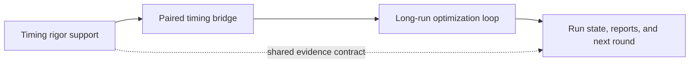

# Psi Headless Optimization Layered Architecture

## 0. Document Boundary

This note is the stable architecture contract for the headless Psi optimization system.

It explains how the work is split into layers so separate sessions can operate without stepping on each other.
It does not contain per-run evidence, current baseline values, or launch prompts.

Related documents:

- `2.7. Psi Automatic Optimization Loop Design.md`: the loop contract and authority model.
- `2.8. Psi Optimization Inventory and Roadmap.md`: the current gaps and next priorities.
- `2.9. Psi Headless Trustee Prompt.md`: the launch prompt family used by the headless trustee.
- `2.11. Psi Clean Baseline Experiment Playbook.md`: the human-readable experiment plan and baseline story.
- `psi-headless-auto-loop.md`: the machine-readable auto-loop contract for status and report surfaces.

## 1. Layered Model

The headless system is intentionally split into three layers:

```text
timing rigor support -> paired timing bridge -> long-run optimization loop
```

A single layer should own one kind of decision surface only.
That keeps the architecture easier to reason about, easier to test, and easier to run in parallel sessions.

## 2. Why the Split Exists

The split exists for three reasons:

1. The timing rules need to be stable before a paired run can be trusted.
2. The paired bridge needs to move real evidence between build / compare / timing / report surfaces without mixing concerns.
3. The long-run loop needs a durable orchestration layer that can continue for many iterations without re-deriving the evidence contract.

Without the split, one session tends to blur infrastructure work, evidence policy, and optimization flow into the same change set.
That makes review harder and increases the chance that a run artifact or timing rule gets treated like a loop policy.

## 3. Layer Responsibilities

### 3.1 Timing Rigor Support

This layer owns the evidence rules that make timing trustworthy.

It is responsible for:

- sample-count expectations for screening versus promotion
- paired delta interpretation and noise handling
- baseline context such as host, compatibility group, and time window
- report-friendly summaries that distinguish current control from historical context

It does not own:

- candidate generation
- patch application
- remote build orchestration
- loop stop decisions

### 3.2 Paired Timing Bridge

This layer connects the remote execution path to the timing evidence surfaces.

It is responsible for:

- carrying paired candidate/control evidence through the remote batch
- preserving build, compare, timing, and verdict artifacts together
- writing the paired evidence surfaces that later status and report readers consume
- keeping the paired evidence visible when compare or timing fails

It does not own:

- the statistical rules themselves
- the candidate search strategy
- long-run budgeting or stop policy

### 3.3 Long-Run Optimization Loop

This layer owns the repeated cycle that searches, tests, records, and continues.

It is responsible for:

- candidate lane selection
- patch queueing and lifecycle management
- stop / continue decisions at the run level
- preserving the top-level run state, logs, and report trail
- keeping neutral and noisy outcomes visible for later reuse or retry

It does not own:

- the paired timing math
- the exact evidence thresholds for acceptance
- the remote build toolchain itself

## 4. Session Split

The current working split maps naturally onto two concurrent sessions:

- Session 1 focuses on timing rigor support.
- Session 2 focuses on the paired timing bridge and the long-run orchestration path.

That split is deliberate.
Session 1 can tighten the evidence contract without needing to touch loop policy.
Session 2 can wire the bridge and preserve remote evidence without re-litigating the timing model.

## 5. Ownership Map

```text
Session 1 -> timing rigor support
Session 2 -> paired timing bridge -> long-run optimization loop
```

A good rule of thumb is:

- if the change decides whether timing evidence is trustworthy, it belongs to the first layer
- if the change moves paired evidence through the remote run surface, it belongs to the second layer
- if the change decides what the loop does next, it belongs to the third layer

## 6. What Each Layer Must Not Do

The layers are separated so each one stays narrow.

Timing rigor support must not become a candidate-selection engine.
Paired timing bridge must not become a new policy layer.
Long-run optimization must not silently redefine the evidence contract.

If a change starts to cross those boundaries, it should be split before implementation rather than patched into a single layer.

## 7. Reference Flow



The first arrow says the timing rules feed the bridge.
The second arrow says the bridge feeds the loop.
The dashed arrow says timing support also informs shared report interpretation, without taking over orchestration or run-state ownership.

## 8. Stable Contract

Future sessions should treat this note as the shared architecture boundary.

If the implementation changes, update the relevant runtime docs and specs first, then keep this note aligned with the new contract.
If a topic becomes run evidence, keep it out of this note.
If a topic becomes launch behavior, keep it in the trustee prompt family.
If a topic becomes a runtime rule, keep it in the auto-loop contract or the loop design note.
