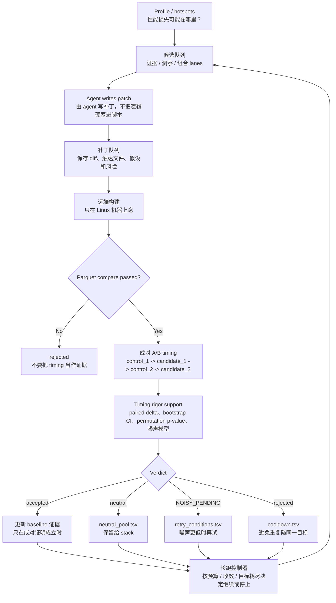
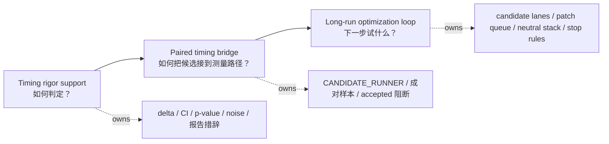

# Psi Headless Optimization Layered Architecture

## Why this note exists

The Psi headless system now has enough moving parts that responsibilities can blur:

- timing rigor support
- paired timing bridge
- candidate generation and patch handling
- long-run stop / continue logic
- report wording and artifact contracts

This note separates those responsibilities so different sessions can work in parallel without stepping on each other.

## The three layers

```text
timing rigor support -> paired timing bridge -> long-run optimization loop
```

## Human-readable flow



This is the whole system in one picture:

- the agent proposes and writes patches
- the remote gate checks correctness
- paired timing decides whether the patch really helped
- the long-run controller decides whether to continue

## Layer responsibility map



### 1. Timing rigor support

This layer defines how timing evidence is interpreted.

It owns:

- paired delta math
- bootstrap confidence intervals
- permutation p-values
- noise-aware verdicts
- timing-history fields
- report wording for evidence

It does **not** own:

- candidate selection
- patch generation
- remote execution
- business optimization logic

Think of this as the `尺子`.
It decides how to measure and how to read the result.

### 2. Paired timing bridge

This layer connects a candidate under test to the remote Linux execution path that can produce paired A/B evidence.

It owns:

- passing `CANDIDATE_RUNNER`
- validating control runner vs candidate runner
- recording paired control/candidate samples
- blocking `accepted` when paired evidence is missing
- writing paired fields into comparison artifacts

It does **not** own:

- candidate discovery
- long-run stop policy
- timing formula design

Think of this as the `桥接层`.
It makes sure the measured object is actually wired into the measurement system.

### 3. Long-run optimization loop

This layer decides what to try next and when to stop.

It owns:

- evidence / insight / combination candidate lanes
- patch queue persistence
- neutral pool retention
- neutral-stack composition
- retry conditions and cooldowns
- budget / convergence / no-target stop rules

It does **not** own:

- timing math
- verdict formulas
- report wording

Think of this as the `调度器`.
It keeps the system moving.

## Why the split matters

Without the split, one session may change the timing rules while another changes the remote bridge, and the report becomes hard to trust.

With the split:

- support work can tighten measurement without changing optimization search
- bridge work can wire real remote evidence without rewriting the math
- long-run work can keep looping without inventing new timing semantics

## How the sessions map

### Session 1

Focus:

- `HFT-wf/scripts/psi_timing_analysis.py`
- `HFT-wf/scripts/psi_timing_history.py`
- `HFT-wf/scripts/psi_daily_report.py`
- `.trellis/spec/HFT-wf/backend/quality-guidelines.md`
- `.trellis/spec/HFT-wf/backend/psi-headless-auto-loop.md`

Role:

- make the `尺子` precise and readable

### Session 2

Focus:

- `HFT-wf/scripts/psi_headless_remote.sh`
- `HFT-wf/scripts/psi_headless_auto_loop.py`
- `HFT-wf/scripts/psi_headless_longrun.py`

Role:

- make the `桥接层` and `调度器` actually work on the remote devbox

## What the full system should look like

```text
profile -> candidate queue -> patch worker -> remote build -> compare -> paired timing
-> verdict -> artifacts -> next candidate
```

The important rule is:

- support layer defines how to judge
- bridge layer ensures the judge sees the real candidate
- loop layer decides whether to keep going

## Practical reading guide

If you are changing:

- timing math -> start with the support layer
- remote execution and `CANDIDATE_RUNNER` -> start with the bridge layer
- candidate queueing, neutral stack, or stop rules -> start with the long-run loop

## Stable rule

Do not mix per-run evidence into this note.

This file is a contract, not an experiment log.
