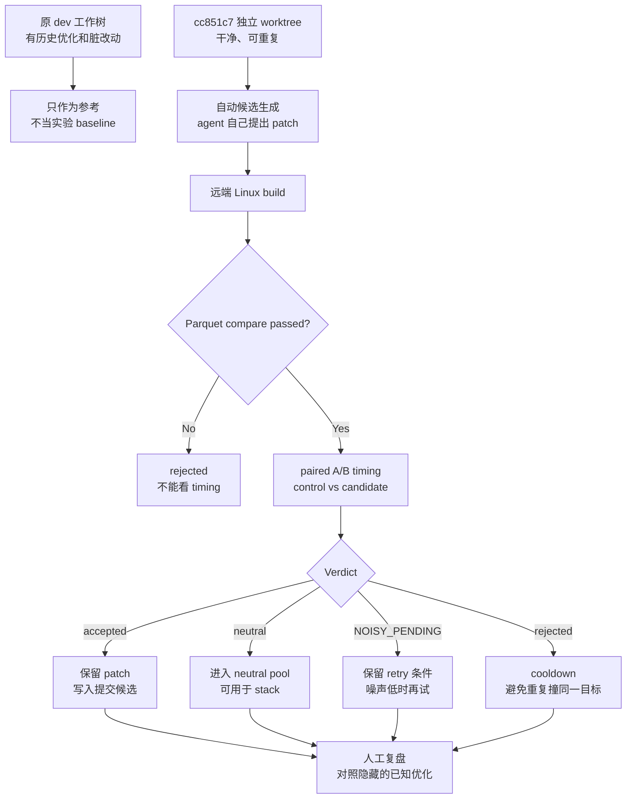

# Psi Clean Baseline Experiment Playbook

## 0. 这份文档讲什么

这份文档是给人看的。

它回答一个问题：

```text
如果我们想验证“全自动 Psi 优化流程到底好不好”，应该从哪里开始、怎么隔离、怎么判断？
```

它不是启动 prompt，也不是某次 run 的结果日志。
真正的运行证据仍然要看 `run_state.json`、`comparison_summary.json`、`timing_samples.tsv`、`timing_history.tsv` 和报告。

## 1. 一句话结论

不要把当前 `dev` 工作树真的回退。

应该用一个干净的独立实验底座：

```text
baseline commit: cc851c7
baseline workspace:
C:\Users\liangjunming\Desktop\work\Code1\psi-trader-liangjunming-baseline-cc851c7
```

然后让自动优化流程在这个独立底座上跑。
旧的已知优化可以作为“上帝视角复盘材料”，但不要喂给候选生成 agent。

## 2. 为什么不直接从 70 秒版本开始

70 多秒的版本适合回答：

```text
系统能不能重新找到很明显的大优化？
```

但现在更重要的问题是：

```text
系统在一个已经比较干净的版本上，能不能继续稳定、严谨、自动地找小优化？
```

这两个问题不一样。

如果从很早的慢版本开始，流程很容易靠大热点过关，看起来很聪明。
但这不一定能证明它已经适合长期 headless 榨性能。

从 `cc851c7` 开始更难一些，但更有价值：

- 它已经是通过 compare 的安全版本。
- 它离当前优化成果很近，不会被明显大坑掩盖问题。
- 它可以测试小收益候选是否会被 paired timing 正确识别。
- 它能暴露候选生成、证据记录、报告解释、stop rule 的真实质量。

## 3. 当前实验底座

当前准备好的实验底座是：

```text
C:\Users\liangjunming\Desktop\work\Code1\psi-trader-liangjunming-baseline-cc851c7
```

这个目录是从业务仓库单独 checkout 出来的 worktree，状态是：

```text
detached HEAD at cc851c7
working tree clean
```

原来的业务仓库仍然保留在：

```text
C:\Users\liangjunming\Desktop\work\Code1\psi-trader-liangjunming
```

那里还有很多未提交改动。
这些改动暂时只当作历史材料和待分拣对象，不作为新实验 baseline。

## 4. 正确的实验结构



这个图里最重要的是两条隔离线：

- `cc851c7` 是实验起点。
- 原 `dev` 上的历史优化和脏改动只用于复盘，不参与候选生成。

## 5. “上帝视角”怎么用

你说的“保存下来的优化只有你能看到”，可以落成一个清晰规则：

```text
candidate agent 不看已知答案。
reviewer / main session 可以在实验后对照已知答案。
```

也就是说：

- 自动流程不知道之前哪些优化有效。
- 自动流程只能根据 profile、hotspot、代码上下文自己生成 patch。
- 实验结束后，再用已知优化做对照：
  - 它有没有重新发现同类优化？
  - 它有没有找到更小但真实的优化？
  - 它有没有把噪声错判成 accepted？
  - 它有没有漏掉明显候选？

这个做法比“直接把已知优化喂进去”更能测试流程能力。

## 6. 什么叫流程真的好

一个好的全自动优化流程，不只是能跑出一个 accepted。

它至少要做到：

1. 候选是 agent 自己生成的，不是脚本硬编码。
2. 每个候选都有 patch、假设、触达文件和验证记录。
3. compare 不过时，不能看 timing，更不能 accepted。
4. 没有 paired A/B evidence 时，不能 accepted。
5. noisy 候选不能让整个长跑停掉。
6. neutral 候选要能保留，后面可以 stack。
7. 报告能让人看懂：
   - 旧 control 是谁
   - candidate 是谁
   - baseline 是否真的更新
   - paired 判定是否完成
8. 长跑停止必须有明确原因：
   - accepted
   - budget_stop
   - no_targets
   - convergence_proven
   - remote_failed
   - repeated_infra_failure
   - user_stopped

如果这些都成立，再谈“榨性能”才有意义。

## 7. 这次实验要观察什么

这次不是只看速度数字。

要看四层东西：

### 7.1 候选生成

观察 agent 是否能从 profile / hotspot 里提出合理候选。

坏信号：

- 总是改同一块代码
- patch 很大但假设很虚
- 修改 benchmark、factor set、schema、baseline 数据

好信号：

- 候选小而可解释
- 每个 patch 都能说清楚为什么可能变快
- rejected 后能换方向，不是原地撞墙

### 7.2 证据链路

观察每个候选是否完整走过：

```text
patch -> build -> compare -> paired timing -> verdict -> artifacts -> report
```

缺一环，就不能算真实 accepted。

### 7.3 timing 判定

观察 paired timing 是否真的在保护我们：

- 小收益不会被粗糙均值误杀
- 服务器抖动不会被误收成 accepted
- NOISY_PENDING 会被保留重试，而不是让全局停止

### 7.4 报告和复盘

观察报告是否能让人快速回答：

```text
这次测的是谁？
compare 过了吗？
paired sample 有多少？
delta 中位数是多少？
CI / p-value 怎么样？
为什么是 accepted / neutral / noisy / rejected？
下一步该试什么？
```

## 8. 去 MVP 化还差什么

现在的系统已经不是玩具，但如果要变成长期可靠的优化机器，还可以继续收紧：

1. Baseline registry

   把 `cc851c7`、历史 70s baseline、accepted baseline、实验 baseline 都登记成明确条目，避免靠人记。

2. Experiment ledger

   每次长跑都有一个总账，记录：

   ```text
   baseline commit
   run_dir
   candidate count
   accepted count
   neutral count
   noisy count
   rejected count
   best evidence
   known-answer comparison
   ```

3. Artifact checker

   自动检查每次 run 是否缺：

   ```text
   run_state.json
   heartbeat.json
   comparison_summary.json
   timing_samples.tsv
   timing_history.tsv
   report markdown
   ```

4. Hidden-answer review

   把已知有效优化当作 blind benchmark 的答案。
   自动流程跑完后，再由 reviewer 对照，判断它是：

   - 重新发现已知优化
   - 找到不同但有效的优化
   - 被噪声误导
   - 没有探索到关键区域

5. Promotion policy

   明确什么时候从实验 worktree 提升到业务 repo：

   ```text
   compare pass
   paired evidence present
   accepted verdict
   report complete
   patch scope clean
   no scratch artifacts staged
   ```

## 9. 本轮执行顺序

本轮推荐顺序：

1. 固定 `cc851c7` worktree。
2. 保持原 `dev` 脏树不动。
3. 让自动流程从 `cc851c7` 起跑。
4. 不给 agent 看已知优化答案。
5. 每个候选都要求远端 build / compare / paired timing。
6. 只把完整 accepted 的 patch 作为提交候选。
7. 跑完后，用已知优化做上帝视角复盘。
8. 如果流程问题比候选问题更明显，优先修流程，不急着追求 accepted 数量。

## 10. 成功标准

这轮实验成功，不一定等于又快了 10 秒。

更合理的成功标准是：

- baseline 干净且可复现
- candidate 由 agent 自动生成
- artifacts 完整
- accepted 不依赖 Windows timing
- 没有 paired evidence 就不会 accepted
- noisy 不会误停全局流程
- 报告能解释每个 verdict
- 人可以用隐藏答案复盘流程质量

如果这些都成立，说明全自动优化 harness 已经进入“可以长期榨性能”的形态。

如果这些不成立，即使跑出了一个速度数字，也应该先修流程。
