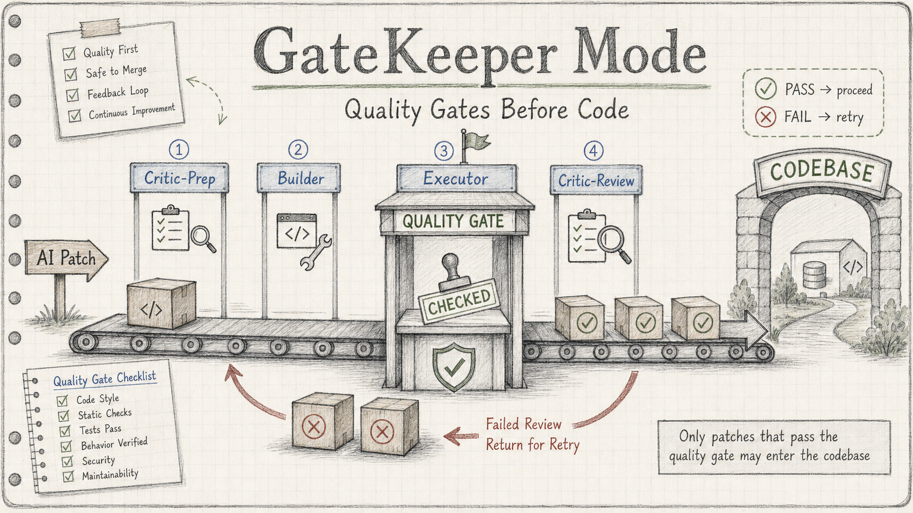
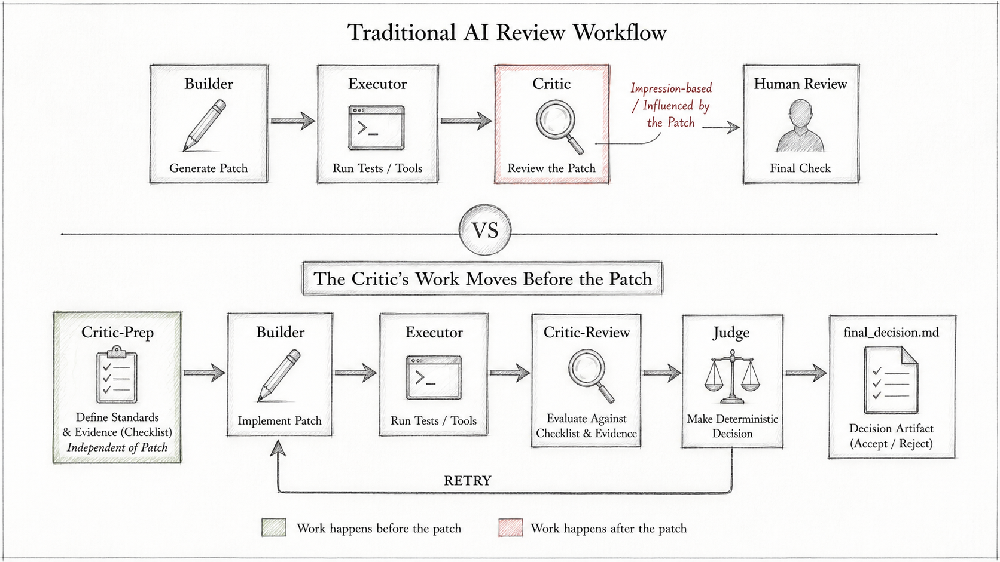
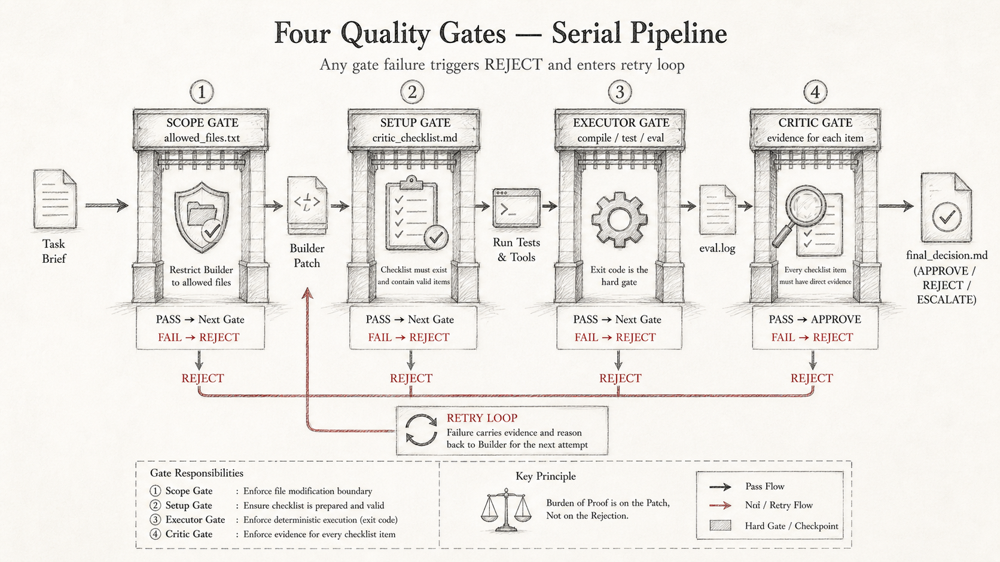
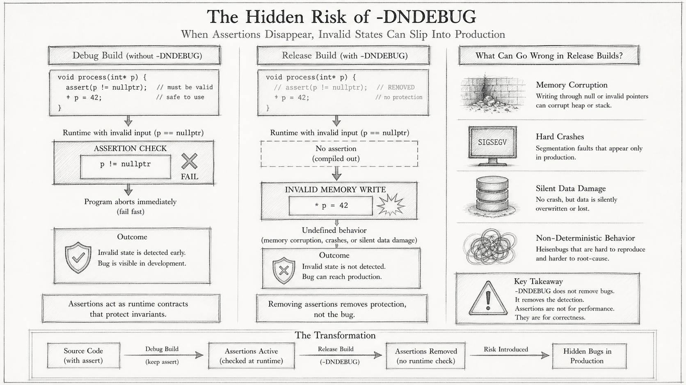

# GateKeeper Mode：在 AI 改代码之前，先建质量门禁

> **核心主张**：当 AI 能写代码之后，瓶颈不再是"它能不能写出 patch"，而是"系统能不能证明这个 patch 应该被接受"。

<!--
╔══════════════════════════════════════════════════════════════════╗
║  🖼  ILLUSTRATION #1  ——  文章题图（文生图）                    ║
╠══════════════════════════════════════════════════════════════════╣
║                                                                  ║
║  Create a 16:9 hand-drawn technical blog illustration.           ║
║  Style: off-white graph-paper background, pencil sketch          ║
║  aesthetic, muted watercolor in pale green, amber, light blue,   ║
║  soft red. No dark gradients, no glossy SaaS UI, no neon colors. ║
║                                                                  ║
║  Topic: A quality gate workflow that intercepts AI-generated     ║
║  code patches before they enter a codebase.                      ║
║                                                                  ║
║  Main metaphor: A customs checkpoint on a conveyor belt road.    ║
║  On the left, boxes labeled "AI Patch" arrive on a belt.         ║
║  In the center, a checkpoint booth with a checklist stamp.       ║
║  On the right, approved boxes proceed to "CODEBASE";             ║
║  rejected boxes loop back with a curved red arrow.               ║
║                                                                  ║
║  Text to include:                                                ║
║  - Title: "GateKeeper Mode"                                      ║
║  - Subtitle: "质量门禁先于代码"                                  ║
║  - Labels: "Critic-Prep", "Builder", "Executor", "Critic-Review" ║
║                                                                  ║
║  Composition: single left-to-right pipeline with four labeled    ║
║  stations on a notebook page background.                         ║
║                                                                  ║
║  Avoid dark gradients, glossy SaaS UI, neon colors,              ║
║  photorealism, generic AI imagery. All text large and legible.   ║
╚══════════════════════════════════════════════════════════════════╝
-->



---

## 1. 为什么"AI 写了代码"不是难点

如果你用 AI 辅助写过一段时间代码，你大概跑过类似这样的流程：

1. 写一个 prompt，让 agent 实现某个功能
2. 让另一个 agent（或同一个）扫一下 diff，看有没有问题
3. 自己快速过一遍改动
4. 跑测试，通过了就 merge

这个流程在简单任务上没什么问题。但它隐藏着几个会在规模扩大时集体爆发的假设。

**友好评审偏见。** 让 AI 评审 AI 写的代码，评审者天然倾向于认可而不是质疑。它看到一个能跑通的实现，读起来又合理，通常不会主动追问"这个 except Exception 是不是 catch 了太多东西"。它没有动机挑毛病，也没有一个独立于 patch 之前的标准来对照。

**测试通过 ≠ 行为正确。** 测试覆盖的是"测试写了什么"，不是"需求要求什么"。如果你的需求是"只能 catch `ZeroDivisionError`，不能过度 catch"，写一组 4/4 全过的测试完全不能证明这一点。测试通过是证据，不是满足所有要求的证明。

**缺少证据被当成可以接受。** 如果 Critic 没找到问题，通常解释为"没有问题"，而不是"没有找到问题的证据"。两件事不一样。

**手动 review 疲劳。** 当你真的想认真看 diff 时，往往已经读了十几轮对话记录，注意力早就不在关键地方了。

**Agent 改了范围外的文件。** 没有明确限制的情况下，agent 很可能顺手改了它觉得"相关"的文件。这些改动有时候不会报错，但会悄悄改变系统行为。

**多轮对话产生难以追溯的漂移。** 跑了三轮之后，谁改了什么、为什么改、上一次失败的原因是什么——这些信息散落在对话历史里，要花时间重新整理。

这些问题并不是 AI 不够聪明造成的。它们是工作流设计的问题。AI 已经能写出合理的 patch，现在的挑战是：**你有没有一个系统，能确定性地告诉你这个 patch 是否应该被接受？**

---

## 2. 内部对抗评审模式

GateKeeper Mode 的核心不是一个更强的 prompt，而是一个角色分离的 workflow。它的关键设计是：**把 Critic 的工作拆成两个时间点**。

普通的 AI 评审流程里，Critic 出现在 patch 之后：看到实现，再发表意见。这意味着 Critic 的判断会受到 Builder 的实现方式影响——它看到一个"能工作的"方案，读起来又合理，批评的门槛自然就高了。

GateKeeper Mode 把 Critic 的工作提前：

| 普通 AI 评审 | GateKeeper Mode |
|---|---|
| Critic 出现在 patch 之后 | Critic 在 patch 之前定义证据标准 |
| 评审基于印象 | 评审基于 checklist + 确定性证据 |
| 测试是可选背景 | Executor 是硬门禁，exit code 决定通过 |
| 批准可以含糊 | 格式错误的批准默认视为 reject |
| 人重新读全部内容 | 人只读 final_decision.md |
| 一次性交互 | Reject 携带证据进入重试，Builder 看到的是失败原因 |

**举证责任在 patch 上，不在 rejection 上。**

Critic 不需要解释为什么拒绝。它只需要说：checklist 的这三项没有找到对应的证据。如果 Builder 的 patch 没有满足这些项，它就应该被拒绝，不需要更多理由。缺少证据，默认拒绝。

<!--
╔══════════════════════════════════════════════════════════════════╗
║  🖼  ILLUSTRATION #2  ——  时间线对比图（文生图）                ║
╠══════════════════════════════════════════════════════════════════╣
║                                                                  ║
║  Create a 16:9 hand-drawn technical comparison diagram.          ║
║  Style: off-white graph-paper background, pencil sketch,         ║
║  muted watercolor in pale green, amber, light blue, soft red.    ║
║                                                                  ║
║  Layout: Two horizontal timelines stacked vertically,            ║
║  separated by a thin dividing line labeled "vs".                 ║
║                                                                  ║
║  Top timeline — "普通 AI 评审":                                 ║
║    [Builder] → [Executor] → [Critic] → [Human Review]           ║
║    The Critic box is drawn in soft red/amber with a note:        ║
║    "印象评审 / 受 patch 影响"                                   ║
║                                                                  ║
║  Bottom timeline — "GateKeeper Mode":                           ║
║    [Critic-Prep] → [Builder] → [Executor] → [Critic-Review]     ║
║                   → [Judge] → [final_decision.md]               ║
║    The Critic-Prep box is drawn in pale green with a note:       ║
║    "先定标准 / 独立于 patch"                                    ║
║    An arrow loops from Judge back to Builder labeled "RETRY".    ║
║                                                                  ║
║  Key annotation in the center: "Critic 的工作提前到 patch 之前" ║
║                                                                  ║
║  No photorealism, no gradients, all text legible.                ║
╚══════════════════════════════════════════════════════════════════╝
-->




---

## 3. 从 GateKeeper Lite 到完整 GateKeeper Mode

这个设计是逐渐演进来的，不是一开始就这么完整。

最早的版本（Lite）是这样的：

```
Builder → Executor → Critic
```

Builder 写代码，Executor 跑测试，Critic 在有了 patch 和执行日志之后做评审。这已经比纯手动好很多：执行结果是确定性的，Critic 的评审有日志可以引用，人只需要看 Critic 的结论。

但这里有一个内在矛盾：Critic 的判断标准是在看到 patch 之后才形成的。它很难真正独立于 Builder 的实现方式。看到一个"能工作的"实现，它自然会从"这里有什么问题"的角度去找，而不是从"这个实现是否满足了预先定义的每一条要求"的角度去查。

完整版本的关键升级是加入 **Critic-Prep**：

```
Critic-Prep → Builder → Executor → Critic-Review
```

Critic-Prep 发生在 Builder 开始工作之前。它读 brief（任务描述）和允许修改的文件范围，写出验收 checklist。这个 checklist 不是模糊的要求，而是具体的、可以逐项核查的证据标准——精确到函数签名、边界情况的期望返回值、哪些文件不能被动。

然后 Builder 在完全不知道 checklist 存在的情况下写代码。这是故意的：Builder 看不到 checklist，所以它的实现不会被 checklist 的措辞引导，Critic-Review 的评审结果也就不会被 Builder 的实现风格污染。

**Critic 有价值，恰恰是因为它在 Builder 影响之前就定义了证据标准。**

---

## 4. 本地 CLI 实现

这套 workflow 目前完全在本地跑，没有引入框架。

| 角色 | 工具 | 说明 |
|------|------|------|
| Builder | Claude Code（CLI） | 写 patch，在 git worktree 隔离，看不到 checklist |
| Critic-Prep | Codex（CLI） | 读 brief + allowed_files，写验收 checklist |
| Executor | Shell 脚本 | 编译、测试、评估器，exit code 决定通过/失败 |
| Critic-Review | Codex（CLI） | 读 patch.diff + eval.log，对照 checklist 逐项核查 |
| Judge | Shell 脚本 | 解析 Critic 输出，写 final_decision.md，决定 APPROVE / REJECT / ESCALATE |
| 人 | 用户 | 只读 final_decision.md，不需要盯每一轮对话 |

每次 GateKeeper run 在独立的 git worktree 里执行，产出的 artifact 包括：`critic_checklist.md`、`patch.diff`、`eval.log`、`critic_review.md`、`final_decision.md`。这些文件是完整的证据链，也是事后追溯的唯一依据。

为什么不用 AutoGen 或 LangGraph？不是因为它们不好，而是在还没有确定性证据证明 workflow 的语义正确之前，引入框架只会增加调试难度。先用可见的文件和日志把语义搞清楚，再考虑迁移。可见的 artifact 比框架抽象更容易调试——这不是偏好，是经验。

---

## 5. 四个门禁

整个流程有四个确定性门禁，任何一个失败都会触发 REJECT：

```
① scope gate:    allowed_files.txt 限制 Builder 能改哪些文件
                 超出范围的修改直接 REJECT，不进入 Executor

② setup gate:    critic_checklist.md 必须存在且包含有效 items
                 Critic-Prep 没跑成功就不允许 Builder 开始

③ executor gate: 编译 + 测试 + 评估器的 exit code
                 任何一个非零退出 → REJECT，进入重试

④ critic gate:   每个 checklist item 必须有对应的直接证据
                 模糊的"大体满足"不算证据，缺少证据默认 FAILED
```

四个门禁是串行的。通过前一个才能进入下一个。这意味着：scope gate 拦截的问题不会浪费 Executor 的时间，Executor 拦截的问题不会浪费 Critic-Review 的时间。失败越早发现，成本越低。

<!--
╔══════════════════════════════════════════════════════════════════╗
║  🖼  ILLUSTRATION #3  ——  四个门禁串行流程图（文生图）          ║
╠══════════════════════════════════════════════════════════════════╣
║                                                                  ║
║  Create a 16:9 hand-drawn pipeline diagram.                      ║
║  Style: off-white graph-paper background, pencil linework,       ║
║  watercolor in pale green (pass), soft red (fail), warm gray.   ║
║                                                                  ║
║  Layout: A left-to-right horizontal pipeline with 4 gate nodes.  ║
║                                                                  ║
║  Input node (left): "AI Patch"                                   ║
║                                                                  ║
║  Gate 1 — "① Scope Gate"                                        ║
║    Pass (→ right): allowed_files only                            ║
║    Fail (↓ red arrow): "out-of-scope file → REJECT immediately"  ║
║                                                                  ║
║  Gate 2 — "② Setup Gate"                                        ║
║    Pass (→): checklist exists                                    ║
║    Fail (↓ red): "no checklist → Builder blocked"               ║
║                                                                  ║
║  Gate 3 — "③ Executor Gate"                                     ║
║    Pass (→): all exit codes 0                                    ║
║    Fail (↓ red): "build/test fail → REJECT + retry"             ║
║                                                                  ║
║  Gate 4 — "④ Critic Gate"                                       ║
║    Pass (→ green "APPROVE"): all items have evidence            ║
║    Fail (↓ red): "missing evidence → REJECT / ESCALATE"         ║
║                                                                  ║
║  Each gate is drawn as a hexagonal checkpoint stamp.             ║
║  A small annotation under the pipeline:                          ║
║  "失败越早发现，成本越低"                                       ║
║                                                                  ║
║  No gradients, no photorealism. All labels in legible print.     ║
╚══════════════════════════════════════════════════════════════════╝
-->



---

## 6. 真实运行结果

**先用最小例子验证每条路径，再切到真实 C++ 项目。** 场景一到四是刻意简化的 Python 任务，目的是让一次通过、重试、ESCALATE、语义拒绝这四条路径在不引入真实项目编译噪声的情况下单独可验证。场景五和六才是真实项目的运行结果。

---

### 场景一：一次通过（APPROVE on attempt 1）

**运行目录**：`gatekeeper_runs/20260503-173556/`

**任务**：在 `python-utils/safe_add.py` 写一个 `safe_add` 函数，处理 `None` 输入。

Critic-Prep 在 Builder 开始前预写了包含 10 项的 checklist：

```
- [ ] File python-utils/safe_add.py defines function safe_add
- [ ] Function signature is exactly safe_add(a: float | None, b: float | None) -> float
- [ ] safe_add(10.0, 2.0) returns 12.0
- [ ] safe_add(None, 2.0) returns 0.0
- [ ] safe_add(10.0, None) returns 0.0
- [ ] safe_add(None, None) returns 0.0
- [ ] safe_add(-5.0, 3.0) returns -2.0
- [ ] File python-utils/test_safe_add.py exists and includes tests for all required cases
- [ ] Evaluator script scripts/evaluators/evaluate_safe_add.sh passes in executor log
- [ ] No files outside the allowed list are modified
```

这 10 项覆盖了精确的函数签名、所有边界情况的期望返回值、测试文件存在性、评估器通过状态、文件范围约束。Builder 没有理解歧义的空间。

```
final_decision.md:
  Final verdict: APPROVE
  Attempts used: 1 / 3
  Gate: CRITIC — All checklist items have direct evidence
```

Attempt 1 直接通过。Critic-Prep 写的 checklist 精确到每个输入的期望输出，实现要么满足要么不满足，没有中间地带。这是场景一想验证的：当证据标准足够清晰，一次通过不是运气，是必然。

---

### 场景二：确定性重试（RETRY → APPROVE）

**运行目录**：`gatekeeper_runs/20260503-173731/`

**任务**：刻意设计成 Attempt 1 必然失败（evaluator 第一次执行返回 exit 1），用于验证重试机制本身是否工作。

Attempt 1 的 `eval.log` 末尾：

```
Attempt number: 1
FAIL: First attempt intentionally fails to trigger retry
This is a deterministic test for retry logic.
```

Judge 解析到 EXECUTOR gate 失败，触发重试。Builder 收到 Attempt 1 的失败原因——包括完整的 `eval.log` 和 Critic-Review 里的具体失败项——重新实现。

```
final_decision.md:
  Final verdict: APPROVE
  Attempts used: 2 / 3

  Attempt 1: REJECT — Gate: EXECUTOR (exit code 1)
  Attempt 2: APPROVE — Gate: CRITIC
```

重试机制的关键设计：REJECT 不只是返回"失败"，它把完整的证据携带给下一轮 Builder。Builder 下一轮看到的是：哪个 gate 失败了、失败原因是什么、哪些 checklist item 没有找到证据。这比单纯的"重试"有信息量得多——Builder 不是盲目重试，而是带着诊断结果重试。重试的效率来自证据的精确传递，不来自 Builder 的猜测。

---

### 场景三：超出重试上限（ESCALATE）

**运行目录**：`gatekeeper_runs/20260503-173917/`

**任务**：两次都确定性失败（`max_attempts=2`），验证 ESCALATE 路径。

```
final_decision.md:
  Final verdict: ESCALATE
  Attempts used: 2 / 2

  Attempt 1: REJECT — Gate: EXECUTOR
  Attempt 2: REJECT — Gate: EXECUTOR
```

附带 cleanup 命令和所有中间 artifact 的路径，等待人工介入。

ESCALATE 不是"流程出错了"，而是系统在说：这个任务超出了当前可以自动处理的范围，需要人来看。`final_decision.md` 给人提供的不是"哪里出错了"的猜测，而是完整的证据链：每一轮的 eval.log、Critic-Review 的逐项判断、Judge 的解析结果。人审查证据包，不需要重新读对话历史。ESCALATE 的价值在于它是一个清晰的停止点，不是一个悄悄失败的终点。

---

### 场景四：语义 Reject（测试通过，Critic 仍然拒绝）

**运行目录**：`gatekeeper_runs/20260503-153929/`

这是最能说明 Critic gate 价值的场景。

**任务**：实现 `safe_divide`，要求只捕获 `ZeroDivisionError`，不能过度 catch。

**Executor 结果**：4/4 测试全部通过。

**Critic-Review 的判断**：

```
Verdict: REJECT

3. Function catches ONLY ZeroDivisionError
   Evidence: FAILED — Patch shows except Exception:

6. No over-catching of unrelated exceptions
   Evidence: FAILED — except Exception: catches too much
```

Builder 写了 `except Exception`，这会把所有异常都吞掉——包括类型错误、属性错误这类调用方应该知道的问题。测试通过，因为测试只测了正常路径和除零路径，完全没有覆盖"只捕获特定异常"这条约束。

**这是 Critic-Prep 的核心价值所在。** 它在看任何代码之前就把"只捕获特定异常"写进了 checklist，这条约束对 Builder 而言是隐藏的、不可妥协的。没有这个预写的 checklist，这种语义问题在评审里几乎一定会被忽略——"4/4 测试通过，代码看起来也合理"，批准的门槛太低了。这个场景同时也验证了一件更重要的事：如果你只看 Executor gate，你会以为 patch 已经通过了。语义正确性需要 Critic gate，两个门禁缺一不可。

---

### 场景五：真实 C++ 项目（cpp-trader-backtester）

**运行目录**：`gatekeeper_runs/20260503-205323/`

**任务**：为 C++ 订单簿项目添加 volume consistency invariant 测试。真实项目，真实 C++ 编译，Debug/ASan 构建。

Critic-Prep 预写了 13 项 checklist：

```
- [ ] Only cpp-trader-backtester/src/test_order_book.cpp is modified
- [ ] New function test_volume_invariant() exists
- [ ] Test records executed quantity via set_trade_callback
- [ ] Test verifies remaining resting volume after matching
- [ ] Test explicitly checks: executed_quantity + remaining_volume == total_submitted_quantity
- [ ] Build passes according to evaluate_cpp_trader.sh
- [ ] All order book tests pass
- [ ] No production files are changed
...（共 13 项）
```

checklist 覆盖了文件范围（只能改 `test_order_book.cpp`）、测试函数名、测试逻辑的三个具体验证点、构建通过状态、生产文件不能被改动。每一项都是可以在 patch.diff 或 eval.log 里找到直接证据的，没有一项是"大体满足就算"的主观判断。

```
Attempt 1: REJECT — Gate: CRITIC
  Missing explicit verification that executed quantity
  equals expected matched quantity.

Attempt 2: APPROVE — Gate: CRITIC
  All checklist items have direct evidence.
```

Builder 在 Attempt 1 里验证了剩余量，但没有显式断言成交量等于期望值——`executed_quantity + remaining_volume == total_submitted_quantity` 这个等式的左边只验证了 `remaining_volume`，没有验证 `executed_quantity`。Critic-Prep 的 checklist 里有这一项，遗漏被准确定位。Attempt 2 补上了这个断言，通过。

这类遗漏在普通 code review 里极容易漏掉：实现看起来完整、测试也通过了，只有对照预先写下的验收标准逐项检查，才能发现"断言的是 remaining 而不是 executed"。

Git commit：`b0712a6 feat(cpp-trader): Add volume consistency invariant test`

---

### 场景六：Stress Test ESCALATE（暴露评估器自身的弱点）

**运行目录**：`gatekeeper_runs/20260503-214848/`

这是整篇文章最有价值的场景，也是最诚实的部分。

**任务**：修复 strategy 层的 ownership 验证和 fill accounting。比 invariant 测试更复杂，涉及多个文件，还需要 strategy 层逻辑配合。

```
final_decision.md:
  Final verdict: ESCALATE
  Attempts used: 3 / 3

  Attempt 1: REJECT — Gate: CRITIC
    Missing evidence that production strategy tests verify owned buy/sell fills.
    Executor log suggests assertions were disabled.

  Attempt 2: REJECT — Gate: CRITIC
    Owned fill behavior is not proven; executor output shows expected position
    updates did not occur while tests still reported PASS.

  Attempt 3: REJECT — Gate: EXECUTOR (exit code 1)
```

Attempt 1 的 Critic 发现了一条关键线索（Codex 写的）：

```
Checklist item: MomentumStrategy::on_trade ignores unrelated trades
Evidence: FAILED — executor log shows assertions were disabled via -DNDEBUG.
Tests that passed may not have actually checked the assertions.
```

这句话指向了根本问题。

---

> ⚠️ **评估器一直在用 Release 模式编译测试。**
>
> 项目的 Release flags 里有 `-DNDEBUG`，C 标准规定 `assert()` 在 `-DNDEBUG` 下被预处理掉，变成空语句。所有依赖 `assert()` 的测试检查，**实际上一行都没有运行**。
>
> 测试报告 PASS，是因为测试里除了 `assert()` 之外没有其他失败路径——这等价于把所有断言全部删掉再跑测试：当然全过，但什么都没有检验。
>
> **评估器的质量门禁，实际上只是冒烟测试。**

---

修复是直接的：评估器改为 Debug/ASan 模式跑测试，Release 构建只用于 benchmark 的烟雾测试。

这次 ESCALATE 是有价值的结果，不是流程失败。**GateKeeper 不只是 patch 过滤器：它是调试质量系统本身的工具。** 如果没有 Critic 在证据层面较真，`-DNDEBUG` 这个问题可能会以"行为奇怪但测试通过"的方式潜伏很长时间，让所有后续的测试结果都带着一个看不见的漏洞。三次 ESCALATE 暴露了评估器自身的质量问题——这件事本身比任何一次 APPROVE 都有价值。

<!--
╔══════════════════════════════════════════════════════════════════╗
║  🖼  ILLUSTRATION #4  ——  -DNDEBUG 漏洞示意图（文生图）        ║
╠══════════════════════════════════════════════════════════════════╣
║                                                                  ║
║  Create a 16:9 hand-drawn technical diagram.                     ║
║  Style: off-white graph-paper background, pencil sketch,         ║
║  muted watercolor in pale green, amber, and soft red.            ║
║                                                                  ║
║  Topic: The -DNDEBUG assert() silencing problem.                 ║
║                                                                  ║
║  Layout: Two side-by-side boxes with a divider labeled "vs".     ║
║                                                                  ║
║  Left box — "Release Build (-DNDEBUG)" in soft red:             ║
║    Code snippet (handwritten style):                             ║
║      assert(x == expected);   // ← 被预处理掉                  ║
║      // 等同于: (空语句)                                        ║
║    Below: "Test reports: ✅ PASS"                                ║
║    Below: "实际执行: 0 条断言"                                  ║
║    A sad/hollow checkmark or ghost tick drawn in red.            ║
║                                                                  ║
║  Right box — "Debug Build (ASan)" in pale green:                ║
║    Code snippet:                                                 ║
║      assert(x == expected);   // ← 实际运行                    ║
║    Below: "Test reports: ❌ FAIL (assertion failed)"            ║
║    Below: "实际执行: 有效检验"                                  ║
║    A solid checkmark drawn in green.                             ║
║                                                                  ║
║  Below both boxes, a footer annotation:                          ║
║  "GateKeeper 让这个漏洞从不可见变成可见"                       ║
║                                                                  ║
║  No photorealism, no dark gradients. Clean legible text.         ║
╚══════════════════════════════════════════════════════════════════╝
-->



---

## 7. Callback 时序问题：顺带暴露的设计 bug

strategy accounting 任务在调试过程中还暴露了一个同步设计问题，和 GateKeeper workflow 本身无关，但通过它的运行才有机会被认真对待。

问题出在调用顺序上：

```
submit_order()
  → add_order()
    → match_order()
      → execute_trade()
        → trade_callback_()    # Strategy::on_trade 在这里执行
  → return order_id            # 已经太晚了，strategy 无法预先注册 id
```

这不是多线程竞争，是同步回调的重入顺序问题。当 `on_trade` 被调用时，`submit_order()` 还没返回，调用方还拿不到 `order_id`。Strategy 在收到 fill 回调时，没有办法判断这笔成交是否属于自己提交的订单。这个 bug 不会触发任何异常，测试在 `assert()` 被禁用的情况下全部通过——它以"行为奇怪但日志正常"的方式存在。

解决方案是两阶段 API：`prepare_order()` 先同步返回 `order_id`，strategy 记录之后再调用 `submit_prepared_order()` 触发撮合。改完之后，ownership 验证才有了正确的时间锚点。

这个 bug 不是 GateKeeper 设计来检测的，也不是它引入的。但如果不是在 ownership validation 的运行过程中较真地看证据，它很可能会继续潜伏。Critic-Prep 写下的 checklist 要求"有证据证明 on_trade 能正确识别自己的 fill"，这条要求强迫实现者必须面对时序问题，没有绕开的空间。

---

## 8. 这套方案还不能解决什么

诚实说清楚边界：

**它不是更强的 prompt 技术。** GateKeeper Mode 改变的是 workflow 结构，不是单次对话的质量。如果你的任务需要一个更聪明的 agent，这套方案解决不了这个问题。

**它不能替代领域测试。** GateKeeper 保证 checklist 里的项有证据，但 checklist 的质量取决于 Critic-Prep 的输入。如果 brief 写得不完整，checklist 就不会覆盖所有需求。评估器测了什么，就只能保证什么。这是使用者的责任，不是系统的保障。

**它不能证明 agent 永远正确。** 通过的 patch 是"在当前 checklist 和测试覆盖下被接受的 patch"，不是"永远正确的 patch"。这两件事不一样，不应该混淆。

**Attacker 还没接入。** 完整的设计里，Attacker 角色应该在 Critic-Review 之前主动用边界输入攻击 patch，把攻击结果作为额外证据送给 Critic。这还没实现，当前的质量门禁只有防御性的，没有主动攻击性的。这是下一个要做的事。

最后一条，也是最重要的一条：

> **一个 Executor 门禁只有它运行的命令那么强。如果测试依赖 `assert()`，在 `-DNDEBUG` 下运行就把质量门禁变成了冒烟测试。**

这不是 GateKeeper 的问题，是使用者的责任。GateKeeper 的价值在于让这种弱点变得可见——但修复需要使用者动手。可见性是前提，行动是使用者的工作。

---

## 9. 为什么这对 Agent 优化很重要

如果你想让 agent 帮你做性能优化——减少内存分配、优化热路径、调整数据结构布局——你需要先确认一件事：**你有没有能力证明优化之后的代码行为和优化之前一致？**

性能优化的本质是在不改变语义的前提下改变实现。如果正确性门禁还是模糊的，优化之后的测试通过只能说明"能跑通"，不能说明"语义没变"。你很可能得到一个跑得更快但行为已经悄悄变了的版本，还很难追溯是哪一步引入了问题。而且这类漂移几乎不会立刻暴露：性能数字变好了，测试依然是绿色的，问题在生产环境里以低概率异常的形式出现，追溯链断了。

**在正确性和证据门禁就位之前，不应该让 agent 做性能优化。**

这是 Blog 2 的主题。GateKeeper Mode 的这套基础建设——确定性的 scope gate、独立的 Critic-Prep、有证据的 checklist、Debug/ASan 构建的 Executor——是让 agent 安全地进行性能优化的前提条件。把正确性证明做好，性能优化才有意义；跳过这一步，agent 优化是在一个没有地基的地方盖楼。

---

## 如果你想试

脚本、brief 模板和六个场景的完整运行记录在 `gatekeeper_runs/` 目录下（每个子目录按运行时间戳命名，artifact 链完整保留）。每个 run 目录包含从 brief 到最终裁决的完整证据链：`critic_checklist.md` → `patch.diff` → `eval.log` → `critic_review.md` → `final_decision.md`。

从一个你已经有测试的小任务开始：写一个 brief，让 Critic-Prep 生成 checklist，再让 Builder 工作——在看 Builder 的实现之前，先读一遍 checklist。这个顺序本身就能让你感受到"证据标准先于 patch"和"有了 patch 再回头评审"之间的区别。体感不对，再调；但先感受一次。

---

*cpp-trader-backtester 是用于验证 workflow 的 sandbox 项目，不是 HFT 生产系统。文章里展示的所有运行结果来自真实执行，包括那次暴露了 `-DNDEBUG` 问题的 ESCALATE——那次 ESCALATE 是这篇文章里最有价值的结果，不是最糟糕的。*
